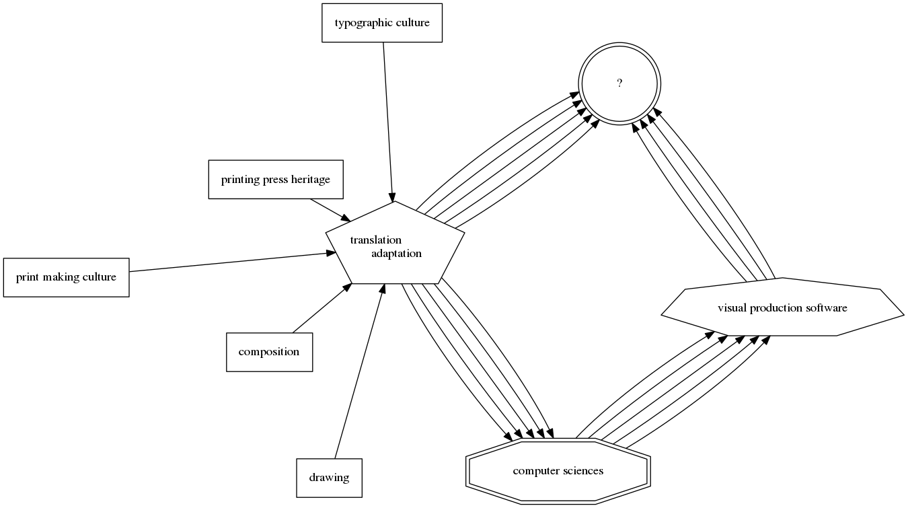
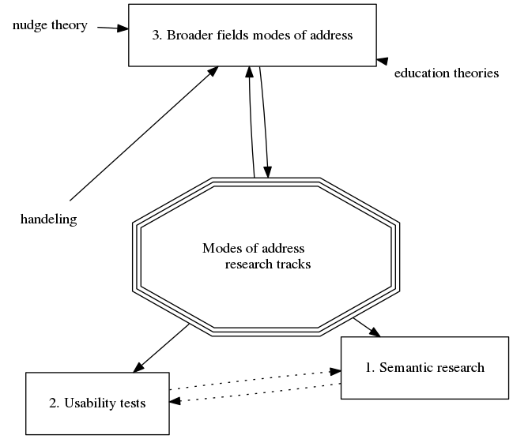
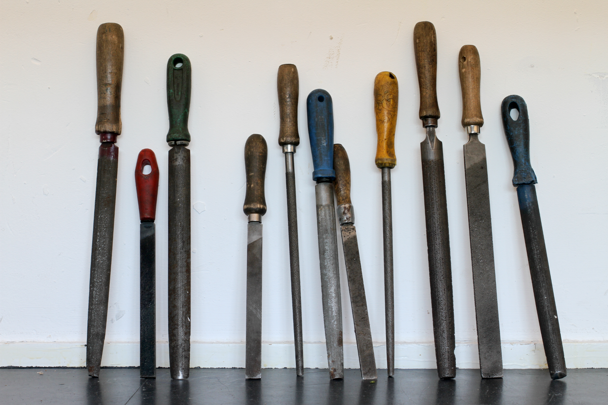
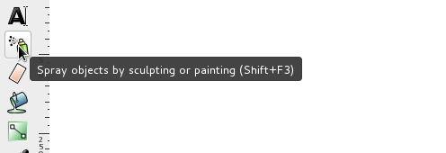
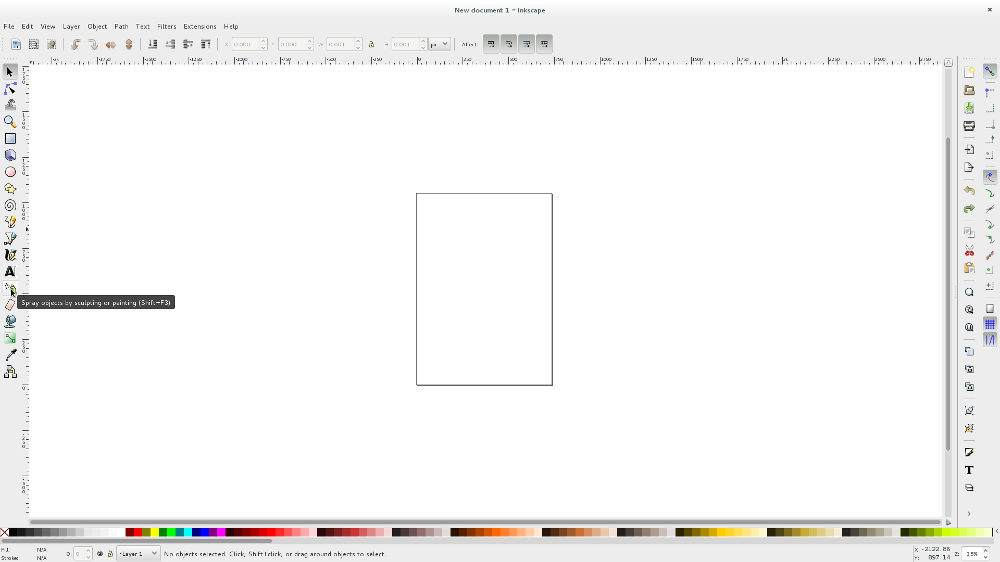
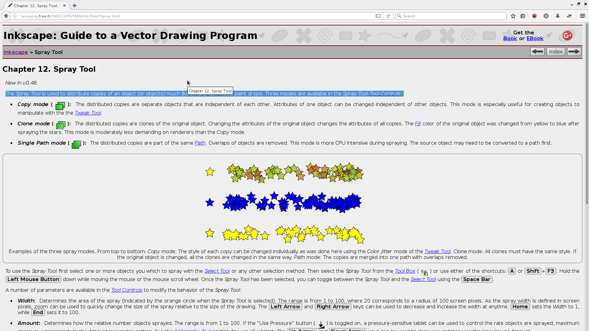

Title: Project proposal v0.3.3
Date: 2016-12-07

# Project proposal v0.3.3
## Modes of address
This research project intends to highlight the importance of different modes of address; the term *modes of address* can be explained as: the *way* we talk. In the case of a service, a device or a tool; the way it talks.
 I'm interested in the relation between the employed mode of address and if / how it enables deeper or alternate understandings of a particular subject matter. My hypothesis is that different modes of address have a great influence on the access to and engagement with knowledge relative to its subject matter. This theory is the foundation for my project, which I will apply more specifically to the realm of visual production software.

At the moment of this proposal, two ideas bring the notion of modes of address to the foreground: firstly, realising that *visual production software is a young, new —isolated— culture* of its own. When this type of software was made, initially at least, two cultures came together, a design culture and a computing / computer science culture. When saying that visual production software is a culture of its own, I'm expressing my desire that both cultures could come together in a more interesting manner. I believe that the new practice-vocabulary that came out of the collaboration of design and computing culture could have been —could still be!— more alternative, making more backwards and forwards motions to and from the application of design methods thanks to computing methods. Meanwhile, why does the speech, the wordings and the sequences of actions in software that enable visual making, not give greater insight. Insight into what pre-software design practices got affected by the perspectives of computing. Instead, the words and names used in visual design software give more instructions that are named after methods, procedures, ways of getting things done. They do not speak of their histories or skills, neither from their design nor their computer science backgrounds (See example in ‘extra material’ ¶)

Secondly, realistically speaking, it's understandable that the vocabulary of software is so, and my intention is not to disregard the power that these software tools can enable. I think at first the transformation of design practices into on-screen actions were viewed as a way to make the designer more efficient, which brings me to the second notion that flags modes of address as important for me. If the neglect of the stemming cultures have affected the vocabulary of software, efficiency has possibly affected *it's tone*;
 Efficient making in design is complex. Efficiency in itself can't really be seen negatively. Most industrial cultures have interest in fast production. Aside from the social and economical dimensions that surround efficiency, it's attitude has been baked into the tools I'm discussing with this project. Again, I believe the first reasons for bringing visual designing to software was an interest in being faster. This focus has permeated most computer and interface practices. It certainly has a key place in the work of the new digital industries, interaction design, user experience design, mobile design. However, efficiency, at it's core, affects how we execute, affects the order of a procedure. It therefore also affects the language that describes the procedures, the language employed by the interface.

My perspective is that what we are left with is a genre of software, a type of tool, that wants to be creative, but negates the cultures it hails from, while trying to make the user execute sequences fast and efficiently, in its very own myopic language.
 Some of this can be altered. Parts of this can be balanced back out, changed so that they speak more clearly and make more links to where the practices came from. They could also have a tone that encourages more testing and using for discovery than using for producing.

Note: My rationale and arguments for the importance of this knowledge transfer to happen within software is a topic I'm developing in my thesis, in the chapter ‘Defining craft’.

## Proceedings

I'm driving this research by taking apart what modes of address can be or can mean; investigating the existing knowledge in various fields, and trying to discover other fields where it applies. I am focusing on three research tracks:

### Semantics
The first view into modes of address is a semantic one (see reference material for specific details), looking at the construction of the language that is employed in software. With open source software it is possible to isolate the written words and sentences of all the menu items. This ‘raw’ view has been a source for analysis; language toolkit (NLTK) have demonstrated there are extremely common tenses of verbs in use across the literal language of interface, leading me to wonder how the interface would feel if these tenses were different. Meanwhile, early stages of research into other dictionary data-sets (word-net) reveal —albeit, non objectively— that the themes of the words in use by the interface do not point to themes of design, or drawing, or making. This literal data analysis approach to the language of interface is potentially vast, but also exiting, as the programmatic approach could be reproduced over different types of software, possibly revealing other interesting patterns. Also, structurally manipulating the language data in data-sets means that adaptations to the language can be made in ways that would be unimaginable manually. This possibly gives way to possible tests in the second track:

### Usability tests
The practice of usability tests for software tools covers some of what I am interested in. Conducting my own tests with candidates reveals useful information. My current test is structured as follows: I sit a candidate down in front of a computer that is running a drawing software, I ask them to perform 3 simple tasks, but to do so by explaining aloud the way in which they are proceeding when navigating on the computer. Sentences arise out of these recordings such as: «Now there is a red thing between the two points, and I will pull on the red thing to make the line curve a bit.» These sentences help in keeping a fresh perspective on how the interface is being understood. They are also begging to be reproduced with altered interfaces, ones that have seen their languages changed as mentioned in the previous track.

### Broader modes of address
Aside from software, there are other fields that I will research that involve mode of address, directly or indirectly. These will be satellite topics that will inform the rest of my research, and give different perspectives. Examples: making of manual tool handles, indirect addressing in spacial design and industrial design, nudge theory, gamification, video essays, spoken essays, education theories, ... I believe that my research topic will benefit from examples that hail from other fields than the one of software and tooling. Uncovering these examples is fundamental to my research.

<!-- for git & wiki output -->

I would add that I have also been building a platform to gather the various materials that are produced during this research online at tangible.tools

## Motivations
This topic came from observing the attitudes built in to the software I was taught to use while training as a graphic designer. Restating some of the content from the introduction; These digital design tools exist thanks to both visual crafts and computer sciences. The computer procedures are used to extend the realm of visual design craft, but seem to make the original ‘hand’ craft absent. It's the new, in-between, practice that appears in the space left by the two that I am concerned with.
Following my professional graphic design training, I spent some time choosing and making tools for commercial projects. In this position I was the middle-man for the ‘misunderstandings’ that software tools designed to manage content online, for example, can generate for a user. These were things I could only feel responsible for as the vendor.
I genuinely believe that there is a way of making tools speak to their users in an interesting manner that can be logical but also educational, if needs be. I find most software today amazing, and to achieve my goal, I am proposing minimal changes, yet I believe my research will show these are changes that will be impactful in empowering users. By adopting modes of address that are engaging, accessible, non condescending, and non patronising, a lot could be changed.

## Who can help you and how?
The narratology perspective of Frans-Willem Korsten will be helpful to widen the understanding of the narratives within interfaces. Before this, discussing the topic with fellow script writing students will certainly be of interest.
 I have also been reaching out to other researchers who's work crosses this topic:

* Amelia Bellamy-Royds: writer and developer who an ‘Invited Expert’ on two W3c initiatives, the SVG standards and [WAI-ARIA](https://www.w3.org/WAI/intro/aria) (Web Accessibility initiative - Accessible Rich Internet Applications Suite)
* Sebastian Derterding: reader/senior research fellow at the Digital Creativity Hub at the University of York (York, UK) as well as affiliated researcher at the Hans Bredow Institute for Media Research (Hamburg, Germany); designer and researcher working on «playful, gameful, and engaging experiences for human flourishing.»
* Jan-Christoph Borchardt: interaction designer on web-apps ownCloud & nextCloud
* Peter Sikkin: self titled interaction architect http://blog.mmiworks.net/2016/05/designing-interaction-for-creative.html

## Relation to previous practice
A part of my previous practice is given in the motivation paragraph, as is in the intro, but an other part of my previous practice is my history with the graphic design research collective Open Source Publishing. This group works collectively around questions of alternatives to the mainstream (arguably industry standards) tools for design. The answers to the questions of practising modern digital graphic design with open source software have been multiple and in various shapes, one of which is the belief that learning software alone is not easy and should not be done alone if possible. Therefor, OSP has been part of —and organised— many workshops where software practice is spread out on the table for people, together, to learn from each other. This, sometimes, has put me in a position of *teacher*. Where I try and introduce a procedure to a group, and need to find multiple ways of explaining the subject matter to remove it from it's abstract nature. It is in this position that *modes of address* as a pressure point became clearer.

## References
* Franz-Willem Korsten — History of narratology: https://pzwiki.wdka.nl/mw-mediadesign/images/a/aa/History_of_narratology.pdf
* Sebastian Deterding — Design Against Productivity: http://codingconduct.cc/Design-Against-Productivity
*  Cognitive and Learning Disabilities Accessibility Task Force (COGA) — Group work statement: https://www.w3.org/WAI/PF/cognitive-a11y-tf/work-statement
* Individuals with Cognitive Disabilities — Barriers to and Solutions for Accessible Information and Communication Technologies: http://transition.fcc.gov/Daily_Releases/Daily_Business/2016/db1006/DOC-341628A1.pdf
* Nielsen Norman Group — Evidence-Based User Experience Research, Training, and Consulting: https://www.nngroup.com/articles/
* Amelia Bellamy-Royds — Accessible Graphics on the Web: https://cdn.rawgit.com/AmeliaBR/accessible-graphics-notes/master/ABR-AccessibleGraphics-LGM2015.html

---

## Extra & example material:
This section is aside from the actual project proposal; it details the beginnings of some of the work. It is here to inform and bring the project proposal up to date, but not intrinsically part of it. Talking points and practicalities.

### Timetable

#### list view timetable:
* proposal validation to end of January: NLTK & word-net processing of language data + making of legible outputs
* February to mid March: Choosing and making of language adaptations to data, rebuilding language file, recompilation of software, then conducting tests.
* Mid march: looking at results of tests, seeing which what tests to continue.
* After mid march: decision on the format of the output of graduation project.

#### detailed verbose timetable:
As layed out in the ‘proceedings’ section, there are currently three tracks I'm persuing. The semantic and testing approach will likely have a step by step mappable progress, whereas the larger search in ‘broader modes of address’ is more sporadic, therefor they will be on separate time-lines. Concerning the former:
* I will have spend time until the end of January, conducting the data-related search into the extracted words and sentences from interfaces. This will involve making the results of the tool-kits searchable and legible.
* From that point, I will chose to make a (limited) number of adaptations to the language source files, in order to rebuild the software with my changed modes of address. Following this comes some new ‘usability testing’ of the adapted software, giving myself 6 weeks for this part.
* Then to take account of the results of the tests, as these will probably be recordings (screen and audio) it could take some time to process.
* From the conclusions of the rounds of tests, a clearer path will be set out towards a final graduation project ‘collection-object’
Meanwhile, the sporadic research will be ongoing, informing my understanding of the larger topic.

### an example of the problem: the spray tool
Following is one example of the type of speech that I find detrimental to the user of, in this case, Inkscape, a vector drawing program.
From inkscape interface tool-tips, on hover over this spray can icon:

Spray objects by sculpting or painting (Shift+F3)

What am I supposed to understand from these seven words? There are a lot of requisites for this to be understandable. What are ‘objects’? I'm going to be able to spray by sculpting? Spray by painting? Without these words, would it not be expectable to use this tool to create a spray paint effect? Meanwhile, from the inkscape manual, accessed by selecting Topbar menu item Help > Inkscape Manual —focuses browser on page ‘Inkscape: Guide to a Vector Drawing Program’ > Section 12. Spray tool

>  The Spray Tool is used to distribute copies of an object (or objects) much like an airbrush would paint drops. Three modes are available in the Spray Tool-Tool Controls [..]

### Prototype 0

The first step I took towards gaining understanding of what modes of address are used in software was a literal one.

I took the language translation files from Inkscape, (type of file that lets a software be recompiled in different languages, while being developed in one core one) and isolated the English text. Processing English in NLTK had many options to explore but my initial interest is semantic, so I took a look at *parts of speech*. This function basically outputs the source text back in a counted list of all the different parts of speech that the (trained library) toolkit knows about.

To make sense of this list, I had to see what the function would do on a different type of text, one that I knew had a different mode of address, but also in the realm of using a tool; I used the vimtutor text second. Much more of a tutorial attitude, different type of program.

I list the raw results in [compare_results.html](http://pzwart1.wdka.hro.nl/~colm/prototypes/modes-of-address/compare_results.html)
