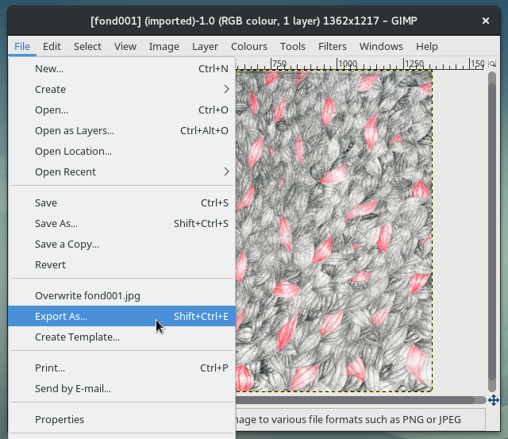
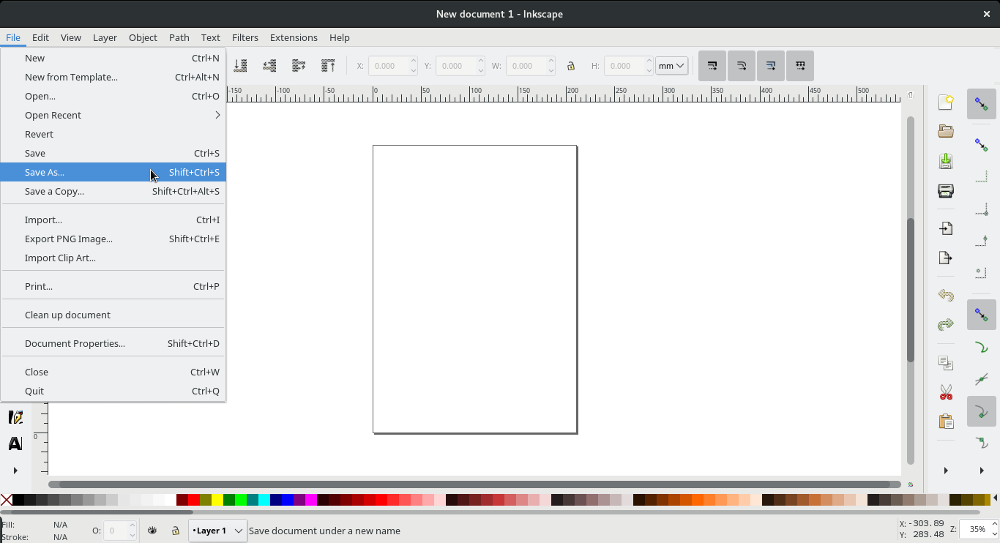
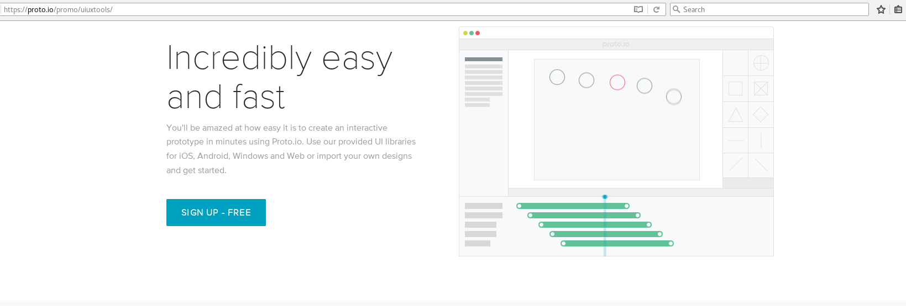
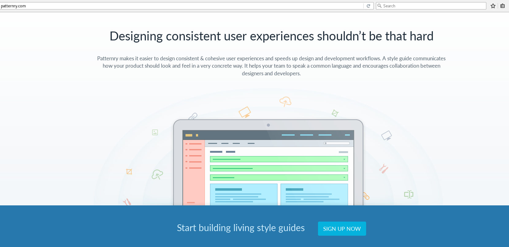
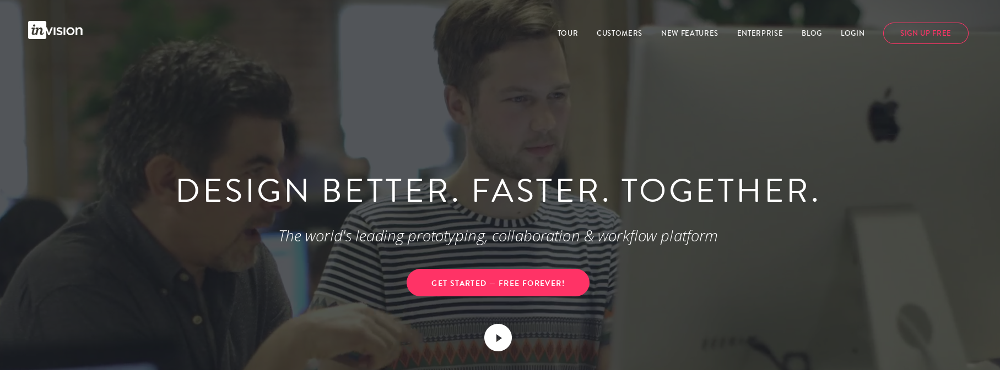
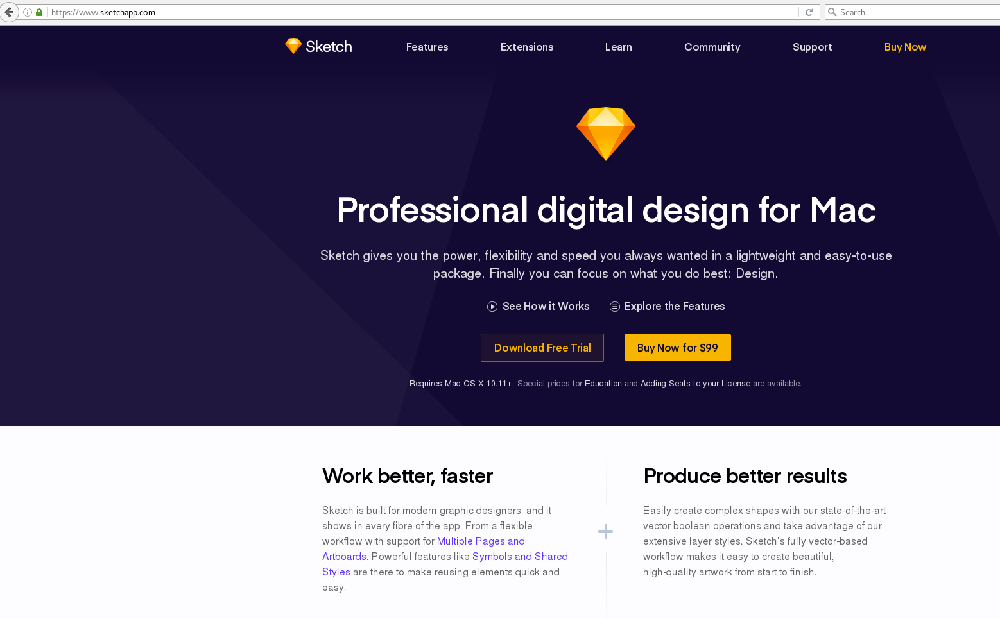
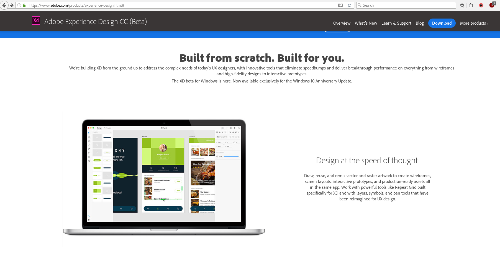

Title: Chapter 2 — Efficacy or efficiency
Date: 2017/01/03

I absolutely believe that *imagination is stimulated by technical understanding* (McCullough, 1996), so we need for engineers to be *more legible* in their proceedings. When I say that I must take on attitudes of a traditional crafts-person, I mean that I need to take interest in all the ebbs and flows of my practice, and each of the tools that it involves. I believe that it is my task to take interest in all of the objects and constructs that build my digital environment. I do not mean with this that I must become prolific in the handling of all of them,[ref]I would think that there is a threshold or a balance point to be found, that would revolve around an ability to cartographically understand the schematics of a digital procedure in a digital space.[/ref] but having knowledge of their presence and workings can only better my understanding of my work environment, and my practice.

My belief is that we need less transparency[ref]meaning as a reaction to McCullough's idea of transparency, I acknowledge that the use of transparency in this sentence is counter intuitive.[/ref] between engineering layers, meaning more ways of understanding the constructs of our programs, more ways of seeing how our files, designs, creations, makings are recorded and understood by our computers. McCullough's demand for a program to be ‘increasingly transparent’ is fundamentally contradictory to his thesis, and extremely problematic. When I read ‘increasingly transparent’, I hear *less visible* — something which is currently happening across the board at the moment— but absolutely not something we need more of, especially in the desire for new craft recognition. I think that if there were to be a greater visibility of the granularity that is clearly present in programming, we would not only become better at what we are given access to, but we would gradually gain broader understanding of what we are working with, undoing the layers of abstractions of the virtual practice, and gain more ways of conveying our practice as the production of virtual objects.[ref]It would be interesting to consider different levels of transparency, levels that could be adjusted by the user to adjust how much of the internals I am seeing. Such a method may come to compliment a progression to the previous footnoted idea, about understanding software as schematics.[/ref]

I think we need to find alternative working methods, in more consciousness of process, this would necessitate a better understanding of the materials and the processes involved in computer-based software design. We need interfaces and programs that reveal seams and boundaries, limiters, inputs and outputs in order to enable an understanding of some of the layers of abstraction that computers are composed of. We need programs and interfaces that help to make the connections between the multiple tools they bring together[ref]Some examples of programs that show their inner composition or that exist to reveal their parts are [_playGnd](http://threejsplaygnd.brangerbriz.net/gui/), the XML editor in inkscape and the 3d page view in Firefox (details in chapter 3).[/ref] and that show themselves as wrappers and containers of many entities, not stand alone magic boxes.

### efficacy or efficiency
I feel like there may be confusion between attitudes of *efficacy* and *efficiency* in the software industry. Efficacy is the power or capacity to produce a desired effect, effectivity, effectiveness. Efficiency is the ability to avoid wasting materials, energy, efforts, money, and time in doing. These two are closely related, but they are different visions for doing. I don't think this distinction is obvious in specific visible way, it is more related to an attitude and vision that the tool maker has of me, of users, my practice and way or reason for employing the tool. I think the misunderstanding of efficiency as efficacy has also come to disable our understanding of digital practices as abstracted crafts altogether.

<!-- ### easy intuitive fast — trade words -->
Commercial software makers are in constant competition. This is partly due to the scarcity of commercial computing systems available, which in itself stems from the fact that there is essentially only one market of users to conquer. There are also multiple ways of delivering solutions in digital matters and often multiple implementations of said solutions. Boiling down competition benchmarks in this field comes down to two things: feature parity and ease; tentatively justifying in commercials how x solution or y product will bring more ease to a task. Software seems to be traded in terms of *Easy, intuitive, fast,*[ref]http://www.trademarkia.com/zookware-fast-easy-intuitive-85648624.html[/ref] or even the ever simplistic *‘it just works’*[ref]https://youtu.be/qmPq00jelpc?t=8s[/ref]. These qualifiers speak to the experience of use, rather than talking about the tools or tasks themselves. Speed, ease and good experience are what is sold to me, and this is what I am told to expect.

<!-- ### speed -->
Speed in accomplishing a task is a parameter of the historic, economic and ideological developments reviewed in chapter 1. The desire to do something fast, because I have other things that I need to do (fast) seems to loop over itself and into itself. A quest for shortcuts and a disinterest in the specifics of a subject or task, that might slow my workflow down. The consequences of such a view of products, solutions and tools for virtual practices have affected specific dimensions of software tools, mainly in their attitudes and articulations, which are now geared towards answering problems and answering them efficiently. Efficiency effects all interface elements, from menu labels, windows, to launching processes right through to document saving and exporting dialogues.

### Example 1: canvases
One example of this is the preliminary need to set a document type or size when using certain canvas based software.[ref]I do not mean to generalise all software tools that employ the canvas metaphor, simply the ones that entertain the possibility of a printed output.[/ref] The very first step demands of me to plan the output of the session. Having to chose a reference size, a colour profile, even sometimes a preset template before any composing can happen is telling of a tool that requires the user to set parameters, to get them out of the way, to get done with the task faster. This choice would also have to be made early in the analog process, but virtualised practices recorded in encoded files have the ability to be written and re-written at will. I plainly feel like this initial requirement sets an non-interesting boundary that goes against the nature of re-writable files, and computer systems. This prerequisite of thinking about output before any input, shapes a linear process that has a set beginning and a set end. I believe this comes to limit how the tool is understood, or how it could speak of its boundaries. If physical scale was a requirement for the exporting process alone, if and when I got to that decision, maybe the making and using in the tool would be slightly less grounded, more flexible, truer to the possibilities that live memory systems offer. In turn, I think a change of this order could empower the user to have greater understanding and control of what virtualisation can bring to a practice: changing the order of the established procedures would be telling of a virtualisation that *augments* a practice rather than only digitising it.

### Example 2: exporting
Another example is a slight difference in saving procedures between two of my most regularly used canvas based software tools, Gimp and Inkscape. When my edits are done and I am ready to use my transformed file in other contexts, in Gimp, I must use a specific menu item labelled ‘Export as...’ that enables export to image file formats. The ‘File’ drop-down menu in Gimp also includes ‘Save’, ‘Save as...’ ‘Save a copy...’ before the export section. However, in Inkscape, the ‘Save as’ item is the one that I must use if I am to use the current file in other image formats.

There is logic to this difference, mainly due to the nature of the file formats and mediums that each program treats respectively, but the fact that Gimp asks to and uses the word ‘export’ delimits the space in which it was intended to act. The understanding of these labels is, in a large part, a matter of interpretation. In the context of interfaces, language and its interpretation are at the foundation. This work has a timeline, and if you're hovering over the export menu item, you're very close to the end of it. Keep in mind that typical export formats, jpeg, png, tiff, gif, are all formats that are accepted as initial input (through the import menu item, just a few lines down), so why this need to export? Meanwhile, Inkscape places static image formats inside it's general save menu, keeping *other use* formats and Inkscape augmented formats on a level playing field. The point of this example is not to compare the working of one tool versus an other, these are vastly different programs, respectively working in vastly different data and image types. The methods and working of the program descend from the different handling of bitmap and vector graphics.

Instead the example is to display how, in some software conceptions, manipulation happens in the only intent of having an output, being an item in a chain. As with the paper-size example, this is a small interstice I'm pointing to, but one that is telling. The reality is that Gimp allows you save working documents, in its own .xcf extension, but the split here is in language, and the order of the usage process. The organisation of menu items and the actual words that are used to enact them are immensely important for the user and thus very important for the understanding of the intended spheres of use and action of the tool, by the makers. A productivist mindset has a harsh effect on any medium, leaving no space, or time for exploration of a tool for it's own sake. The tool that asks for 'export' does not speak of itself as an environment for manipulation and testing as much as it says that it is a set of procedures that are not valuable in contexts other than the ones they are intended in.

### Example 3: tool-tips
A confusion between efficacy and efficiency is visible with some tool-tips: I hover over the multiple toolbars in my vector drawing application, for example, tool-tips appear with only ever short sets of descriptors around an imperative form verb: ‘Create rectangles and squares (F4)’, ‘Create and edit text (F8)’, ‘Snap bounding box’. Rather than describing what the tool can do, the language of the interface refers to what the tool is meant to be used for, it speaks to me in terms of what the tool was meant to be used for. A change of verb could suffice here, plain, indicative present tense speaking of related objects would give descriptor sentences instead of orders: ‘Creates rectangles and squares (F4)’, ‘Creates and edits text (F8)’, ‘Snaps bounding box’. Considering a small change in language could demonstrate the subtlety that exists in the difference between efficiency and efficacy. I believe this small change in language would make the difference between software being understood as a unidirectional, function-isolated tool or it being a place for thoughts to develop, by them being confronted with possibilities. The encouragement of trials and tests would alter perspectives and reorganise the ways in which the digital medium can be handled.

Aside from this observation, the shortening of the legible language is plainly unnecessary. Is there any reason for these tool-tips not to be lengthened? The only explanation I can come up with for this imperative speech is a desire to optimise space. Vector drawing programs, as other drawing programs, can and do get crowded with toolbars and windows. But is this the reason for the short text? To be out of my way so that I can get my job done? I don't see why interfacing can't be more generous and verbose with the languages it uses. A little spray can icon tool is listed in a left vertical bar in Inkscape. When hovered over, the tool-tip reads: ‘Spray objects by painting or sculpting’. Quite cryptic, a lot of pre-requisites are needed to understand such a sentence. [ref]This is not to say that it is the tool-tip's job, though this is slightly beside the point of this chapter and will be addressed in chapter 2.[/ref] What I wonder is, why the tool-tip text could not be the one that exists in the help menu. ‘Spray objects by painting or sculpting’ could becomes ‘The Spray Tool is used to distribute copies of an object (or objects) much like an airbrush would paint drops’. A reshaped tip as such is simply more meaningful it can generate more understanding of each function and possibly give ideas of more options to use.

### Ease becomes experience
Next as a sign of efficiency, the idea of *ease* comes as a promise of consideration —and maybe premonition. Sales focus dictates that if something is easy, it is efficient. For something to be efficient, it must be made easy. *Easy* is employed upstream, it is said to anticipate and comes to respond to *complex*, which is the most feared label for a software maker. To tell a user that a software tool makes a task more accessible is one thing, to say that it makes a task easy drags in a long set of assumptions around what ease entails. I am not implying that ease is necessarily a negative attribute. There are plenty of reasons to celebrate greater ease within interfaces. There are plenty of reasons to encourage interface and software builders to think of easiness, the main one being potential larger accessiblity of a system. However, “easy” is a subjective term, and often ease of use results in automation that conceal the functionality of the software. An other way of saying this might be that I wish ease in interface came with the values of efficacy, but they only seem to be built through the lens of efficiency. It seems that the quest for easy interfacing tries to take on the inflection points caused by computer environments and smooth them out. I believe 'easy' to be a good goal for a software tool, so long as it remains reasonable, that it does not impede learning or understanding a process. I think procedural ease should be encouraged so long as it remains clear that software is a wrapper, a collection of procedures, a multi-tool of sorts. If created ease clouds this vision of a wrapper, then it must be reviewed. Furthermore, it is notable that *easy* interface, has arguably been re-branded as what the industry is now calling *experience*.

<figcaption>↗ proto.io, a user experience design app, says **Incredibly easy and fast** (accessed March 2017) </figcaption>

<figcaption>↗ patternry, a front end design app, says **Designing consistent user experiences shouldn’t be that hard** (accessed March 2017) </figcaption>

Gathering the procedures and methods that serve a user in accomplishing a task in software under the term *experience* is a way of ironing out the specifics and the details, from the vending point of view. Meanwhile a flurry of new job titles have appeared to address the layering and renaming of procedures to interface to experience: ‘experience designers’, ‘user experience designers’, ‘user interface designers’, ‘interaction designers’, ‘product designers’ now all exist to address product communication in ways that are intended to keep the user enthused about what is happening onscreen. This creates a great distance once more between what the user does, and what is actually happening inside the computer. As is often the case with new software, the aim seems to be that is disappears entirely, to remove any effort, therefor any thought. This is telling of an era of deeper software competition, which is being battled by marketing. The aim is to be so fast that you don't see it work, or even think about the fact that it is doing work in the background. ‘Seamless’.[ref]Marketing becomes a part of the identity of software, it enters the interface. A part of supporting the idea of seamlessness is being consistent, and with I believe we have a second way of understanding the change of User Interface (UI) practices towards User Experience (UX) doings. [/ref] I also need to constantly reminded myself that interface is communication. Interface elements give access to functions, but in doing so, they isolate the procedure to an item in and of itself. I think the field of user experience is the result of software interface being a set of isolated procedures of which we forget the start and the end points. We only know the action, not the transformation. We know the verb, but not its meaning. Interfaces of this sort add layers of opacity in order to achieve efficiency.

<figcaption>↗ invision, a prototyping tool, says **DESIGN BETTER. FASTER.** (accessed March 2017) </figcaption>

I see efficiency as the demand of a production focused work environment. Efficiency in interface is the demand of modern *technology* [ref]a term I have been avoiding, In order to prevent the field of product and service from moving too far from software and also because the term technology is a placeholder, a substitute for the industry to not have to deal with specifics. Ted Nelson reminds that Technology is a myth. This does not mean that Technology does not exist, it does, there is much less of it than the use of the word might signify. TCP/IP, DNS, DHCP, these are all technologies, but to say that 'the internet', for example, is a technology is plain oversight. Most of the times we say Technology we mean to say that it is *packaging*, and *conventions*.[/ref]. Modern software can't be mentioned without referring to solutionism funnelled through *technologies*. *“Technology is typically seen as a problem-solver, and well-designed technology *is supposed to follow an according aesthetic of efficiency*, ease and—ultimately—automation.”* (Morozov, 2013) It demands *better* methods for production: optimisation of resources —this view implies that there is a limit of supply, or that efficiency more often than not means trying to accomplish a task with fewer people and resouces. Theoretically speaking, this taylorist optimisation towards seamlessness is without end. When one portion of the production chain is optimised, other areas are then revealed to be less efficient. This leads to a vision of constant forwards motion, constant rethinking —which is another way of framing a second characteristic of capitalism; growth. The resulting attitude is the ideology of technologies and solutionism. [ref]One final example of the confusion and how interpreting the language that results from it ends up hurting the user - software relationship is skeuomorphism. This subject had been addressed specifically here, but for word-count reasons it has been relocated to an [essay on Skeuomorphism on tangible.tools](http://tangible.tools/skeuomorphism-abstract-thought.html)[/ref]

<figcaption>↗ sketch a digital design app, [...]**gives you the power, flexibility and speed you always wanted**[...] and makes you **Work better, faster** (accessed March 2017) </figcaption>

<figcaption>↗ adobe experience design, is built [...]**with innovative tools that eliminate speed-bumps**[...] and let one **Design at the speed of thought.** (accessed March 2017) </figcaption>

These elements tell me that indeed there is a confusion between efficacy and efficiency. I have a desire for computer programmes to be more open, to facilitate a user's exploration of the nature of computing, encoding and visualisations, but there seems only to be a demand for efficient solutions. Most of the language and communication that surrounds software and applications sell the view that digital practice is only about solving problems. The consequence of this design communicates that that it is not our place to be concerned with any of the substances that the digital and networked world are composed of, we are facilitated to use objects that answer singular problems in a singular fashion. We are not encouraged to take interest in the specificities of mediums. In this way the solutionist mindset builds a barrier between the maker and user. For the former to sustain, it is best if the latter does not know too much about the characteristics of the procedures, matter or natures of digital mediums. Ultimately, efficacy in digital practice might not be attainable due to the confusion with efficiency. Vendors portray computing as a way of being more efficient but not as a practice that can question or a process that can improve various fields.

The five screenshots above from Adobe XD, Sketch, InVision, Proto.io and Patternry show this portrayal, in its commercial application. I oppose these procedures as I believe that computer culture is vast and wild and it is truly limited through the scope of solutions.  I'm advocating for alternatives as I believe that solutionism builds hierarchies. Interface solutionism prevents curiosity and obfuscates the visibility of the moving parts of a program. Ease focused interface design produces a situation where I expect too much from my tools, everything feels like seamless magic, everything is taken care of for me. I then become increasingly dependent upon these tools. They offer me ways of thought that impede my ability to see and understand software. They impede my digital literacy.
