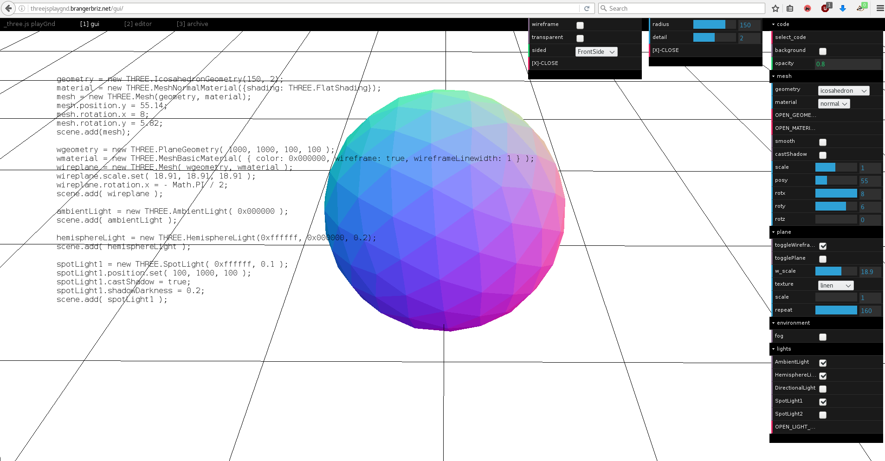
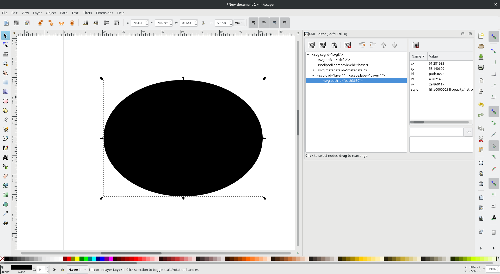
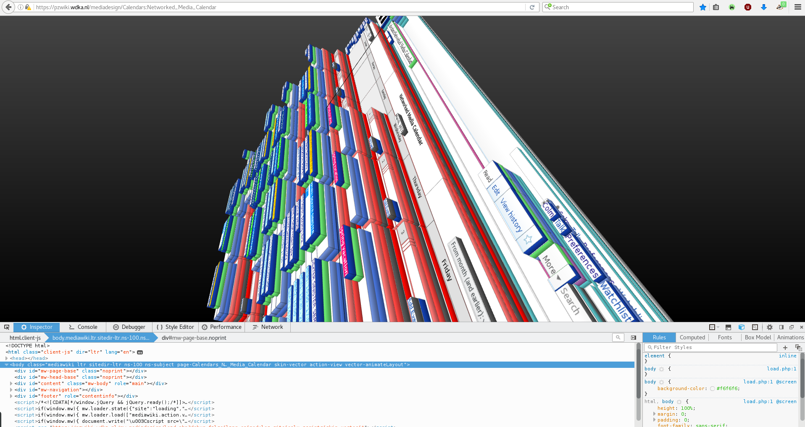

Title:Chapter 3 — The user, the learning curve
Date: 2017/01/04

# The user, the learning curve

I find myself stuck between the effects of solution providing software and interfaces: I identify primarily as an end user of software, but graphic design has lead me to web design, and with it, web development, so I now also identify with the second category of "parties involved in the configuration of software": curators.[ref]i.e. the end-user-facing entities that integrate software structured as services into their own operations (they include so-called enterprise customers). Curators pick and choose which services to use with implications for their end-users. These curators can be IT departments, local web development teams or individual developers;(Gürses and van Hoboken, 2016)[/ref] (Gürses and van Hoboken, 2016) My work as an independent graphic designer and website developer involves the choice and implementation of pre-existing tools and processes for others to publish their content. But the more I do work as curator/middle-man, the more responsible I feel for the digital literacy I expect of the end-users I produce (for). This leads me to question the potential for the acquisition of this kind of literacy, with regards to people (customers/collaborators) who spend a lot of time on computers despite my services.

Requesting that an interface become more open in the display of the routines/programs/packages that it uses will require greater investment from the user. It would become necessary for a user to learn the basic procedures enabled by the interface. Such an interface method expects the user to have some motivation towards learning the ways of computers and information systems. Learning this somewhat invisible material/procedure that the software system is comprised of would not be *easy* or necessarily directly logical, but a payoff of the learner's investment is a much greater agency and situation across the spectrum of computation. Following are some examples of interfaces that strike a balance between usability and visible seams.

<figcaption>This interface called _playGnd enables the creation of 3d objects that can be easily embedded on web pages. The tool proposes to start with the graphical user interface, but each value that is changed or tweaked automatically updates in the code view that is flush left on the screen. This dual attitude of code and interface shows the user how each object is encoded and reflected by the interface, in the code. It's a great tool for learning the 3D web languages. (accessed March 2017) </figcaption>

<figcaption>The pane open on the right side of this capture is called the XML editor. Inkscape is a vector drawing program that records drawing data in the Scalable Vector Graphics (svg) language along with some wrapping of the svg language in Extensible Markup language (xml) to save file names, some preferences, profiles etc. This pane lists and updates a text view of the objects you draw by using the toolbar tools. It splits object types and their attributes (type, scale, position, transformations) into legible tables. Along with this, it lets you manipulate the xml file, with keyboard and text editing procedures, to continue the creation of your drawing while manipulating the code it is recorded as.(accessed March 2017) </figcaption>

<figcaption>This 3d view is a feature inside the web inspector that is built into the Firefox web browser. Hypertext Markup Language is a way to tag portions of text for hierarchy of a document. The Browser can then read the markup and visually render the hierarchy that has been encoded. Web inspectors let users and website makers review how their html is being interpreted by the browser. Firefox takes this one step further by offering this 3d view of the html document, by layering enclosed and nested items over one another. The 3d view lets you click on the different visual layers to see what the element stack is, displaying HTML exactly how the browser reads it, but letting the user look at a third dimension rendering, for clarity and understanding.(accessed March 2017) </figcaption>

I find this type of interface extremely interesting. These examples follow many of the established communication and interface conventions, but offer alternative positions, informing the user of the computer language and proceedings, augmenting the interface to be an exploratory, interesting object in itself. To this point I've been advocating more verbosity and transparency in interface. The examples above highlight the potential of an interface as a tunnel through abstraction layers. They make space for interfaces to become exploratory, wherein some elements are present purely to inform, for browsing purposes, I use the term browsing here in much the same way as [Adele Goldberg does in the presentation documents for one of the first graphical user interfaces; Smalltalk](https://youtu.be/AuXCc7WSczM?t=1m32s)[ref]https://youtu.be/AuXCc7WSczM?t=1m32s[/ref]: in which browsing is emphasised because “too often we think of computers as being very precise machines, in which we have to very precisely say I want this or that and you get it back, exactly what you asked for. But the nice quality of a library [browser] is that you can walk around looking for something specific, but as you do that, you find other things, and that's what browsing is all about.” (Goldberg, 1979)

Goldberg and Smalltalk were prolific during the early 80s, a period when the computer was no longer reserved only for scientists or engineers. Personal computers were thought to extend towards other fields, other crafts could benefit from computational power. The work of Goldberg and Alan Kay[ref]a fellow researcher within the Learning Research Group at Xerox Palo Alto Research Centre[/ref] on graphical user interfaces as they conceived them was never meant to obfuscate code, to hide it from the user, as it is on other commercial computer systems today, it was meant to augment the code to help you program. Windows and Apple, whose commercial activity was spawned from the work at Xerox, chose to ignored the metamedia concept[ref]a new classification of medium imagined by the Learning Research Group, whose content would be a wide range of already existing and not-yet-invented media.[/ref], instead, simply imitating old media. Movies, Music and books would eventually become .mov, .mp3 and .pdf on the computer, not all that different from their analog counterparts (Briz, 2016). In contrast, for Goldberg and Kay, the computer was an active medium which could “respond to queries and experiments, so that the message may involve the learner in a two-way conversation. This property has never been available before except through the medium of an individual teacher. We think the implications are vast and compelling [...] a new kind of medium would have been created: a metamedium, whose content would be a wide range of already existing and not-yet-invented media.” (Goldberg and Kay, 1977)

Unfortunately, it is hard to find many embodiments of the working methods for interfaces Goldberg and Kay set out in 1977. Passing information from the background to the foreground is not a concern for modern interfaces.[ref]A subculture of computer enthusiasts sharing configuration files, dot-files, the parameters with which they have configured their software does exist, and is vibrant. Example: https://gitlab.com/sandorczettner/dotfiles/tree/master In this sense, an view of interfaces being tunnels through abstraction layers is very much alive.[/ref] I rarely see instances of interfaces considering the task of teaching. I am concerned by this lack of focus for knowledge transfer. So I identify the concepts of experience and seamlessness to be responsible for the lack of literacy mentioned above. The result of these notions is that these interfaces end up looking like one another and adopting one an other's characteristics. Consistency is actively encouraged as a way ‘*for users to be able to transfer their knowledge and skills from one app to another. The principle of consistency holds that an app should respect its users and avoid forcing them to learn new ways to do things for no other reason than to be different.*’ (macOS Human Interface Guidelines, 2017) However, this statement relies on the assumption that previous apps have gotten everything right and that all the knowledge that users need exists already. The fact that it discourages alternate approaches limits diversity. Diverse interfaces are necessary in order to promote diverse approaches to different practices. If all methods become and feel similar, it stands to reason that operations/outcomes will become similar. The term consistency is one amongst many others within these guidelines: Forgiveness, Aesthetic integrity, Metaphors, Mental models, all of these principles are documented and spoken of as singular ways to make software interfaces. They exist within the world of macOS, which openly states that it believes that technology should be transparent. In opposition to this, my vision for better communications within interfaces relies on visible seams. When OSx says transparent, they mean to make the components of an interface invisible. I believe the opposite needs to happen, that we must make models that are heterogeneous, and build interfaces that make some homogeneity for functions. The confrontation in the video below makes these visions clearest, in the words of the company itself:[ref]for offline readership: this video puts two conversations in parallel, one being a snippet from Marshall McLuhan's lecture The medium is the message (1977) that detail how the "the hidden aspects of the media are the ones that should be thought". The second is a portion of an advertisement run by Apple when promoting their tablets. The speech here says: "We believe technology is at it's very best, when it is invisible."[/ref]

<video class="no-print" controls="" poster="http://contemporary-home-computing.org/art-and-tech/not/material/mcluhnik.jpg" height="405" width="100%">
		<source src="http://contemporary-home-computing.org/art-and-tech/not/material/09.webm" type="video/webm">
		<source src="http://contemporary-home-computing.org/art-and-tech/not/material/09-web.mp4" type="video/mp4">
</video>

Clearly, a learning curve does exist, and a certain knowledge becomes a dependency, which is inevitable if a more heterogeneous mix of interfaces is to surface. Facing the learning head on can be daunting, I believe this to be the case because of how many of the computer proceedings choose to happen out of sight. This learning can appear overwhelming because there are no clear boundaries to computer literacy. One subject leads to the next, and no doubt depends upon other components to function. But I'm strong in my belief that investing time towards computer literacy is rewarding. Exploring the backgrounds of software systems often reveal histories and narratives that are fascinating and thought-provoking. Being more familiar with what happens behind the scenes, or under the hood has often brought me to understanding the componentry of my computer, and that most of these components are usable individually. A vision of how my (design) tools function and the structure they are built on makes me aware of alternatives procedures and able to consider occurrences where I might not need the full-fledged tool. Being able to interact with software componentry leaves me with transportable knowledge across situations and tasks. This knowledge means I'm able to think with parameters in mind and I'm able to conceptualise in adjustable environments. The derivations of this understanding loops over to become the methodologies and inputs for next projects. And my imagination does get stimulated by technical understanding (McCullough, 1996).

I would be remissed not to mention that digital literacy, like any literacy, is best acquired around enthusiasts, in communities that take pride in the subject matter. The groups of people that gather around the Linux operating system[ref]or other Unix-like free and open-source development and distribution models[/ref] use and make programs with the ideals of digital literacy at heart. Understanding componentry, in this model, is much easier and accessible, because these procedures are written about, thought about, developed and celebrated in a commons that brings the understanding of software and computer systems as an active vibrant culture.
