Title: EU cookie law
Date: 2017/01/03

# EU cookie law

## Context

I'm collecting examples of how websites are informing their visitors of the use of cookies. I find this to be an interesting subject matter because cookies are a technical application hidden in the background of the browser. Needless to say that they are potentially detrimental, so the passing of the cookie law is a great information move.

When the law was passed in 2011, it's fair to guess that cookie knowledge was not widesfigcaptionad. 6 years later, it's hard to tell if the regulation has had an effect on people's behaviour towards cookies, but it's interesting to note how initial implemetations onto websites were at least attempting compliance, whereas nowadays they barely get a list item in a website's footer.

More information on the Directive itself (from https://www.cookielaw.org/):
> The Cookie Law is a piece of privacy legislation that requires websites to get consent from visitors to store or retrieve any information on a computer, smartphone or tablet. It was designed to protect online privacy, by making consumers aware of how information about them is collected and used online, and give them a choice to allow it or not. It started as an EU Directive that was adopted by all EU countries in May 2011. The Directive gave individuals rights to refuse the use of cookies that reduce their online privacy. Each country then updated its own laws to comply. In the UK this meant an update to the Privacy and Electronic Communications Regulations.

The more specific information is as follows:

> The new directive came into effect on 25 May 2011. The text of the directive is about 26 pages long, but the most important paragraph about cookies can be found on page 20:

> >“Member States shall ensure that the storing of information, or the gaining of access to information already stored, in the terminal equipment of a subscriber or user is only allowed on condition that the subscriber or user concerned has given his or her consent, having been provided with clear and comfigcaptionhensive information, in accordance with Directive 95/46/EC, inter alia, about the purposes of the processing. This shall not figcaptionvent any technical storage or access for the sole purpose of carrying out the transmission of a communication over an electronic communications network, or as strictly necessary in order for the provider of an information society service explicitly requested by the subscriber or user to provide the service.;”

> In short this means before somebody can store or retrieve any information from a computer, mobile phone or other device, the user must give informed consent to do so.

## The modes

But how do websites go about complying to this law? In short, the implied consent route has been chosen by most websites, which, in itself does not really go along with the idea that a visitor can opt out of the use of cookies. It translates to, "This is how we're doing it, if you don't agree, then leave this page."

Meanwhile, let's look at some example of how websites go about getting your informed consent, and the addressing techniques within:

<small>please note the sources at the bottom of the article, a few existing recaps were very helpful to bring these together.</small>

### ‘Privacy policy’, ‘cookie use’, ‘cookie policy’, ...

Now that the directive is wearing thin and implemented across the board, most sites get away with a two word mention. Two heavy words that assume that if you continue without changing your settings, they assume that you are happy to receive all cookies from X website.

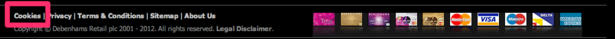
<figcaption>Cookies</figcaption>

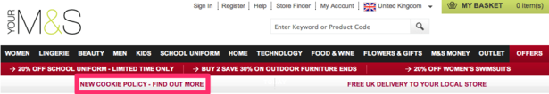
<figcaption>Cookie Policy - find out more</figcaption>

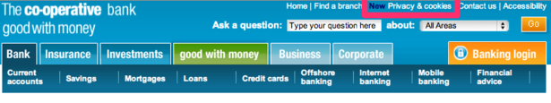
<figcaption>Privacy & cookies</figcaption>

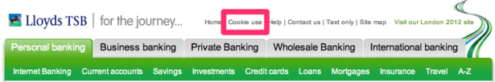
<figcaption>Cookie use</figcaption>

### (Full) Phrasal:

Some websites do use more than two words to inform their visitors of their use of cookies, and make sentences. Quite a head scratch to determine who exactly is speaking out these sentences, but none the less, they are speaking aloud.

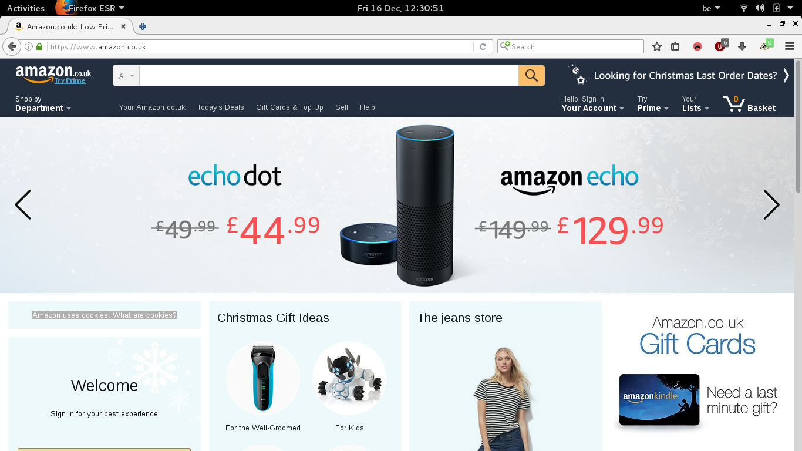
<figcaption>‘Amazon uses cookies. What are cookies?’</figcaption>

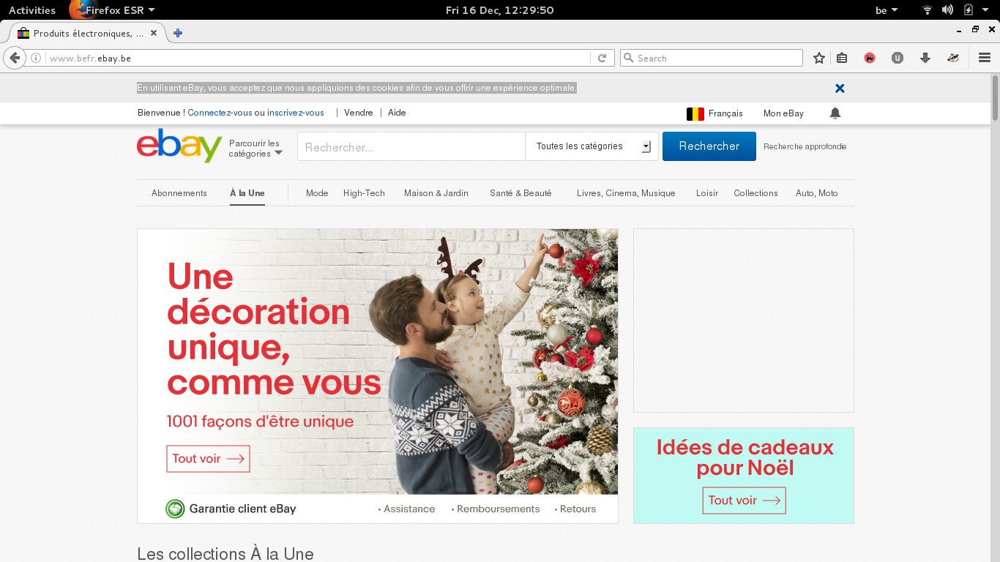
<figcaption>
En utilisant eBay, vous acceptez que nous appliquions des cookies afin de vous offrir une expérience optimale.</figcaption>

Meanwhile, some websites go the extra mile and more again. News websites —but not only— offer information on the situation, the why and the how. They also give access to forms that enable you to choose exactly which cookies are set, and for what they are / can be used.

<figcaption>
<h2> cookies on the BBC website </h2>

 The BBC has updated its cookie policy.

We use cookies to ensure that we give you the best experience on our website.

This includes cookies from third party social media websites if you visit a page which contains embedded content from social media.

Such third party cookies may track your use of the BBC website.

We and our partners also use cookies to ensure we show you advertising that is relevant to you.

If you continue without changing your settings, we'll assume that you are happy to receive all cookies on the BBC website. However, you can change your cookie settings at any time. 

<ul"> <li id="bbccookies-continue"> <button type="button" id="bbccookies-continue-button">Continue</button> </li> <li id="bbccookies-settings"> <a href="/privacy/cookies/managing/cookie-settings.html">Change settings</a> </li> <li id="bbccookies-more"><a href="/privacy/cookies/bbc">Find out more</a></li></ul>
</figcaption>

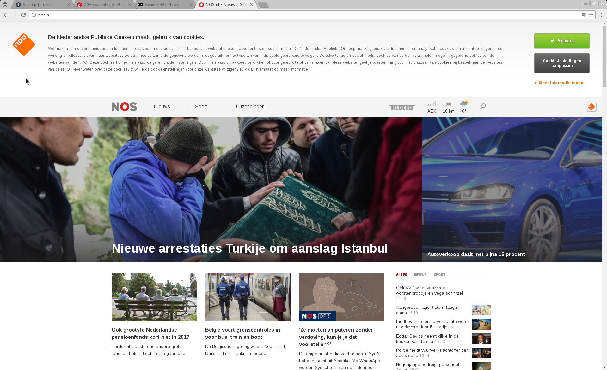
<figcaption>

NPO - Nederlandse Publieke Omroep

<h3 class="npo_cc_h3">De Nederlandse Publieke Omroep maakt gebruik van cookies.</h3>
We maken een onderscheid tussen functionele cookies en cookies voor het beheer van webstatistieken, advertenties en social media. De Nederlandse Publieke Omroep maakt gebruik van functionele en analytische cookies om inzicht te krijgen in de werking en effectiviteit van haar websites. De daarmee verzamelde gegevens worden niet gebruikt om activiteiten van individuele gebruikers te volgen. De advertentie en social media cookies van derden verzamelen mogelijk gegevens ook buiten de websites van de NPO. Deze cookies kun je hiernaast weigeren via de instellingen. Door hiernaast op akkoord te klikken of door gebruik te blijven maken van deze website, geef je toestemming voor het plaatsen van cookies bij bezoek aan de websites van de NPO. Meer weten over deze cookies, of wil je de cookie-instellingen voor onze websites wijzigen? Klik dan hiernaast op meer informatie.

<ul id="npo_cc_col_right"><li><a href="//cookiesv2.publiekeomroep.nl/consent/all?return_parameters=0" class="npo_cc_btn"><i class="npo_cc_tick"></i>Akkoord</a></li><li><a href="//cookiesv2.publiekeomroep.nl/?return_parameters=0" class="npo_cc_btn npo_cc_btn_grey">Cookie-instellingen aanpassen</a></li><li><a href="#" class="npo_cc_a" id="npo_cc_toggle_extended"><i class="npo_cc_arrow"></i>Meer informatie tonen</a></li></ul>
</figcaption>

<figcaption>

 

Your privacy is important.  You can protect it on this site by limiting the cookies we set in your browser.  This will not affect cookies on other sites, or the functionality of this site.

<a class="optanon-alert-box-close" href="#">Close</a>

<a class="optanon-allow-all" href="#">Accept Cookies</a>

<a class="optanon-toggle-display" href="#">Control Cookies</a>

</figcaption>

### Burial:

It's hard to fault this example, because they make mention of the policy twice on the homepage, but burying the legible informating inside a large portion of text is a technique we see quite often in other User License Agreements, documents that are purposefully made illegible.
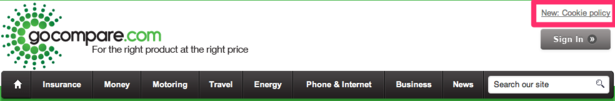
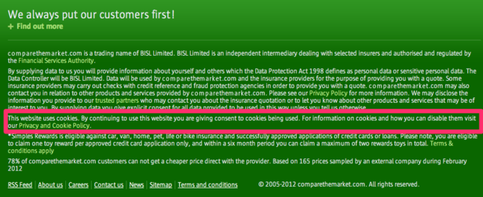

### In form consent

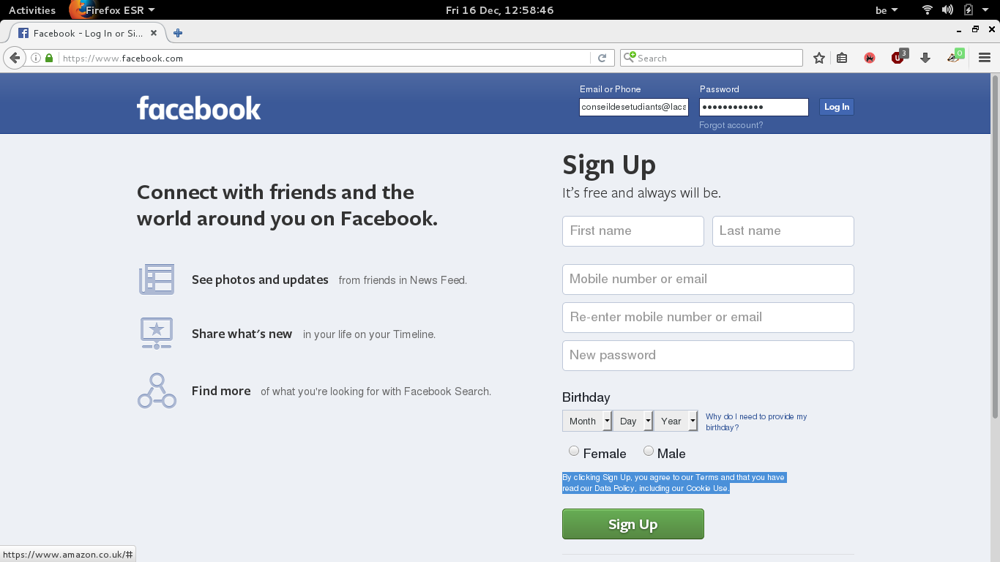
<figcaption>
By clicking Sign Up, you agree to our Terms and that you have read our Data Policy, including our Cookie Use.
</figcaption>

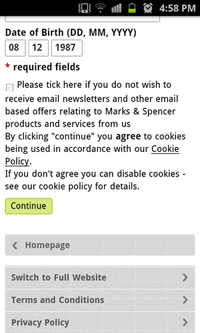
<figcaption>
By clicking "continue" you *agree* to cookies being used in accordance with our Cookie Policy. If you don't agree you can disable cookies - see our cookie policy for details.
</figcaption>

## Conclusions

While I think that this directive had mostly an informational goal to it, it's hard to omit the recurring sentence in all cookie policy texts, by default, you are opted in. As questionnable as these practices are, the inherent contradiction of the cookie information banners is pure irony:
If one decides, that s/he does not want to accept the cookie policy of the website, by not accepting them at the browser level, the banners become more aggressive, stating that cookies are needed for the website to function properly. While this might well be true, and outside of the EU such an enforcement is not legally problematic, the tone and speech becomes surpisingly helpful when websites want you to activate cookies.

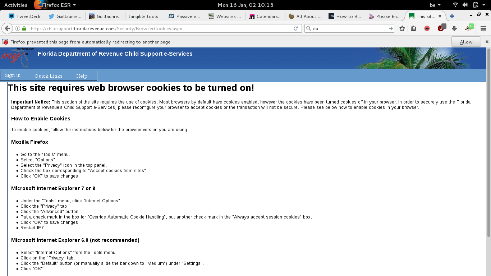

---

##### Sources:
* https://econsultancy.com/blog/10205-20-examples-of-eu-cookie-law-compliance/
* https://www.cookielaw.org/the-cookie-law/
