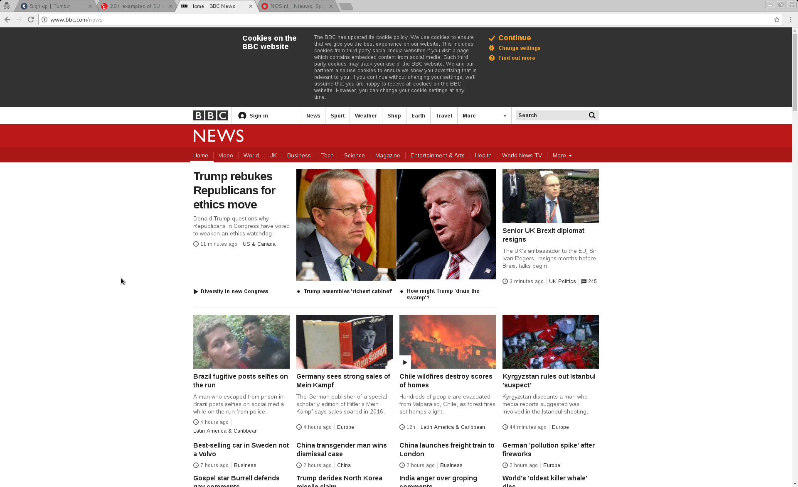

Title: visualising website cookie policy information
Date: 2017/01/11
Template: prototype

## cookie policy information breakdown

The last post that dealt with cookies looked at the different phrasing methods that were employed by different websites to comply with the requirements of the policy. On this page, I'm attempting different deconstructions of the language, visually. By tagging and splitting the text on the occurences that mention the two parties concerned by the policy i.e. the website, and it's visitor; me, I try to see what the text would be like if it was actually a dialog. A text layed out where I as the visitor can see where I'm been spoken to, or about, and when the website mentions itself.

I've picked two examples out of the selection of cookie policy texts, one from the BBC, the other from Facebook. It's my opinion that one of these sites does a good job of addressing the user directly legibly, and gives access to options. The other is more subversive in it's compliance.

# BBC cookie address

<figcaption>
<h2> cookies on the BBC website </h2>

 The BBC has updated its cookie policy.We use cookies to ensure that we give you the best experience on our website. This includes cookies from third party social media websites if you visit a page which contains embedded content from social media. Such third party cookies may track your use of the BBC website. We and our partners also use cookies to ensure we show you advertising that is relevant to you. If you continue without changing your settings, we'll assume that you are happy to receive all cookies on the BBC website. However, you can change your cookie settings at any time. 

<ul"> <li id="bbccookies-continue"> <button type="button" id="bbccookies-continue-button">Continue</button> </li> <li id="bbccookies-settings"> <a href="/privacy/cookies/managing/cookie-settings.html">Change settings</a> </li> <li id="bbccookies-more"><a href="/privacy/cookies/bbc">Find out more</a></li></ul>
</figcaption>

<h2> cookies on the BBC website </h2>

 The BBC has updated its cookie policy. We use cookies to ensure that we give you the best experience on our website. This includes cookies from third party social media websites if you visit a page which contains embedded content from social media. Such third party cookies may track your use of the BBC website. We and our partners also use cookies to ensure we show you advertising that is relevant to you. If you continue without changing your settings, we'll assume that you are happy to receive all cookies on the BBC website. However, you can change your cookie settings at any time. 

<ul"> <li id="bbccookies-continue"> <button type="button" id="bbccookies-continue-button">Continue</button> </li> <li id="bbccookies-settings"> <a href="/privacy/cookies/managing/cookie-settings.html">Change settings</a> </li> <li id="bbccookies-more"><a href="/privacy/cookies/bbc">Find out more</a></li></ul>

<h2> cookies on the BBC website </h2>

 The BBC has updated its cookie policy. We use cookies to ensure that we give you the best experience on our website. This includes cookies from third party social media websites if you visit a page which contains embedded content from social media. Such third party cookies may track your use of the BBC website. We and our partners also use cookies to ensure we show you advertising that is relevant to you. If you continue without changing your settings, we'll assume that you are happy to receive all cookies on the BBC website. However, you can change your cookie settings at any time. 

<ul"> <li id="bbccookies-continue"> <button type="button" id="bbccookies-continue-button">Continue</button> </li> <li id="bbccookies-settings"> <a href="/privacy/cookies/managing/cookie-settings.html">Change settings</a> </li> <li id="bbccookies-more"><a href="/privacy/cookies/bbc">Find out more</a></li></ul>

<!--

<h2>BBC</h2>

 The BBC has updated its cookie policy. We use cookies to ensure that we give you the best experience on our website. This includes cookies from third party social media websites if you visit a page which contains embedded content from social media. Such third party cookies may track your use of the BBC website. We and our partners also use cookies to ensure we show you advertising that is relevant to you. If you continue without changing your settings, we'll assume that you are happy to receive all cookies on the BBC website. However, you can change your cookie settings at any time. 

 The BBC has updated its cookie policy. We use cookies to ensure that we give you the best experience on our website. This includes cookies from third party social media websites if you visit a page which contains embedded content from social media. Such third party cookies may track your use of the BBC website. We and our partners also use cookies to ensure we show you advertising that is relevant to you. If you continue without changing your settings, we'll assume that you are happy to receive all cookies on the BBC website. However, you can change your cookie settings at any time. 

-->

 The BBC has updated its cookie policy. We use cookies to ensure that we give you the best experience on our website. This includes cookies from third party social media websites if you visit a page which contains embedded content from social media. Such third party cookies may track your use of the BBC website. We and our partners also use cookies to ensure we show you advertising that is relevant to you. If you continue without changing your settings, we'll assume that you are happy to receive all cookies on the BBC website. However, you can change your cookie settings at any time. 

 The BBC has updated its cookie policy. We use cookies to ensure that we give you the best experience on our website. This includes cookies from third party social media websites if you visit a page which contains embedded content from social media. Such third party cookies may track your use of the BBC website. We and our partners also use cookies to ensure we show you advertising that is relevant to you. If you continue without changing your settings, we'll assume that you are happy to receive all cookies on the BBC website. However, you can change your cookie settings at any time. 

 The BBC has updated its cookie policy. We use cookies to ensure that we give you the best experience on our website. This includes cookies from third party social media websites if you visit a page which contains embedded content from social media. Such third party cookies may track your use of the BBC website. We and our partners also use cookies to ensure we show you advertising that is relevant to you. If you continue without changing your settings, we'll assume that you are happy to receive all cookies on the BBC website. However, you can change your cookie settings at any time. 

#facebook cookie address

<figcaption>

To help personalize content, tailor and measure ads, and provide a safer experience,we use cookies. By clicking or navigating the site, you agree to allow our collection of information on and off Facebook through cookies. Learn more, including about available controls: <a class="_5l9y" href="https://www.facebook.com/policies/cookies/" id="cpn-pv-link" data-pv="2" target="_blank">Cookies Policy</a>.

</figcaption>
<figcaption>

<h2 class="">Cookies &amp; Other Storage Technologies</h2> Cookies are small pieces of text used to store information on web browsers. Cookies are used to store and receive identifiers and other information on computers, phones, and other devices. Other technologies, including data we store on your web browser or device, identifiers associated with your device, and other software, are used for similar purposes. In this policy, we refer to all of these technologies as “cookies.”    We use cookies if you have a Facebook account, use the <a href="/help/1561485474074139">Facebook Services</a>, including our website and apps (whether or not you are registered or logged in), or visit other websites and apps that use the Facebook Services (including the Like button or our advertising tools). This policy explains how we use cookies and the choices <span="reader">you have. 

</figcaption>

To help personalize content, tailor and measure ads, and provide a safer experience,we use cookies. By clicking or navigating the site, you agree to allow our collection of information on and off Facebook through cookies. Learn more, including about available controls: <a class="_5l9y" href="https://www.facebook.com/policies/cookies/" id="cpn-pv-link" data-pv="2" target="_blank">Cookies Policy</a>.
<h2 class="">Cookies &amp; Other Storage Technologies</h2> Cookies are small pieces of text used to store information on web browsers. Cookies are used to store and receive identifiers and other information on computers, phones, and other devices. Other technologies, including data we store on your web browser or device, identifiers associated with your device, and other software, are used for similar purposes. In this policy, we refer to all of these technologies as “cookies.”    We use cookies if you have a Facebook account, use the <a href="/help/1561485474074139">Facebook Services</a>, including our website and apps (whether or not you are registered or logged in), or visit other websites and apps that use the Facebook Services (including the Like button or our advertising tools). This policy explains how we use cookies and the choices <span="reader">you have.

To help personalize content, tailor and measure ads, and provide a safer experience,we use cookies. By clicking or navigating the site, you agree to allow our collection of information on and off Facebook through cookies. Learn more, including about available controls: Cookies Policy.

<h2 class="">Cookies &amp; Other Storage Technologies</h2> 
Cookies are small pieces of text used to store information on web browsers. Cookies are used to store and receive identifiers and other information on computers, phones, and other devices. Other technologies, including data we store on your web browser or device, identifiers associated with your device, and other software, are used for similar purposes. In this policy, we refer to all of these technologies as “cookies.”

We use cookies if you have a Facebook account, use the Facebook Services, including our website and apps (whether or not you are registered or logged in), or visit other websites and apps that use the Facebook Services (including the Like button or our advertising tools). This policy explains how we use cookies and the choices <span="reader">you have.

<!--

To help personalize content, tailor and measure ads, and provide a safer experience,we use cookies. By clicking or navigating the site, you agree to allow our collection of information on and off Facebook through cookies. Learn more, including about available controls: Cookies Policy.

Cookies are small pieces of text used to store information on web browsers. Cookies are used to store and receive identifiers and other information on computers, phones, and other devices. Other technologies, including data we store on your web browser or device, identifiers associated with your device, and other software, are used for similar purposes. In this policy, we refer to all of these technologies as “cookies.”

We use cookies if you have a Facebook account, use the Facebook Services, including our website and apps (whether or not you are registered or logged in), or visit other websites and apps that use the Facebook Services (including the Like button or our advertising tools). This policy explains how we use cookies and the choices <span="reader">you have.

To help personalize content, tailor and measure ads, and provide a safer experience,we use cookies. By clicking or navigating the site, you agree to allow our collection of information on and off Facebook through cookies. Learn more, including about available controls: Cookies Policy.

Cookies are small pieces of text used to store information on web browsers. Cookies are used to store and receive identifiers and other information on computers, phones, and other devices. Other technologies, including data we store on your web browser or device, identifiers associated with your device, and other software, are used for similar purposes. In this policy, we refer to all of these technologies as “cookies.”

We use cookies if you have a Facebook account, use the Facebook Services, including our website and apps (whether or not you are registered or logged in), or visit other websites and apps that use the Facebook Services (including the Like button or our advertising tools). This policy explains how we use cookies and the choices <span="reader">you have.

-->

To help personalize content, tailor and measure ads, and provide a safer experience,we use cookies. By clicking or navigating the site, you agree to allow our collection of information on and off Facebook through cookies. Learn more, including about available controls: Cookies Policy.

Cookies are small pieces of text used to store information on web browsers. Cookies are used to store and receive identifiers and other information on computers, phones, and other devices. Other technologies, including data we store on your web browser or device, identifiers associated with your device, and other software, are used for similar purposes. In this policy, we refer to all of these technologies as “cookies.”

We use cookies if you have a Facebook account, use the Facebook Services, including our website and apps (whether or not you are registered or logged in), or visit other websites and apps that use the Facebook Services (including the Like button or our advertising tools). This policy explains how we use cookies and the choices <span="reader">you have.

To help personalize content, tailor and measure ads, and provide a safer experience,we use cookies. By clicking or navigating the site, you agree to allow our collection of information on and off Facebook through cookies. Learn more, including about available controls: Cookies Policy.

Cookies are small pieces of text used to store information on web browsers. Cookies are used to store and receive identifiers and other information on computers, phones, and other devices. Other technologies, including data we store on your web browser or device, identifiers associated with your device, and other software, are used for similar purposes. In this policy, we refer to all of these technologies as “cookies.”

We use cookies if you have a Facebook account, use the Facebook Services, including our website and apps (whether or not you are registered or logged in), or visit other websites and apps that use the Facebook Services (including the Like button or our advertising tools). This policy explains how we use cookies and the choices <span="reader">you have.

To help personalize content, tailor and measure ads, and provide a safer experience,we use cookies. By clicking or navigating the site, you agree to allow our collection of information on and off Facebook through cookies. Learn more, including about available controls: Cookies Policy.

Cookies are small pieces of text used to store information on web browsers. Cookies are used to store and receive identifiers and other information on computers, phones, and other devices. Other technologies, including data we store on your web browser or device, identifiers associated with your device, and other software, are used for similar purposes. In this policy, we refer to all of these technologies as “cookies.”

We use cookies if you have a Facebook account, use the Facebook Services, including our website and apps (whether or not you are registered or logged in), or visit other websites and apps that use the Facebook Services (including the Like button or our advertising tools). This policy explains how we use cookies and the choices <span="reader">you have.

<!--

 The BBC has updated its cookie policy. We use cookies to ensure that we give you the best experience on our website. This includes cookies from third party social media websites if you visit a page which contains embedded content from social media. Such third party cookies may track your use of the BBC website. We and our partners also use cookies to ensure we show you advertising that is relevant to you. If you continue without changing your settings, we'll assume that you are happy to receive all cookies on the BBC website. However, you can change your cookie settings at any time. 

 The BBC has updated its cookie policy. We use cookies to ensure that we give you the best experience on our website. This includes cookies from third party social media websites if you visit a page which contains embedded content from social media. Such third party cookies may track your use of the BBC website. We and our partners also use cookies to ensure we show you advertising that is relevant to you. If you continue without changing your settings, we'll assume that you are happy to receive all cookies on the BBC website. However, you can change your cookie settings at any time. 

To help personalize content, tailor and measure ads, and provide a safer experience,we use cookies. By clicking or navigating the site, you agree to allow our collection of information on and off Facebook through cookies. Learn more, including about available controls: Cookies Policy.

Cookies are small pieces of text used to store information on web browsers. Cookies are used to store and receive identifiers and other information on computers, phones, and other devices. Other technologies, including data we store on your web browser or device, identifiers associated with your device, and other software, are used for similar purposes. In this policy, we refer to all of these technologies as “cookies.”

We use cookies if you have a Facebook account, use the Facebook Services, including our website and apps (whether or not you are registered or logged in), or visit other websites and apps that use the Facebook Services (including the Like button or our advertising tools). This policy explains how we use cookies and the choices <span="reader">you have.

To help personalize content, tailor and measure ads, and provide a safer experience,we use cookies. By clicking or navigating the site, you agree to allow our collection of information on and off Facebook through cookies. Learn more, including about available controls: Cookies Policy.

Cookies are small pieces of text used to store information on web browsers. Cookies are used to store and receive identifiers and other information on computers, phones, and other devices. Other technologies, including data we store on your web browser or device, identifiers associated with your device, and other software, are used for similar purposes. In this policy, we refer to all of these technologies as “cookies.”

We use cookies if you have a Facebook account, use the Facebook Services, including our website and apps (whether or not you are registered or logged in), or visit other websites and apps that use the Facebook Services (including the Like button or our advertising tools). This policy explains how we use cookies and the choices <span="reader">you have.

-->

<h3>side by side visualisation of the 'dialog' frame for each cookie policy</h3>

 The BBC has updated its cookie policy. We use cookies to ensure that we give you the best experience on our website. This includes cookies from third party social media websites if you visit a page which contains embedded content from social media. Such third party cookies may track your use of the BBC website. We and our partners also use cookies to ensure we show you advertising that is relevant to you. If you continue without changing your settings, we'll assume that you are happy to receive all cookies on the BBC website. However, you can change your cookie settings at any time. 

 The BBC has updated its cookie policy. We use cookies to ensure that we give you the best experience on our website. This includes cookies from third party social media websites if you visit a page which contains embedded content from social media. Such third party cookies may track your use of the BBC website. We and our partners also use cookies to ensure we show you advertising that is relevant to you. If you continue without changing your settings, we'll assume that you are happy to receive all cookies on the BBC website. However, you can change your cookie settings at any time. 

 The BBC has updated its cookie policy. We use cookies to ensure that we give you the best experience on our website. This includes cookies from third party social media websites if you visit a page which contains embedded content from social media. Such third party cookies may track your use of the BBC website. We and our partners also use cookies to ensure we show you advertising that is relevant to you. If you continue without changing your settings, we'll assume that you are happy to receive all cookies on the BBC website. However, you can change your cookie settings at any time. 

To help personalize content, tailor and measure ads, and provide a safer experience,we use cookies. By clicking or navigating the site, you agree to allow our collection of information on and off Facebook through cookies. Learn more, including about available controls: Cookies Policy.

Cookies are small pieces of text used to store information on web browsers. Cookies are used to store and receive identifiers and other information on computers, phones, and other devices. Other technologies, including data we store on your web browser or device, identifiers associated with your device, and other software, are used for similar purposes. In this policy, we refer to all of these technologies as “cookies.”

We use cookies if you have a Facebook account, use the Facebook Services, including our website and apps (whether or not you are registered or logged in), or visit other websites and apps that use the Facebook Services (including the Like button or our advertising tools). This policy explains how we use cookies and the choices <span="reader">you have.

To help personalize content, tailor and measure ads, and provide a safer experience,we use cookies. By clicking or navigating the site, you agree to allow our collection of information on and off Facebook through cookies. Learn more, including about available controls: Cookies Policy.

Cookies are small pieces of text used to store information on web browsers. Cookies are used to store and receive identifiers and other information on computers, phones, and other devices. Other technologies, including data we store on your web browser or device, identifiers associated with your device, and other software, are used for similar purposes. In this policy, we refer to all of these technologies as “cookies.”

We use cookies if you have a Facebook account, use the Facebook Services, including our website and apps (whether or not you are registered or logged in), or visit other websites and apps that use the Facebook Services (including the Like button or our advertising tools). This policy explains how we use cookies and the choices <span="reader">you have.

To help personalize content, tailor and measure ads, and provide a safer experience,we use cookies. By clicking or navigating the site, you agree to allow our collection of information on and off Facebook through cookies. Learn more, including about available controls: Cookies Policy.

Cookies are small pieces of text used to store information on web browsers. Cookies are used to store and receive identifiers and other information on computers, phones, and other devices. Other technologies, including data we store on your web browser or device, identifiers associated with your device, and other software, are used for similar purposes. In this policy, we refer to all of these technologies as “cookies.”

We use cookies if you have a Facebook account, use the Facebook Services, including our website and apps (whether or not you are registered or logged in), or visit other websites and apps that use the Facebook Services (including the Like button or our advertising tools). This policy explains how we use cookies and the choices <span="reader">you have.

