Title: para interfacing
Date: 2017/05/27

<!-- ### para interfacing:
* Part 1: examples
* Part 2: observations
* Part 3: observations → project
* Part 4: adversarial.interfacing.space site study -->

# An informal address

Many supposedly technical words have become common place as a result of our adoption of devices that enable networking and interconnectivity. Some of these notions have taken on new meanings, possibly because of a lack of precision resulting from the mainly invisible nature of our connections. Programs, applications, technologies, sites and platforms, for example, are a set of conceptions I think can be easily interchanged without drastically altering the comprehention. I assume that the common understanding of these notions grows organically from example to example because for a regular user, as opposed to categorically, which might be the case for a computer scientist. There is not often a need or desire for specific distinction, but there may be an interest in function or offering.

The portion that displays and deals functions to the user is another notion who's meaning can be confusing due to it's wide use: interface. Interfaces are the key component in bringing computing access to the masses and yet, their modern trajectory is towards disappearance. (I'm talking about user interface here, not to be but easily confused with other types of computer interfaces such as hardware interfaces, application / binary interfaces or application / programming interface that all are shared boundaries between components but only user interfaces aim to speak to a non computer litterate person.) The development of user interface (UI) design has been ongoing since computers were ever thought to have a place in the laypersons home. However the position of UI design has been foregrounded in the last decade or so as new devices bring new interaction methods, pricipally, the touchscreen.

I have always been interested in user interface design as it appeared to me to be the portion of software that had to mediate the possible function of software and the varying digital litteracy of its users. The combination of visual an written language, thought out to enable computer power 'for all' seems like a valiant field. Having said all this, I began to observe a phenomenon, within user interfaces, that I could not pin as either functionnal or educational. Direct addresses started appearing around the sites and services I used regularly. Not only are these sites speaking to me directly, they seem to allow themselves to speak to me in an extremely informal way;

#### direct address, sites calling me by my first name

<figcaption>Hi Colm, recommended for you, Colm, says Amazon</figcaption>

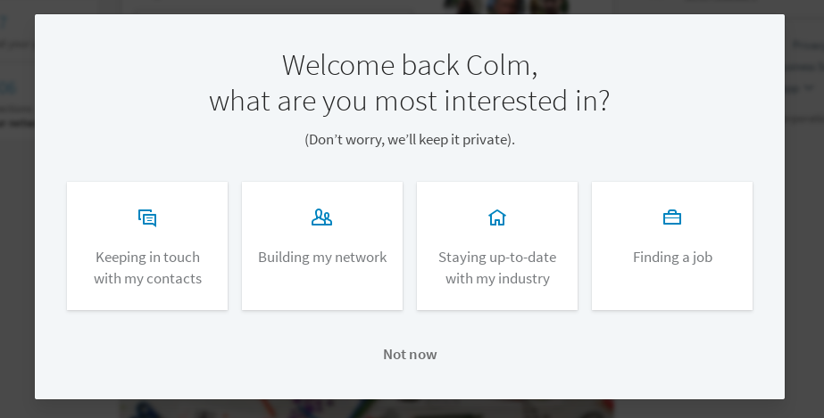
<figcaption>Welcome back Colm, says LinkedIn, like some sort of home comming. After the first question I'm also assured not to worry about answering questions, *we'll keep it private* LinkedIn says.</figcaption>

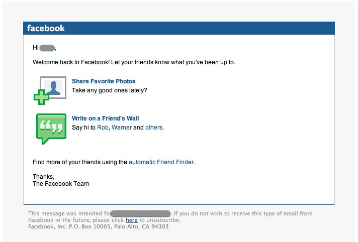

#### informality to obtain consent

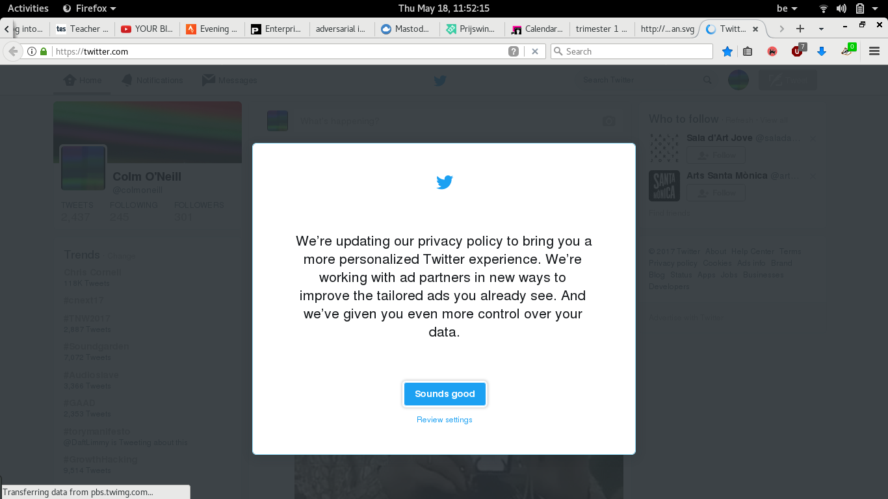

#### informality to explain a point of view

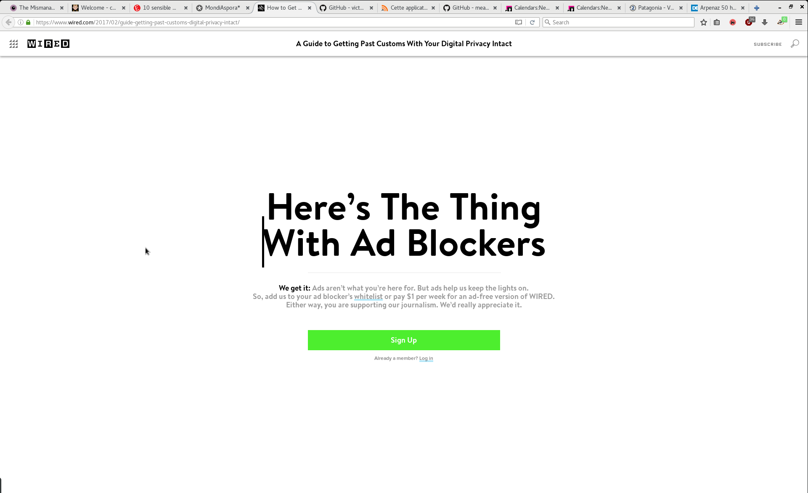

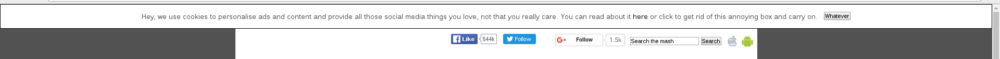

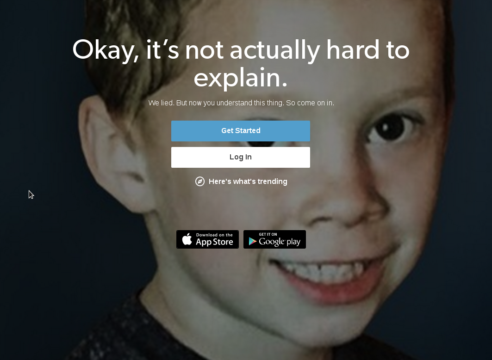

#### informality to express care

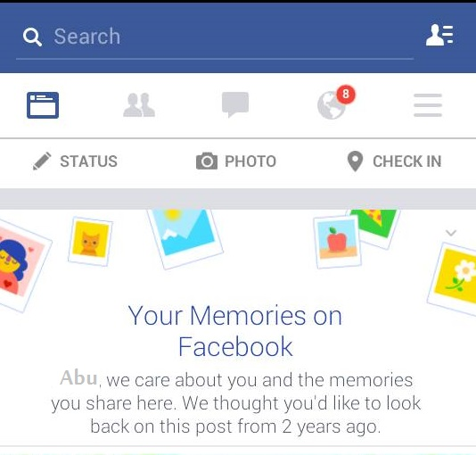

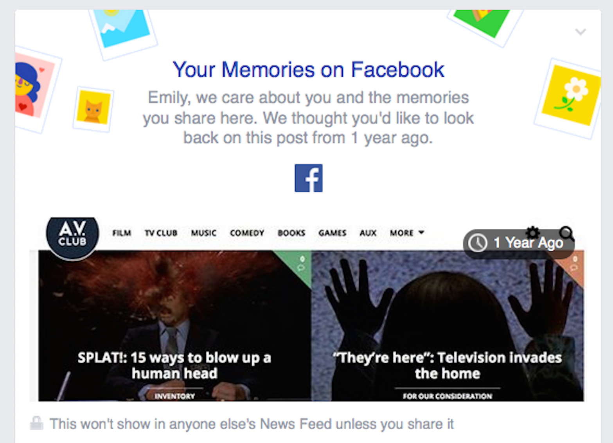

#### informality to detail a change or an error

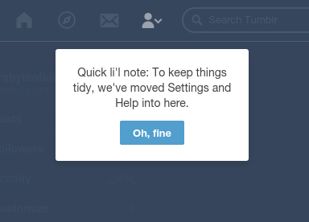

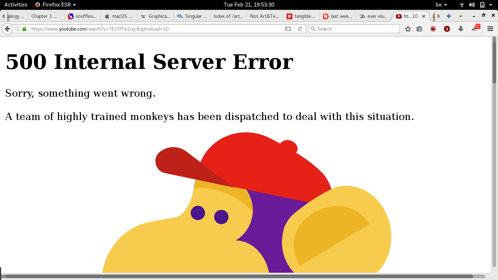

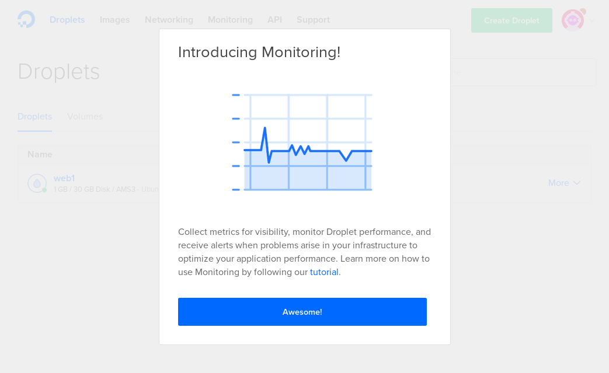

<!-- #### observations & questions -->

## 0 enforced persona

My first issue with the different degrees of chumminess examplified above is a feeling of disidentification. I wonder who is speaking to me exactly? I am visiting specific sites, but am I to understand that an entire website is summing up its voice into these informalities? It is impossible to determine who has built these sentences, but what is certain is that none of these addresses are not in actual dialog with me. This is not live conversation, this is a chipped message. A message for a more or less specific circumstance in which it is considered that I the user must be talked to. Which brings me to consider my side of this message. While the necessity of the message itself is not interesting consideration here, the projection by the message writer of who the reader is becomes very visible.

The practice of UI design and UX design often uses a method of personas. Persona development is a tool used to verify the ease with which the audience of said site or app will find the information they seek. These made up visitors are very often given names, genders, ages, occupations, interests and objectives for the navigation. They are omnipresences in the development process. There is no determining if the makers of all of the mentionned examples above used a methodology of personas. But in this address, with this informality, and with some knowledge of the products, it appears that individuals have not be considered at all as the imagined potential market of these mega platforms is thought to virtually be *the entire human race*.

Wether or not potential different users have or have not been considered in this audience is not my concern. I am perturbed by the use of one single familiar tone to keep the entire possible market 'engaged' with the service. An address and a tone that deals an idea of personal service, but delivers it at scale. The contradiction that informality at scale presents is where these informal modes of address grow.

I would never read a message about an updated privacy policy geared towards better ads and respond the words: 'Sounds good'.

Similarly, it would take quite a ground breaking subproduct from this VPS host for me to respond to the sales pitch with the word: 'Awesome'.

## 1 A rhetorical turn

The large scale audiences that these informalities deal to remind me that while x or y product offers this or that, all of these websites are primarily in the maket of data collection and data analytics. William Davies looks at informal addresses as a rhetorical turn. This turn is a minor rhetorical adjustment in language that can yield significal expansions in data collection through an illusion of 'care'. To use Davies's examples, rather than asking coldly “What is your date of birth”, plaforms simply offer to help “celebrate your birthday!” Rather than demand “your full address,” they invite you to identify a certain location as “home.”

## 2 a compromise of morals

As one sided the advantages of data collection are, there are intitiatives and regulations that attempt to inform the target of these privacy compromising practices. The most interesting one to look at in terms of modes of address is the the ePrivacy directive adopted by the EU in 2011. This is the directive that states that if a site whiches to write a cookie to your browser, it must obtain your consent before doing so. The way in which cookie using websites have complied with the regulation are all methods that work on the flexibility of consent. “By using this site you agree to out <u>privacy policy.</u>”

But in the subversive ways in which sites obtain our consent they reveal a lot more of their politics than might be first visible:

They reveal the importance they give to this regulation, and the importance they place on ensuring their visitors are aware of this consenting act. In this reveal, we get an insight into the morals and politics of the website managers. Combining the attention or not that is placed on mode of address and policy concent it become clear that visiting a site is no longer a neutral act. The visit happens on the terms of the host, and the terms of the access providers. I find myself realising that it's not only my agreement to policy that happens when I use, I am substituting my ideas, my ideals for the ones of the interface.

This substitution deepens my disidentification. I am spoken to as an individual I do not identify with, and my plain acts of being in online spaces associates me with politics I do not agree with.

## 3 totalisation

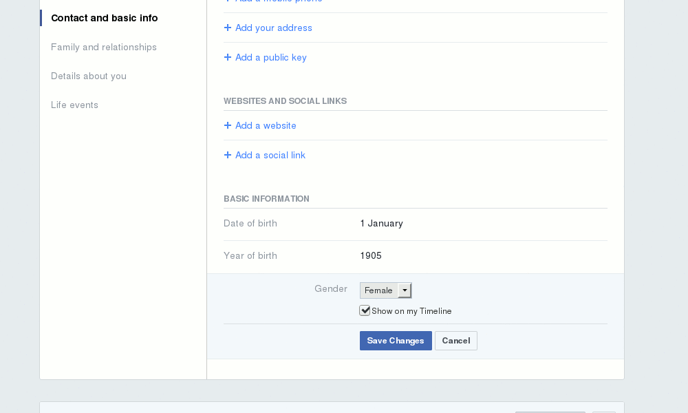

