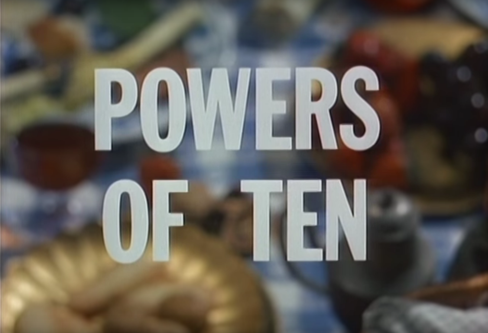

# Matthew Fuller SO[N]IA @ MACBA podcast
Matthew Fuller
11.08.2017 (46' )

Matthew Fuller is an author and Professor of Digital Media at the Centre for Cultural Studies, Goldsmiths College, London. He works in the fields of media theory, software studies, critical theory, and contemporary fiction.

In this podcast, Fuller begins with a detailed analysis of the notion of scale, not only in an abstract sense, but as a doorway into pressing issues regarding ethics, ecology, technology and post-human practices. Following Fuller’s reasoning, the very idea of scale becomes a fundamentally political question in a context characterised by profound environmental damage. As such, it is a crucial tool to measure and understand the world around us, and to rethink it and our impact on the medium we inhabit. This subtle shift of the collective point of view is in a sense the backbone of Fuller’s case, also in the case of his recent work around sleep: “People are conscious in different kinds of ways, at different levels, when they are asleep; but they are also not the classical human subject. So for a third of our life we are not the classical human subject. And this maybe provides a possibility for rethinking the human”.

SON[I]A talks to Matthew Fuller about sleep, procedural imperialism, big data, post-humanity, and what he calls “denial of service attacks on people’s brains”.

Timeline:
* 02:10 The threshold of knowledge has been passed: we have to start working in ways that are collective
* 04:18 Scale, levels of reality, levels of transformation
* 06:45 A very contemporary problem
* 10:05 Water density over large areas of forest
* 11:43 The question of big data and scale
* 16:30 New forms of knowledge and the self: the figure of Chelsea Manning
* 20:50 How do we learn about the world? All knowledge is situated, even the supposedly critic
* 28:18 We are already in the future
* 31:04 Denial of service attack on people's brains: evil media
* 36:20 We spend a third of our lives sleeping
* 41:12 Jonathan Crary
* 41:50 Sleep: rethinking the human
* 43:36 Commodification of sleep
* 44:53 Sleep: an experience that we can not experience

## transcription

Friedrich Kittler proposes that the early 70s was the last time any single person knew what was going on in a particular computer, now the complexity of each semi conductor, each circuit is such that it has to be jointly held knowledge or different teams of specialist within a company would be able to describe this.
That is interesting because there is a kind of threshold of knowledge that has been passed. It's often said that Leibniz was the last real polymath, who was able to operate across disciplines, you know this was in the 17th century.
And if what Kittler suggests is true, then we have a condition where a single artefact has become so complex that a single person can not describe it in all its detail anymore. And this is very interesting state being on the one hand it means that the traditional form of knowledge if humanities knowledge is being held by an individual person is no longer tenable and we have to start working in ways that are collective, to think about what is the form of knowledge that is appropriate or what is the form of research that is appropriate to the humanities and the arts if collective working becomes more and more a way of gaining traction on different scales of reality, then maybe this is something that we have to deal with? But it also that, since the systems are less knowable, there is more capacity in some ways for approaches that de-structure the possibilities for control, there is the possibility within a grounds of a more or less knowable more or less unknowable system for certain kinds of autonomies, certain kinds of freedom certain kinds of experimentation to be established, so the unknowable is also useful in this regard.

A way of thinking about scale is a scale that is a level of reality that may be produced by thresholds and the thresholds are between levels of transformation so they may be threshold of perception, of representation of capacity, they may be of states of matter, so a scale can also be in terms of the level of description that is appropriate to making a more or less adequate account of something. So that a scale can also be an epistemological scale, so a scale that is to do with the way in which a particular mode of knowledge, of sensation, perception, prehension, enters in composition with a thing or a process or a dynamic, but we can also say scales are scales of experience but also scales have something to do with different ordering levels of reality as it also enters into composition with knowledge, so we have scales organise disciplines, to a certain extent, so scales organise the relationship between physics, chemistry, biology. Scales describe the relations between for instance design and architecture, scales are also to do with the way in which both sides are organised into levels of perception, scales might be at the molecular level, at the atomic or sub atomic level, and all of these are produced by interactions of matter and forms of knowledge and forms of instrumentation. They are complex things that always involve relations. A scale is not in and of itself, per say, but in relation with other forms of understanding, of instrumentation, of equipment, of apparatus, that also implies relations between scales. This is fundamental, because scales are autonomous to some degree, has it's own degree of consistency, but also has multiple traces of the relations it has with other scales. And that's I think, a fundamental characteristic of scale.

It becomes a very contemporary problem in a way, a classic diagram of scale is the Eames film Powers of Ten which moves from the cellular level to the level of the organism, to the level of the environment, the level of the city, to the level of the geological land mass to the level of the planet, to the scale of the universe. Each of these different scales are produced by a mathematical move going up by a power of ten, but they are also ways of latching onto a describing scales at which different kinds of logic different kinds of composition come into play. So for instance if you have the level of the human body as a scale, you have a certain set of things that are appropriate to describing it. This is something that Art had been involved in the description of for thousands of years, it's a fundamental part of art, working with the scale of the human body. If we're to think of the / a scale beneath that, you're working a the level of the organs, bodily systems and then these in turn are composed by the scale of hormones, of energy cycles and so on. Each of these scales has their own particular qualities in order to understand them, we have to work with medicine, biology, botany, in the case of plant species, and the way in which scales are interesting are because they demand a certain kind of attention to them, they demand if one is to work in the context of a particular scale or conjunction of scales that particular kind of approaches, of perception, of care are acquired and i think in the present moment, in a condition of massive changes to ecology, massive changes brought about by climate damage, the question of the scale that is appropriate also becomes then a fundamentally political question. What is the scale of a politics that can actually address these questions fundamentally? and hits is something that we have yet to find, a political scale on this planet that allows us to address these questions. And that's not necessarily to call for increased the scale of government, or a world state as some might propose, it's more to think about what is the form of political organisation that can address substantial existential crisis for the planet. It requires a new scale. The scale also also requires questions of composition of knowledge, you know how is it that we're supposed to know in order to act and so, what is it that we're to know, how we're to know, requires thinking about the scale at which we're to know which requires thinking about the planet as a whole and that also implies a sense of the combined forces of knowledge that allows in some sense to engage with the problem, or being to engage with the problem, at the technical, ecological level and political levels.
PAUSE AT 10:04
