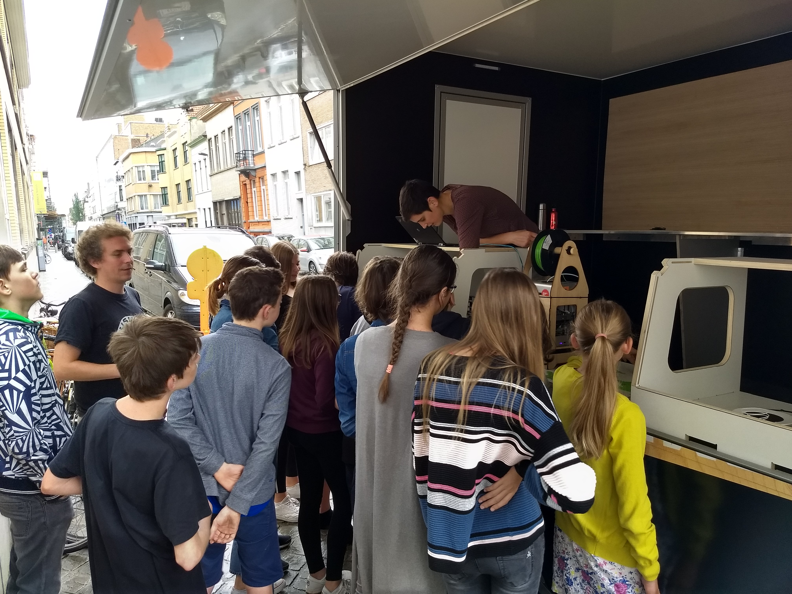
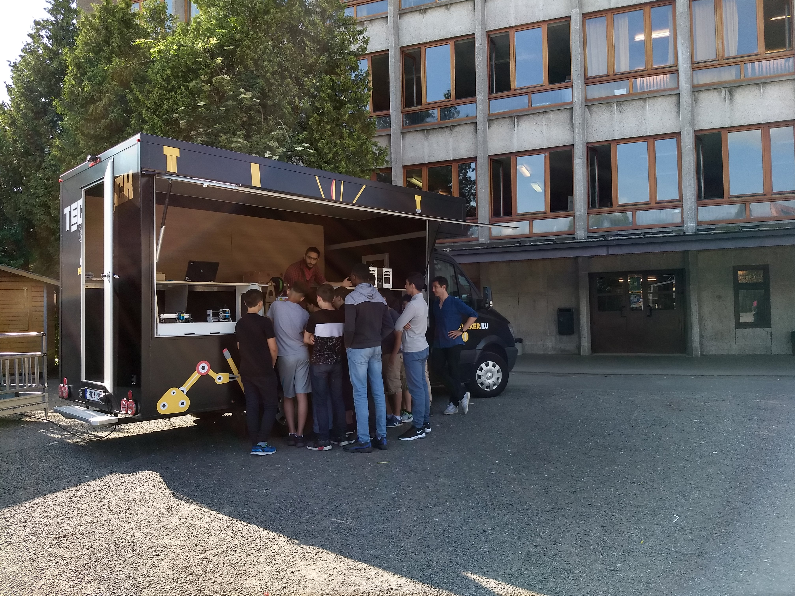
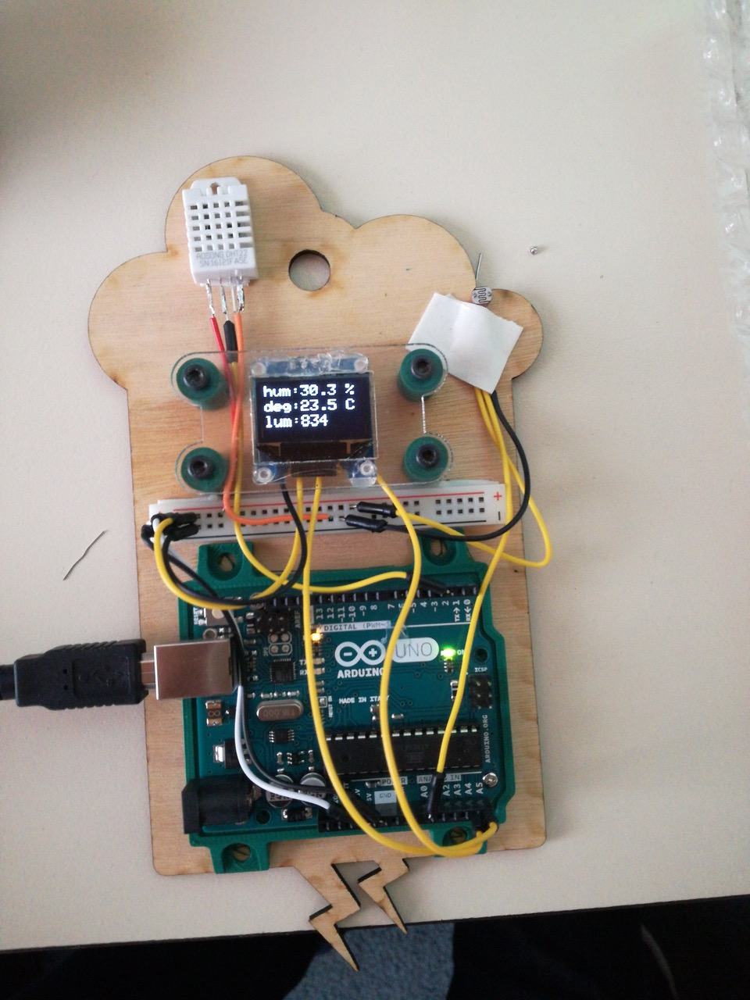
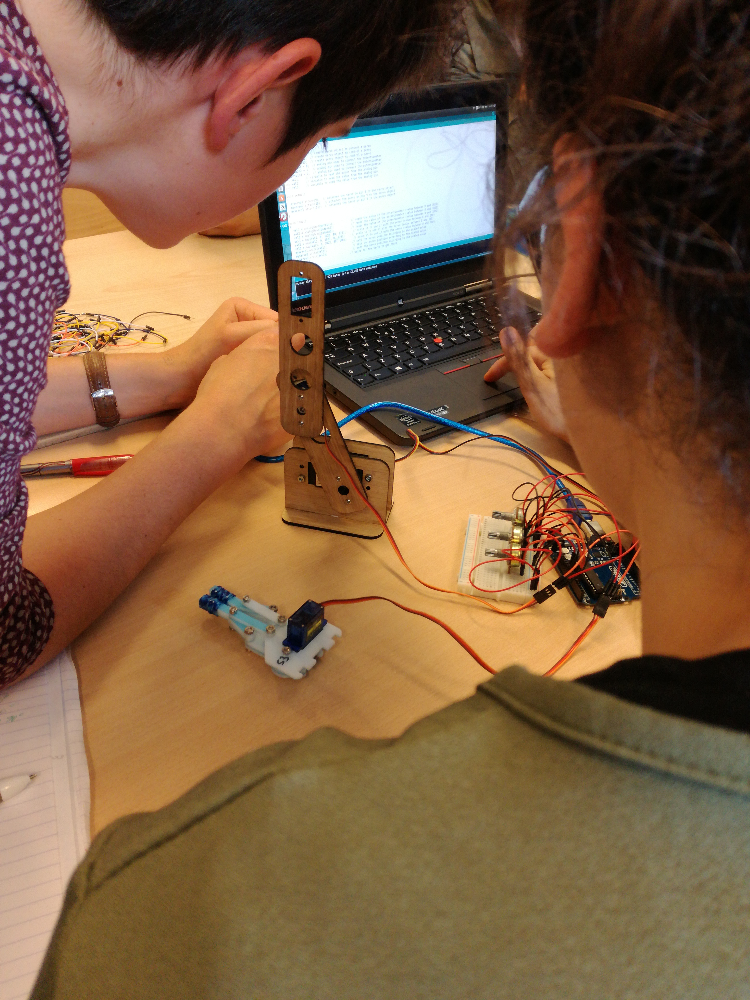
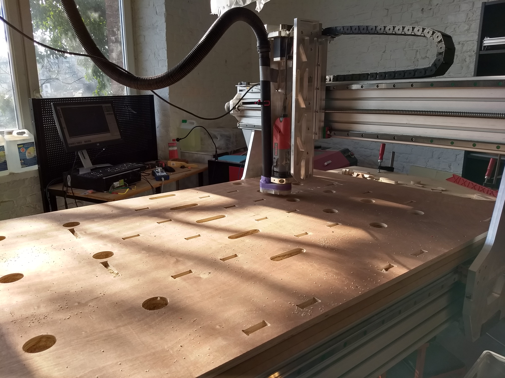
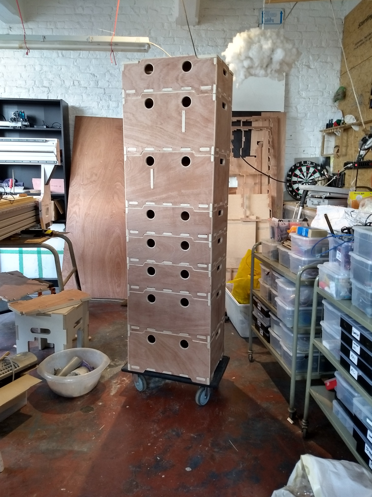
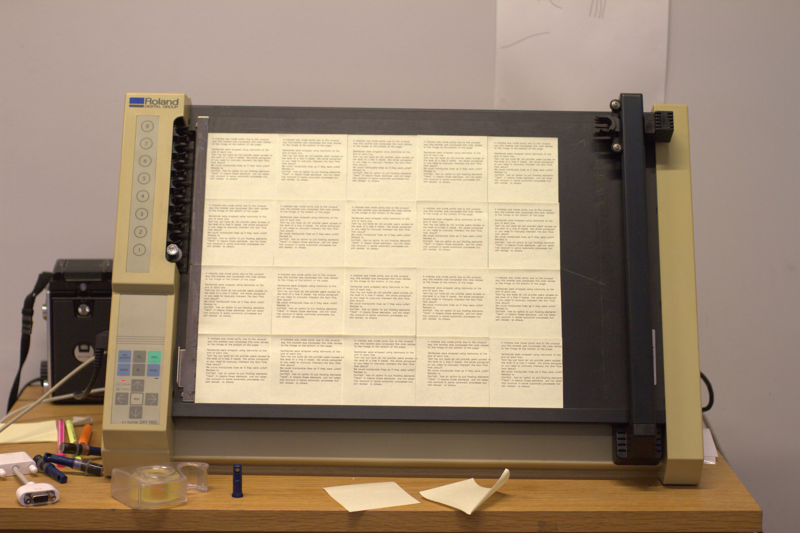

# supporting documents

## Colm O'Neill

These documents detail some of my recent practice in the sphere of fabrication laboratories, maker spaces and educational projects.

#### Research statement

My name is Colm O'Neill, I am a freelance researcher, graphic designer, web developper and teacher. After studying photography, I took concern with how graphic design and interfacing can enable a particular and potentially detrimental mode of address. The formatting of today's technology does not help the common users to understand the way in which it's systems function. My research is still focused on this question top down and while this remains a concern, I continually seek means to work the issue bottom up with my main interest in digital literacy. For this, I have been focusing on physical expressions of *new technologies*, education rooted in experiences, hoping to give grasp on tangible functioning of our numerical surroundings. The projects below detail how this has been undertaken.

#### Working with BeMaker

My current professional function is *education lead* for an organisation called beMaker. The group (http://bemaker.eu) is a non profit organisation from Brussels that is focused on introducing fablab-like practices to students between the ages of 10 and 16. It’s main vocation is to **demystify** what are broadly called *new technologies*. Specifically, beMaker has built two *food truck*-like vans to fully function as mobile fablabs. This allows us to work on school sites directly with children, taking time to, firstly introduce them to what a fablab may be, secondly to give varied length workshops introducing the children to programming, basic electronics and design methods.

##### Everyday practice

{.third}
{.third}
{.third}
 

These pictures show the mobile fablabs in use in various school contexts. The general introduction we give takes between 30 and 50 minutes, depending on the specific interests of each group.

#### Lengthened workshops

{.half}

One of the small weather station built as part of a more extensive set of workshops. The station aims to teach the students to measure and display humidity levels, current temperature and amount of brightness, but also use other sensors. Later, this micro weather station can be updated to receive a digital communication module to log the readings from each sensor for better studying.

{.half}

A second extensive workshop uses the idea of articulated arms, displaying to the students how a tri- or quad-angled robot arm works theoretically. When deployed, this project requires less programming involvement, but needs more parts designing in order to make the robotic arm usable.

#### Production add-on

Below are images of some of beMakers internal projets / productions, these are a collection of little add-ons or creations we had to build to facilitate the workings of the mobile fablab.

{.half}

One of the main issues with making a fablab mobile is storage and security while driving the van between school locations. All of the workbenches and furniture has been custom built for the project. This image shows our storage and transport box before assembly.

{.half}

The boxes are purpose built to carry specific equipment. This box is meant to hold 6 laptops, and their chargers in the smaller compartment. We later laser cut thick packing foam to protect and space out the laptops safely.

{.half}

All the boxes are also designed to stack atop one another. This facilitates safe transport in and outside of the vans.

{.half}
As this small cnc mill serves mostly for demonstrations, we added a speed clamp system, allowing the moblile fablab staff to quickly and easily change the demonstration cutting cards.

{.half}
This laser cutter is small and ideal for demonstrating the tools ability to children. However, unlike larger laser cutters, it does not come with eye protection. We designed and built these UV filtering boxes to add around the lasers protecting all observers eyes. In addition to this, we hand out protective eyeware (also UV filtering) to guarantee no injuries can happen.

#### Pen plotters and Open Source Publishing

Gesture, ductus and machinic gestures have been an important focuses for my research as a graphic designer and as a member of the design collective Open Source Publishing (<http://osp.kitchen>). As a collective we question the necessities and boundaries of the copyrighting systems. OSP always had an educational motivation, most of our members being active teachers. Among our many parallel research tracks, machine tinkering with mid 80s pen plotters quickly became an interest.

{.half}

Bezier side by side with Spiro, one of the first posters I made with OSP.

  
{.third}
{.third}
{.third}

16 case stories, co-position LGRU (Libre Graphics Research Unit) catalogue design.
2012, Print, 24 page booklet, Risograph print and flatbed pen plotter cover. Design with Pierre Huyghebaert. https://gitlab.constantvzw.org/lgru/co-position-catalog/blob/master/facsimile/digital-catalog.pdf

This booklet used the pen plotter in some of it's basic function to print a research outcome booket questionning the practices of page layout. From this *“16 case stories”* research spawned a more speculative writing research project called Drawing Curved, concerned with the nature of curvature.

<http://drawingcurved.osp.kitchen>

#### Relearn

http://relearn.be

*“Relearn is a collective learning experiment with as many teachers as it has participants. It is motivated by the possibility to displace parameters of/for research, studying and learning. During the week of Relearn, we work with a set of case-studies, observations, questions or stacks of study material that we call "tracks". Relearn outlines the idea of resetting thinking modes, for a diverse set of approaches that we can reconsider, that come out of the development of our cultures towards and through digital entities. While Relearn is an experiment in collective learning, it grows from an interest in Free / Libre Open Source Software culture and practices as a way to address and acknowledge the production processes and frameworks involving technology and culture.”*

{.half}

{.half}

Project archives and repository: https://gitlab.com/relearn

#### breadfellows.school

A website, online publication space, pedagogical tool and
archive made in collaboration with Clare Breen, September 2017 – present

Educational methods are rarely considered to be intellectual property however, documentation material, publications, artworks or media gets easily bound to closed licences through copyright. This means (that outside of the academic frame) it is hard to publish research and methodological (reflection) materials in support of new educational research. As the focus of Breadfellows.school is to share and disseminate neoteric educational practices, we publish the written content, the visual material, the supporting audio, video media and the code developed specifically for this site, as a statement of where the research positions itself socially. Copyright and licencing issues were not initial interest in the Breadfellows Chats project, but through our collaboration, developing this platform, we attempt to continue the constructivist, conversational ambition of the Breadfellows project.
