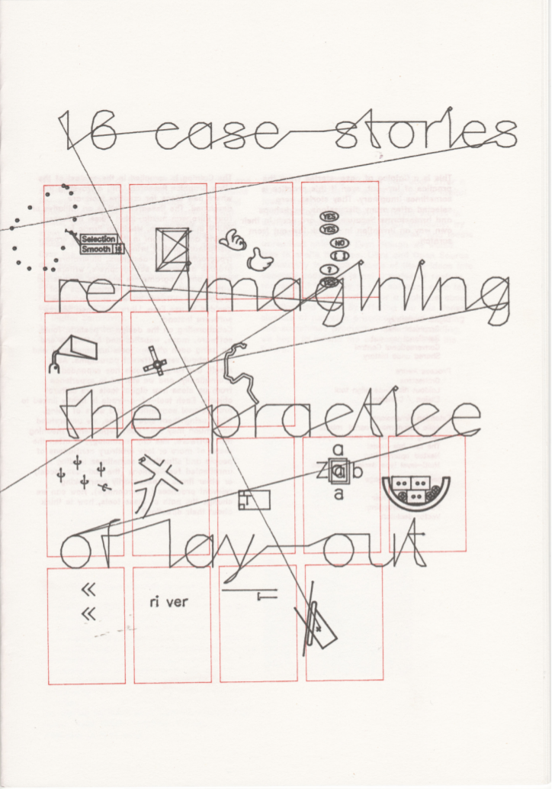
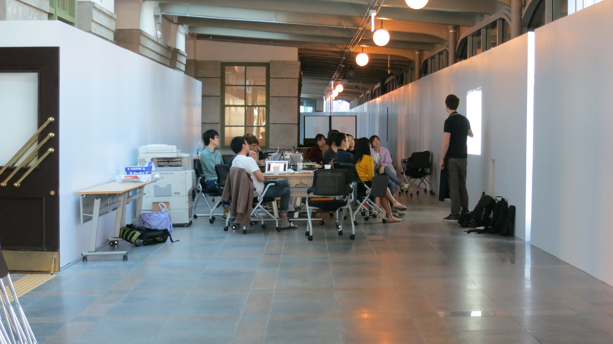
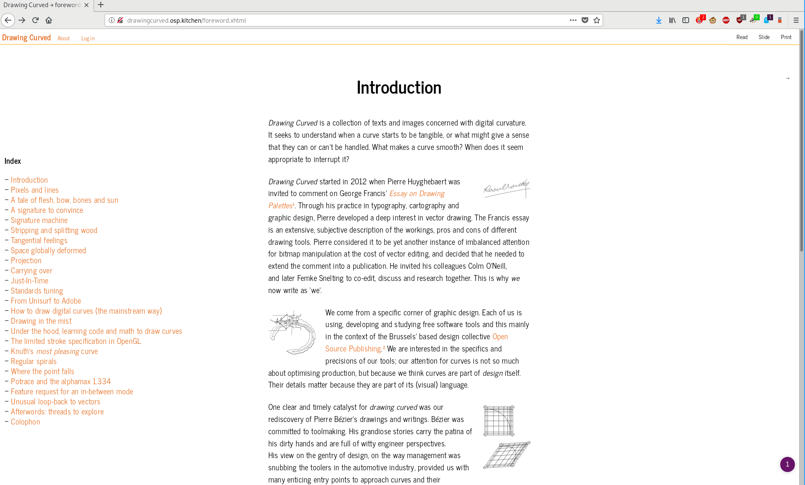
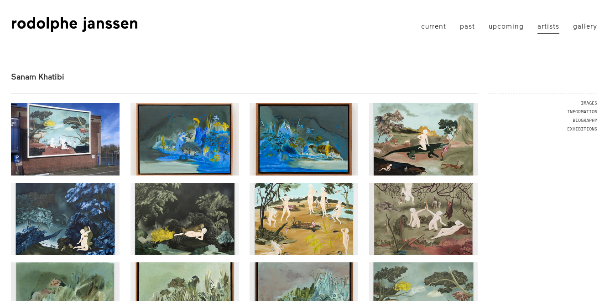
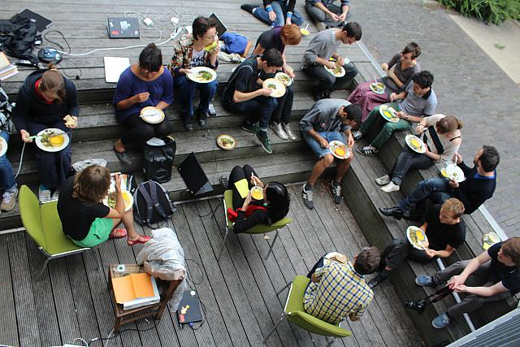
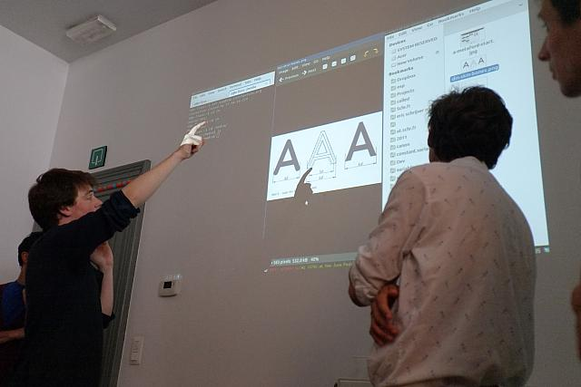
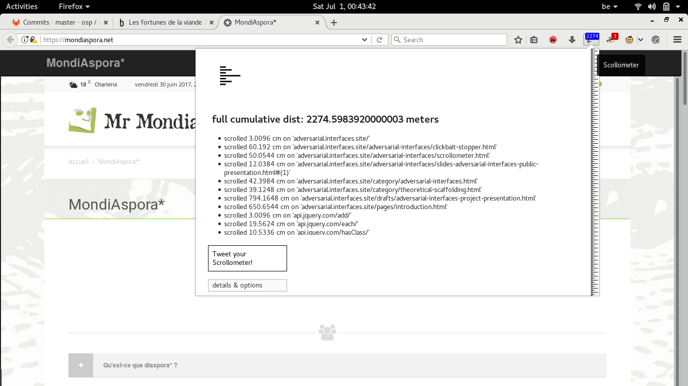
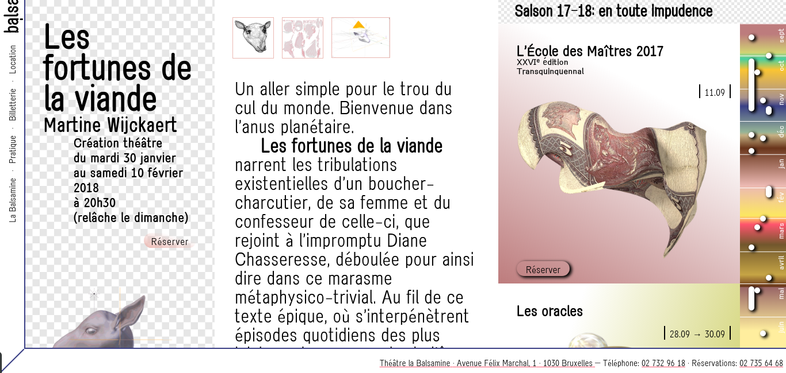
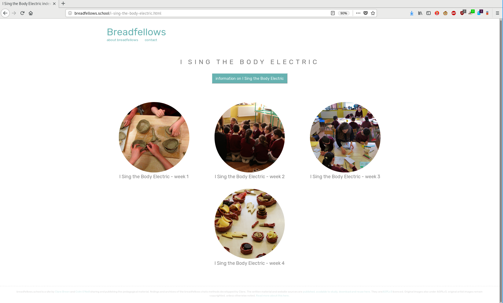

# Supporting documents — Colm O'Neill

These documents gather projects that have a particular dialogical focus. 

## 16 case stories catalogue

2013

{.half}

16 case stories, co-position LGRU (Libre Graphics Research Unit) catalogue design.
2012, Print, 24 page booklet, Risograph print and flatbed pen plotter cover.

Design with Pierre Huyghebaert.

https://gitlab.constantvzw.org/lgru/co-position-catalog/blob/master/facsimile/digital-catalog.pdf

---

## Typoganchi typography biennial

2014

Photograph from Typojanchi Seoul 2013 biennial workshop: during the typography biennial in Korea, we gave a 5 day workshop during which we re-trained tesseract, an optical character recognition tool, to work on selected examples of Hangul script. We focused on tesseract to compare novice human understanding of Hangul to machinic understanding of the script. This workshop's focus was type design, our challenge was to find a way in which to speak of the subject matter without being familiar with the script or the participants being necessarily familiar with Latin script.

http://typojanchi.org/2013/en/exhilaration_en/#contents

---

## osp.kitchen design review

2015

OSP visual culture before the redesign

OSP visual culture after the redesign and at it's current version: http://osp.kitchen

http://osp.kitchen/
Project repository: http://osp.kitchen/tools/visualculture/ & https://gitlab.constantvzw.org/osp/tools.visualculture/

---

## Drawing Curved

2015

Drawing curved is written research commissioned by the Reader branch of the Libre Graphics Research Unit. Drawing curved looks at the nature of curvature, how curves are calculated and how they are presented. The research touches upon signature machines, lesbian curves, guitar making techniques and wood stripping as a source for natural curvature. The text eventually addresses the graphical representation of curves in software and graphical interfaces.

Authors: Pierre Huyghebaert, Colm O'Neill

http://drawingcurved.osp.kitchen/

---

## Rodolphe Janssen website

2016

Rodolphe Janssen is a leading contemporary art gallery in Brussels. This project rebuilt the site from the ground up, harnessing data feeds from internal management databases of artists work and images.

http://rodolphejanssen.com

Project repository: https://github.com/colmoneill/Jason-Scraper

---

## Relearn

2013 - 2017

This image is extracted from the pictures of Relearn 2013. Relearn is an experiment in collective learning initiated by OSP. Since 2013 Relearn has happened every summer, and is coming to Rotterdam in August 2017.

http://relearn.be

Project archives and repository: https://gitlab.com/relearn

---

## Scrollometer

2017

The scrollometer is a web-extension that exists within the context of the Adversarial interfaces project. It offers up metrics that show a view of data collection and interpretation.

https://gitlab.com/colmoneill/WebExtensions/blob/master/scrollometer/scrollometer-1.0-fx.xpi

Project repository: https://git.xpub.nl/colm.WebExtensions/files.html

---

## Adversarial interfaces

2017

Adversarial interfaces is a critical analysis the rhetoric of certain user interfaces. With this analysis and critique the project proposes ways (see menu items) by which to practically and discursively adapt our understandings of computer and network infrastructures in the aim of resisting seamless integration of software and interfaces as totalitised spaces with no alternatives and no outsides.

http://adversarial.interfaces.site/

---

## Balsamine.be redesign

2017

La Balsamine is a contemporary theatre in Schaerbeek, Brussels. This is their brand new website.

http://balsamine.be

Project repository: https://gitlab.constantvzw.org/osp/work.balsamine.www

---

## breadfellows.school

