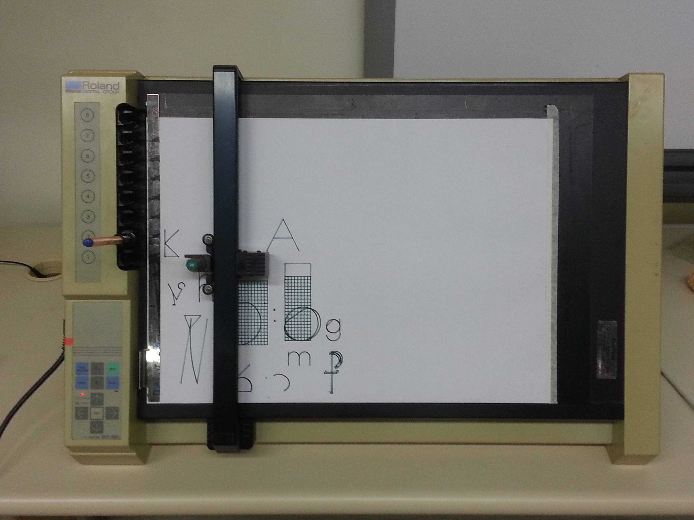
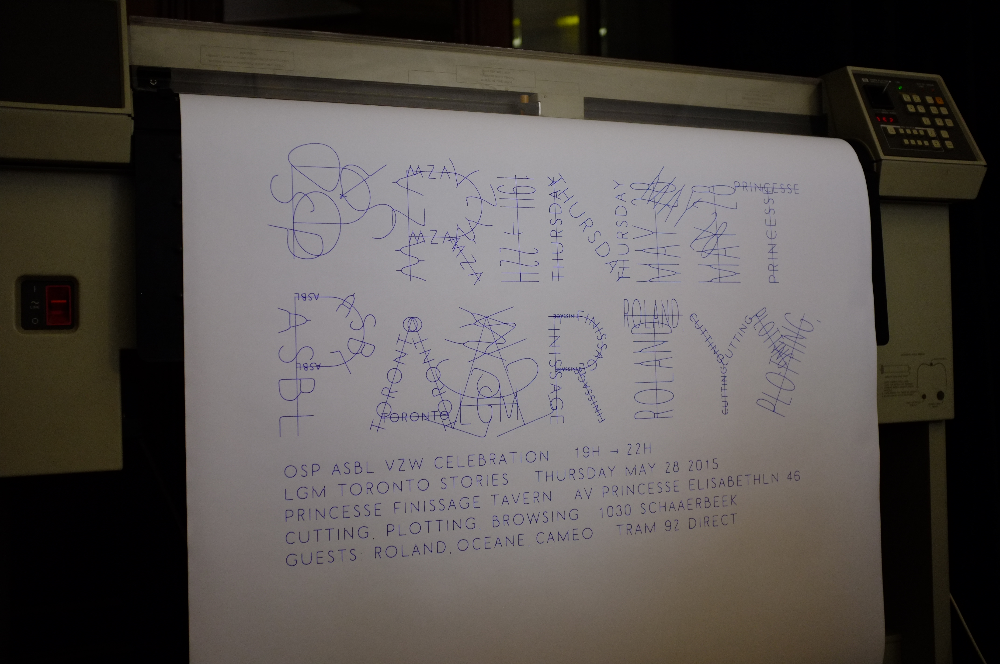
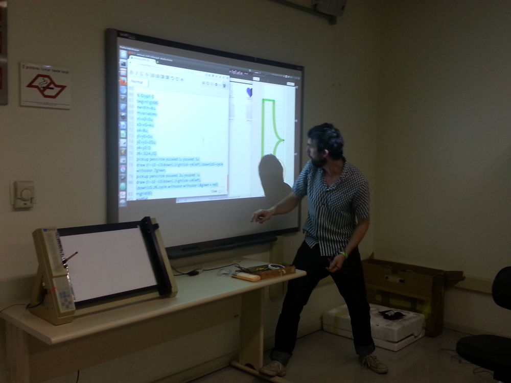
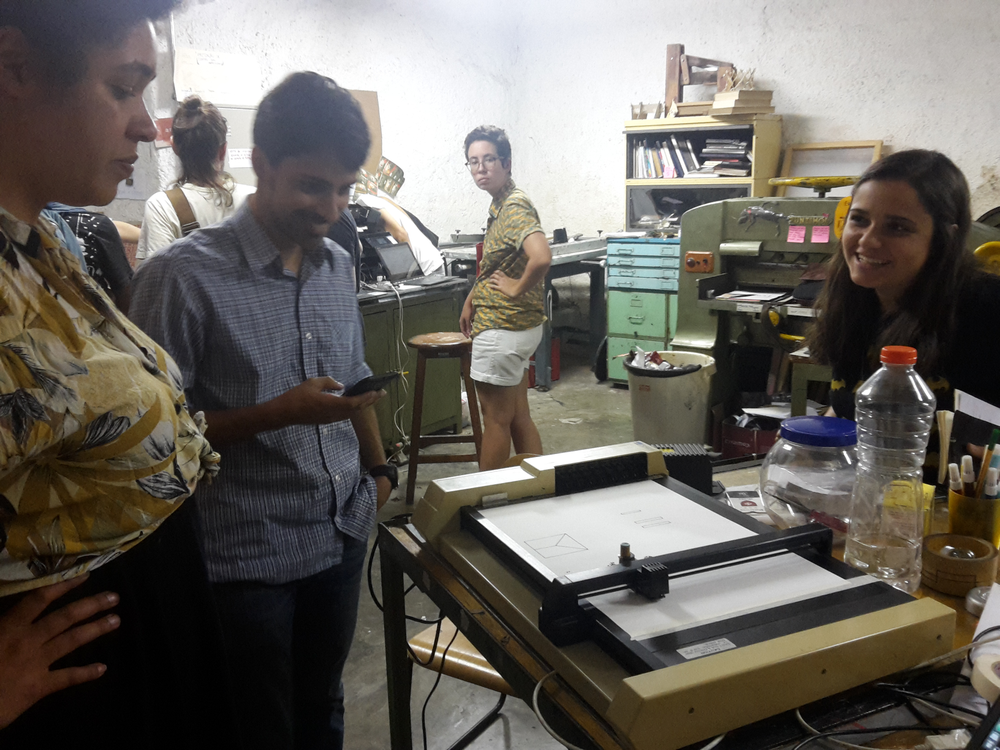
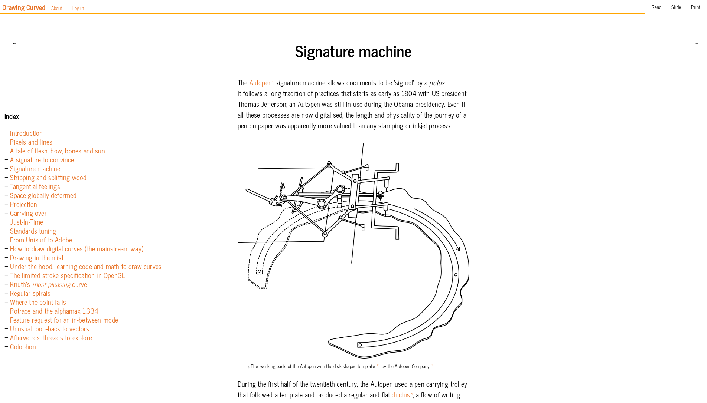
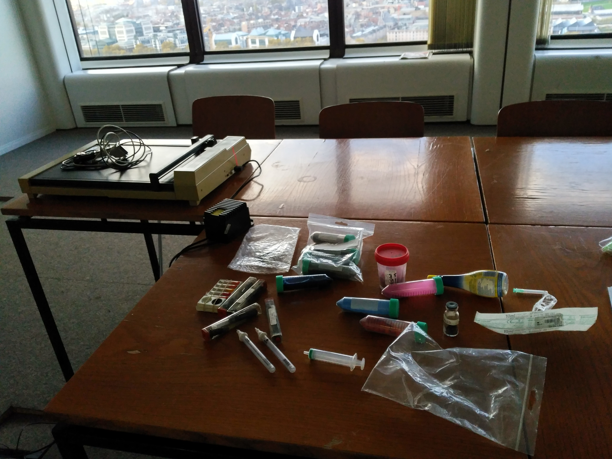
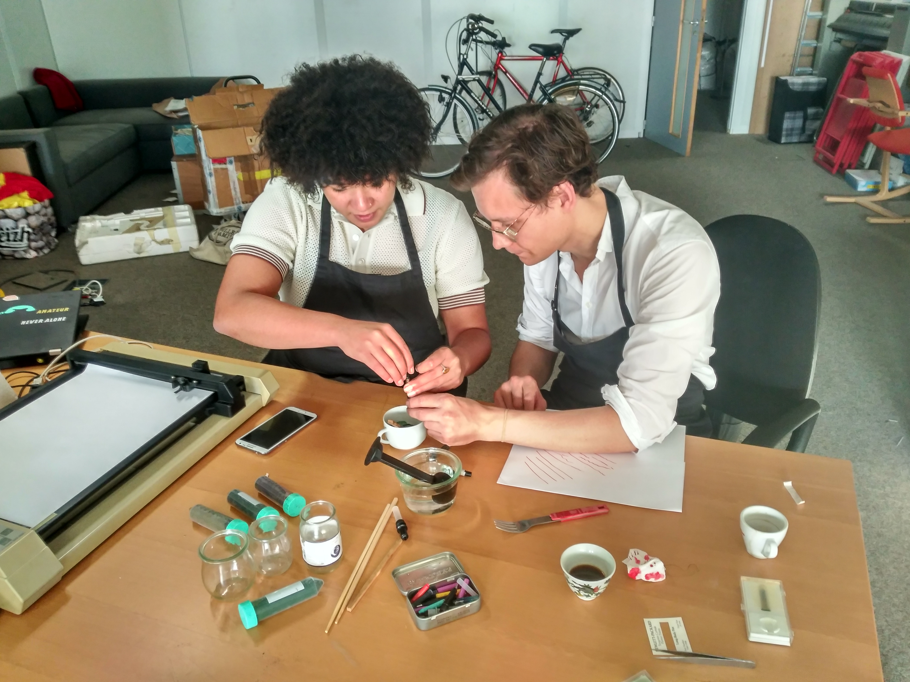
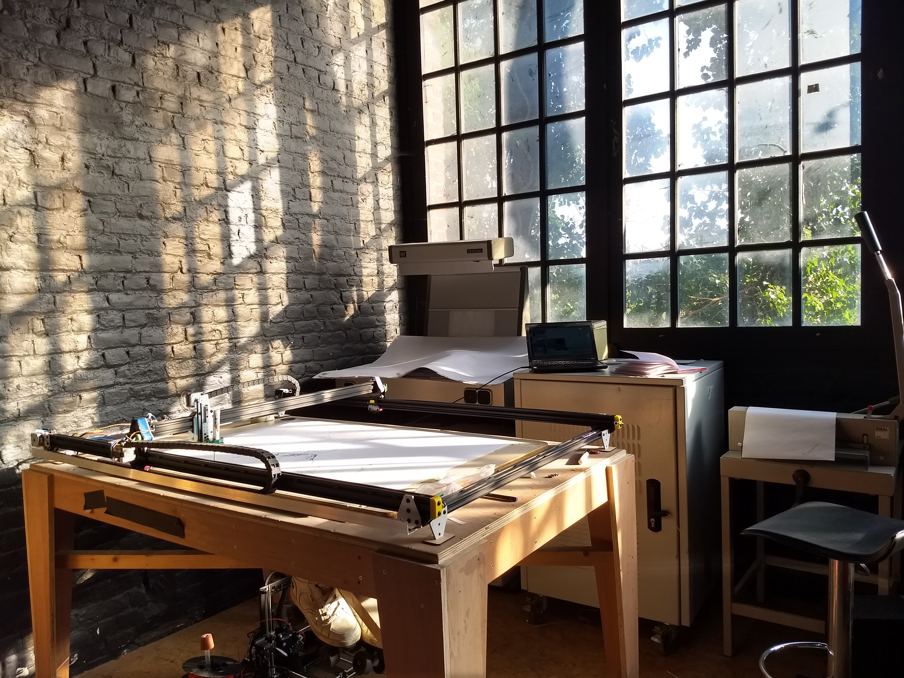
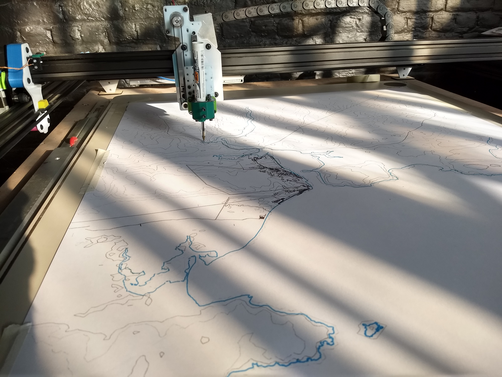
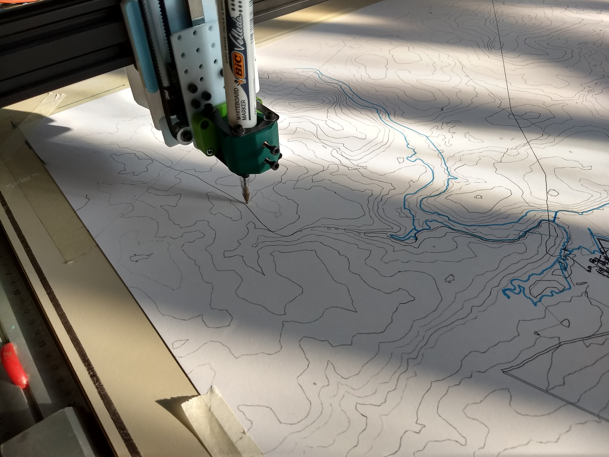

### **three axis plotter** — individual arts grant scheme 2019
My name is Colm O'Neill I am a graphic designer, artist, educator, web developer and researcher. Until recently I was part of a research collective focused on Open Source graphic design and publication called Open Source Publishings 0. I have recently moved to Carlow after living in Brussels, Belgium all of my life previously. I am applying for the individual arts grant scheme in order to obtain funds to self build an automated drawing and drafting machine/tool called a *pen plotter*.

A pen plotter is a type of computer printer that prints vector graphics. This type of printer used to be the norm before the more commonplace ink-jet cartridge printers came to replace them. In it's functions a pen plotter differs from ink-jets as it is only able to draw lines (using pens, pencils or the like) instead of spreading ink to fill areas. With that simple difference between lines and areas, there is a link to be made to the difference between vector (line) based graphics and raster (pixel based) images. This distinction is fundamental to the history of computer graphics, and remains key for any screen display and graphics practice today, albeit a bit hidden.

Pen plotters were used by architects, artists, engineers and scientists alike to 'plot' (or precisely draw) plans, maps, diagrams, shapes, drawings and forms to aid their practices. Multiple computer manufacturing brands built and sold pen plotters in the 70's and 80's but ink-jets came to be more practical (all-in-one) machines for offices and homes. This means that old, second hand, manufactured pen plotters are theoretically available, but the older machines, apart from probable needs for restoration, require of-the-time equipment for their function as well as the fact that they will require a different type of input (meaning *input code*, input format: drawing instructions) to what our modern computers can create.

{.half}

<small>a restored Roland DX1300 — A3 sized flatbed 8 pen machine, used by OSP</small>

{.half}

<small>a HP pen plotter — A0 sized roll top bed, used by OSP</small>

As part of my practice as an graphic designer, artist, and educator, I have completed multiple works using these older manufactured pen plotters. They have enabled my colleagues and I, to construct multiple publications and bodies of research around the subject. This ranged from using plotters as a regular poster output machine 1, a publication tool 2, and tools to use during workshops with art students, graphic design students and computer science students alike 3.

{.half}

{.half}

<small>pictures of OSP during a Metapost / Metafont workshop using drawing instructions to understand how computers read and interpret graphics in the figure and font drawing language mpost by Donald Knuth.</small>

I am interested in this type of machine because vector graphics are the tools of my craft. As a graphic designer, a major part of what I do is manipulating vectors, shapes, typographic glyphs (which are only vector graphics made to look like letters), diagrams and forms. Painters and sculptors, for example, have many common tools at their disposal to practice their craft. It is similar for the practice of graphic design, except that most of my tools are on screen, mediated by keyboards, mice and software. I see very few differences between the craft of a painter and the craft of a graphics designer, only one tends to happen mostly on a computer screen.

My interest in pen plotters stems from questioning of the tools of my craft, specifically the way we can draw on screen. I am deeply invested in the different types of lines curves (Bi-cubic, Bezier curves, Spiro curves, … ) I can manipulate with various software tools I have at my disposal. Sometimes accessing different types curved renders on screen requires an exprimental approach to software, which is why I chose to work with open source software tools, as they let me dive into how they are built.

MORE ABOUT FAB_LAB-like making

It is this way of working that has also kept my interest in output machines, like printers and plotters, active.

The expression of a line or a curve in software, then on screen, is recorded as a mathematical equation. Lines and curves and shapes are combined to build images, but at their core, they are mathematics, resolved at baffling speeds by our computers. The primary advantage of recording/saving graphics in this way is that they have no set resolution. They can be magnified to infinity. The other major method for recording/saving digital images is the pixel or what is called the raster grid (when multiple pixels are put side by side to build a fine grid, resulting in an image). The pixel / raster method is interesting in instances of capture (photography) but after this capture has happened, the medium is set, the resolution is set, no magnification or up-scaling is possible. Raster based imagery has been the dominant form of digital images in the last 20 to 25 years but my belief is that vector based images are actually truer expressions of our surroundings. They might not depict objects in the way a photograph can, but our eyes do not see the world the way a camera captures. Our eyes are sensitive to light of different wavelengths, our brain comes to understand these wavelengths as colours and shapes. For me, vector graphics, in how they look and how they feel, are closer to physical wavelengths and light (or even sound) than pixels. I have written more about the artistic value of vectors, lines and curves in a research text co-authored with Pierre Huyghebaert called **Drawing Curved** 4.

 <small>screenshot from the web publication http://drawingcurved.osp.kitchen</small>

One could question why I am attempting to build a new plotter when these machines seemingly already exist. While the older pen plotters are objects of beauty and hold true historical value, retrieved and restored 1980s / 1990s pen plotters have their limitations. Having mentioned the older interfaces (cables) and older input formats (& languages — HPGL (Hewlett Packard Graphics Language)) the problematic limitation of the older machines is that they are two axis machines. HPGL plotters function on two axis, an X axis (usually moving from left to right) and a Y axis (usually top to bottom) to carry around a pen to draw shapes in a two dimensional space, on paper. The carriage system for the pen has two states, *pen up* or *pen down*. Pen up allows the machine to move without placing tracing on the paper, pen down is to place ink on the page and this is sufficient for many operations. But the possibility of controlling a third axis, the Z axis (moving the pen up and down similar to applying more or less pressure to the pen or pencil one uses to write or draw), opens the door to many more types of output with this machine/format.

 
 <small>Bezier vector projections, three dimentional (like a 3 axis plotter) aside two dimentional (like a pen up / down plotter)</small>

The project I am applying to fund is to self build a pen plotter that can firstly be controlled with more modern machine code (movement instructions) G-code as opposed to the older, slower HPGL. Secondly, I intend to make the z-axis full dynamic axis of movement, not a simple up or down state. This will allow a wider variety of pens and drawing tools to be used but also brushes, sponges, cloths and other non-pointed drawing tools. Additionally, the possibility of using custom inks is currently being explored.

I intend to build this machine in collaboration with and using plans distributed with/by an ex-colleague Julien Dutertre, a French artist based in Brussels. Julien has been working on three axis machines in various setups and is the designer and builder of home made CNC (Computer Numerical Control) milling machines, home made 3d printers and and multiple prototypes and versions of 3 axis pen plotters. In the last year of working with Julien (as part of BeMaker ASBL — cfr. CV), I was able to get familiar with modern fabrication and prototyping techniques (3d printing, lazer cutting etc) know as Makerspace or FabLab practices. Along with this I learnt about how Julien re-uses drivers and software meant for CNC milling machines on pen plotter prototypes. A CNC mill already has the ability to move a tool along a z-axis.  The CNC mill holds a spinning spindle intended to cut flat stock of wood, metal or plastic. The difference here is that the pen plotter will only hold a pen for which the height can be precisely set or varied over the movements drawn.

<small>image of the latest pen plotter prototype; comfortable page size: 70*100 cm, Loop Studio, Ixelles, Brussels</small>

<small>detail of y and z-axis, dislaying how the pen holder can move up and down</small>

<small>detail of ongoing plotting/drawing, here a cartography of Youghall bay and the River Blackwater, Co. Cork</small>

Moreover, the software and firmware required to build this type of machine is published with open licences, the code itself is made open source, which is in itself an invitation for makers and tinkerers to employ the code. (The plotter would be build upon the GRBL controller, running off a Arduino micro controller board.)

My artistic and graphic practices revolve around digital graphics, cartography, typography, information graphics and web technologies. My application for the funds to build this three axis pen plotter would result in a tool that could better my own practice, but also serve as a workshop tool, firstly as method to explain vector graphics, but later to be used as a way of thinking about vector in opposition to raster based images. Within my practice as a member of OSP we have conducted a set of workshops using manufactured pen plotters as shown above, but the possibility of a three axis machine opens up the potential for workshop with all sorts of artists, sculptors as well as graphic designer, students, art enthusiasts and more.

References:
0. OSP — Open Source Publishing — http://osp.kitchen
1. http://blog.osp.kitchen/news/osp-asbl-vzw-celebration-print-party.html / http://blog.osp.kitchen/news/article-iii-goal-social-object-field-of-action.html
2. http://git.constantvzw.org/?p=lgru.co-position.catalog.git;a=blob_plain;f=facsimile/digital-catalog.pdf
3. http://osp.kitchen/workshop/meta-brasil/ & http://osp.kitchen/workshop/meta-port-au-prince/ & http://osp.kitchen/workshop/meta-fig/ & http://osp.kitchen/workshop/metapost-workshops/
4. http://drawingcurved.osp.kitchen/ & http://drawingcurved.osp.kitchen/foreword.xhtml
