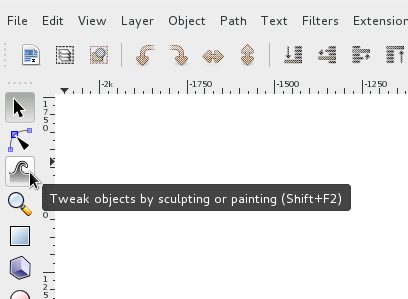
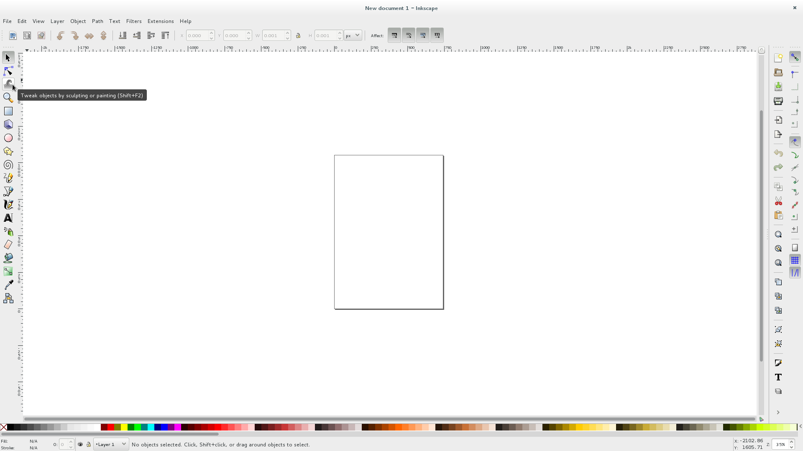
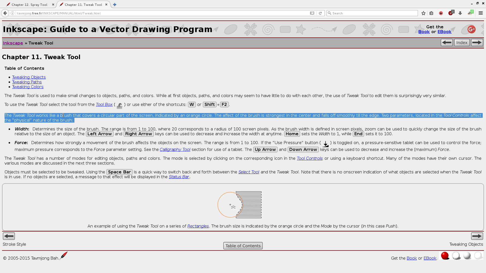

Title: Project proposal v0.3.2
Date: 2016/11/29

# Project proposal v0.3.2

This research project intends to highlight the importance of different modes of address. In short, the term *modes of address* can be explained as; the *way* we talk. In the case of a service, a device or a tool; the way it talks.
 I'm interested in the relation between the employed mode of address and if / how it enables deeper or alternate understandings of a particular subject matter. My hypothesis is that different modes of address have a great influence on the access to and engagement with the knowledge relative to the subject matter. This theory is the foundation for my project, which I will apply more specifically in the realm of visual production software.

At the moment of this proposal, two ideas are bringing the notion of modes of address to the foreground: firstly, realising that *visual production software is a young, new —isolated— culture* of it's own. Meaning that when this type of software was made, initially at least, two cultures came together, a design culture and a computing / computer science culture. When saying that visual production software is a culture of it's own, I'm expressing a desire, wishing that both cultures could come together in a more interesting manor. I believe that the new practice-vocabulary that came out of the collaboration of design and computing culture could have been —could still be!— more alternative, making more backwards and forwards motions to and from the application of design methods thanks to computing methods. Meanwhile, why does the speech, the wordings and the sequences of actions in software that enables visual making, not give larger insight? Insight into what pre-software design practices got affected by the perspectives of computing. Instead, the words and names used in visual design software give more instructions that are named after methods, procedures, ways of getting things done. They are not telling of any history or skill not from design, nor from computer sciences.

Secondly, realistically speaking, it's understandable why the vocabulary of software is so, and I do not wish to disregard the power that these software tools can enable. I think at first the transformation of design practices into on-screen actions were viewed as a way to make the designer more efficient, which brings me to the second notion that flags modes of address as important for me. If the neglect of the stemming cultures have affected the vocabulary of software, efficiency has possibly affected *it's tone*;
 Efficient making in design is complex. Efficiency in itself can't really be seen negatively. Most industrial cultures have interest in fast production. But aside from the social and economical dimensions that surround efficiency, it's attitude has been baked into the way the tools I'm discussing with this project. Again, I believe the first reasons for bringing visual designing to software was an interest in being faster. But this focus has permeated most computer and interface practices. It certainly has a key place in the work of the new digital industries, interaction design, user experience design, mobile design. However, efficiency, at it's core, affects how we execute, affects the order of a procedure. It therefore also affects the language that describes the procedures, the language employed by the interface.

My perspective is that what we are left with is a genre of software, a type of tool, that wants to be creative, but negates the cultures it hails from, while trying to make the user execute sequences fast and efficiently, in it's very own ‘autistic’ language.
 Some of this can be altered. Parts of this can be balanced back out, changed so that they speak more clearly, make more links to where the practices came from, and have a tone that encourages more testing and using for discovery than using for producing.

Note: My reasonings and aguments for the importance of this knowledge transfer to happen within software is a topic I'm developping in my thesis, in chapter ‘Defining craft’.

---
## an example of the problematic tone:
From inkscape interface tooltips, on hover:
> Tweak objects by sculpting or painting (Shift+F2)

---

From inkscape manual, accessed by selecting Topbar menu item Help > Inkscape Manual —focuses browser on page ‘Inkscape: Guide to a Vector Drawing Program’ > Section 12. Spray tool
>  The Spray Tool is used to distribute copies of an object (or objects) much like an airbrush would paint drops. Three modes are available in the Spray Tool-Tool Controls:

---

I plan to drive this research by taking apart what modes of address can be or can mean; investigating the existing knowledge in education theory, accessibility practices, interface design, tool making and most likely, other topics that I am unaware of at this point in time. To do this, I will be interviewing various people about their vision of what modes of address can be in their field.

In parallel, I will be pushing forwards my understanding of what modes of address are in my fields by conducting experiments. Clearly, my *understandings* and the questions I will be posing to the people above will cross paths, but I imagine these to take different forms.

One example of how I wish to pursue one of my understandings, by using practices from manual craft and labour, in the wood workshop. I'm interested in hand tools. More specifically, I'm interested in handles. Handles as a silent device that communicates how a tool is meant to be used. The shaped wooden handles on the wood rasps in the photograph invite you to put the tool in your hand, and tell you by their physical shape how the tool should be held. Smaller finer tools have a different size, so do their handles, bigger coarser ones are chunky, heavy and manage a different type of work.

<!-- for tangible.tools output -->
<!-- for git & wiki output -->

An other example are the set of experiments that have been conducted up to now, with software tools. The current test goes as so: I sit a candidate down in front of a computer that is running a drawing software, I ask them to perform 3 simple tasks, but to do so by speaking out loud the way in which they are proceeding when navigating on the computer. Sentences arise out of these recordings such as: «Now there is a red thing between the two points, and I will pull on the red thing to make the line curve a bit.» This is an embrace of what 'usability tests' are, but are analysed in a way that is more about comprehension and addressing. This also somewhat crosses the aformentioned field of accessibility, an area I believe to be rich in ideas that keep technologies usable for people who out of the designed scenarios. Physical handicaps, but also technological limitations, slower network and computing speeds.

Both of the methods of interview/research and tests/prototypes will be brought back to the project in notes and texts that will document the research, most likely published as they are being written. The web assembly platform at http://tangible.tools (while still being built) should give an idea of this.

---

In terms of timetable, The two portions mentioned will happen side by side. I will afford myself the time for this research to happen. At this point I am not concerned about the forms that this work could have by the end of the school year. I am not interested in making an installation. However, setting a intermediary point in February seems sensible, to take account, to decide what tracks are flourishing, which ones should be abandoned. At that point, I could chose to develop one or more axis into some sort of self standing branch (a publication, a website, a physical object, a lecture, a video) or to pursue the research project as is.

---

My motivations for this topic come from observing the attitudes built in to software I was taught to use while training as a graphic designer. Restating some of the content from the introduction; These digital design tools exist thanks to both visual crafts and computer sciences. The computer procedures are used to extend the realm of visual design craft, but seem to make the original 'hand' craft absent. It's the new, in-between, practice that appears in the space left by the two that I am concerned with. Using these design programs does not lead backwards to the craft, and it does not really lead forwards to the automation's and other possible power that computing offers. This makes the doing of the job very focused, but also very autistic and isolated. I'm doing this research because I find it —at the very least— a shame that the interstices are not made more obvious. This, to me, points to a big failure in mode of address and speaks loudly to how incapable the vendor thinks their users. Further, I will argue that the the bordering cultures are areas that should be investigated by the users / designers. Ultimately, I believe it to be —at least partially— the responsibility of the software vendor to not only build and develop the pathways between the bordering cultures into their software tool, but that the mode of address they use to accomplish this and all of their other goals need to have a mode of address that is engaging, accessible, non condescending, and non patronising.

## Who can help you and how?
An aspect that has emerged from the interface observation tests and exercises are some notions of narratives. To accomplish tasks in some of the software I've observed, several steps are needed.*First this, then that parameter, then this mode then the action, then maybe some tweaking after.* Interfaces have time-lines. I am surrounded by script writers and story tellers, I will be asking for help to look at this narrative in different manors. Maybe a narratology perspective from Frans-Willem Korsten will be helpful to widen this area.

## Relation to previous practice
A part of my previous practice is given in the motivation paragraph, as is in the intro, but an other part of my previous practice is my history with the graphic design research collective Open Source Publishing. This group works collectively around questions of alternatives to the mainstream (arguably industry standards) tools for design. The answers to the questions of practising modern digital graphic design with open source software have been multiple and in various shapes, one of which is the belief that learning software alone is not easy and should not be done alone if possible. Therefor, OSP has been part of —and organised— many workshops where software practice is spread out on the table for people, together, to learn from each other. This, sometimes, has put me in a position of *teacher*. Where I try and introduce a procedure to a group, and need to find multiple ways of explaining the subject matter to remove it from it's abstract nature. It is in this position that *modes of address* as a pressure point became clearer.

## Relation to a larger context
The larger context that this topic poses is one of knowledge, culture, and morals. I believe critically observing modes of address could lead to a better understanding of why new users of the programs I am talking about hit such a big learning curve from the very beginning. I also believe that some of the *ways of talking* inside software, pruning efficiency over cross culturalism, are ways of understanding how the maker of the software tool views it's user, and the way they intend their tool to be used. That use case is one very sequestered narrative.

The moral context of this is, in my view, very bleak; it seems to stimulate the polarisation of a field that really has no need to be, and as these sequestered narratives move their tools out of our laptops and onto the clouds, the de-skilling of the user is taken one step further. I think that in my moral views I have a duty to communicate, in a way that is understandable, accessible, not condescending, and not patronising, why this is the wrong path.

## References
