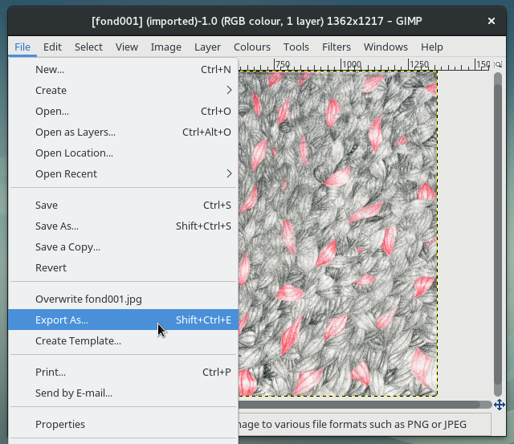
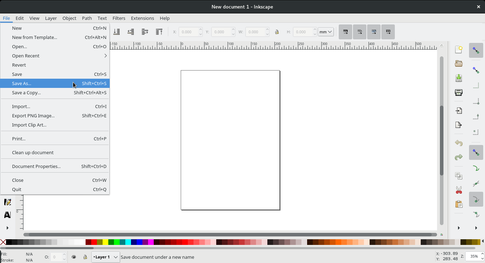

Title: Chapter 2 — Efficacy or efficiency
Date: 2017/01/03

# Efficacy or efficiency

<!-- ### intro + definitions -->
I feel like there may be confusion between attitudes of *efficacy* and *efficiency* in the software industry. The confusion exists on both ends: the user and the maker. Efficacy is the power or capacity to produce a desired effect, effectivity, effectiveness. Efficiency is the ability to avoid wasting materials, energy, efforts, money, and time in doing. These two are closely related, but they are different visions for doing. I don't think this distinction is in any visible way obvious, from the users point of view at least. This has more to do with attitude and the vision that the tool maker has of it's user, her/his practice and way or reason for employing the tool. I think the misunderstanding of efficiency as efficacy has also come to further confuse our thinking of digital practices as crafts of abstraction and as practices all together.

<!-- ### easy intuitive fast — trade words -->
Today's commercial software makers are in constant competition. This is firstly because of the few choices of commercial computing systems available, but also because there are multiple ways of bringing solutions when the matter is digital, and multiple implementations there of. Boiling down competition benchmarks in this field comes down to two things: feature parity and ease; tentatively justifying in commercials how x solution or y product will bring more ease to a task. Software seems to be traded in terms of *Easy, intuitive, fast,* or even the ever simplistic *‘it just works’*. These qualifiers speak to the experience of use, rather than talking about the tools or tasks themselves. Speed, ease and good experience are what is sold to us, and this is what we are told we must expect.

<!-- ### speed -->
Speed for accomplishing a task is a parameter of the historic, economic and ideological developments that we reviewed in chapter 1. The desire to do something fast, because I have other things that I need to do (fast) seems to descend from a capitalist mindsets preaching that time is money. In many ways, without some aspects of industrial capitalism, I probably would not be able to voice these opinions of and though these mediums, so I'm not saying speed or capitalism are direct destructor of computing (comprehension or conscience); however, the consequences of a capitalistic view on products, solutions and tools for virtual practices have affected specific dimensions of software tools, mainly in their attitudes and speakings, which are now geared towards answering problems and answering them efficiently. Efficiency ends up affecting all interface elements, from menu labels, windows, the launch of a process, right through to document saving and exporting dialogues. One example of this is the preliminary need to set a document type or size when using canvas based software. The very first steps, before any manipulation or any virtualisation, requires the user to plan the output of the session. Having to chose a reference size, a colour profile, even sometimes a preset template before any practice can happen is telling of a tool that wants you to set facts, get them out of the way, narrowing the frame to get done with the task faster.

Of course, this choice would have to be made early also in the analog process, but virtualised practices recorded in files have the ability to be written and re-written at will. Probability is that the initial step of setting a scale in software comes to mimic the manual procedure, I plainly feel like this imitation sets an non-interesting boundary that goes against the nature of re-writable files, and computer systems. This prerequisite scale step, thinking of output before any input, shapes a linear process that has a set start and a set end. I believe this comes to limit how the tool is understood, or how it could speak of it's boundaries. If physical scale was a requirement for the exporting process alone, maybe the making and using in the tool would be slightly less grounded, more flexible, truer to the possibilities that live memory systems offer. In turn, I think a change of this order could let a user understand what digital virtualisation can bring to a practice. By this, I do not mean say that software tools should be less specific, less direct, or less applied to a field, nor should they not draw upon the established practice that they virtualise, but changing the order of the established procedures would be telling of a virtualisation that augments a practice instead of only virtualising it.

<!-- ### example of speed, timeline -->
Another example is a slight difference in saving procedures between two of my most regularly used canvas based software tools, Gimp and Inkscape. When my edits are done and I am ready to use my transformed file in other contexts, in Gimp, I must use a specific menu item labelled ‘Export as...’ that enables export to image file formats. The ‘File’ drop-down menu in Gimp also includes ‘Save’, ‘Save as...’ ‘Save a copy...’ before the export section. However, in Inkscape, the ‘Save as’ item is the one that I must use if I am to use the current file in other image formats.

There is logic to this difference, mainly due to the nature of the file formats and mediums that each program treats respectively, but the fact that Gimp asks to and uses the word ‘export’ delimits the space in which it was intended to act. This work has a timeline, and if you're hovering over the export menu item, you're very near the end of it. Keep in mind that typical export formats, jpeg, png, tiff, gif, are all formats that are accepted as initial input (through the import menu item, just a few lines down), so why this need to export? Meanwhile, Inkscape places static image formats inside it's general save menu, keeping *other use* formats and Inkscape augmented formats on a level playing field. The point of this example is not to compare the working of one tool versus an other, these are vastly different programs, respectively working in vastly different data and image types. The methods and working of the program descend from the different handling of bitmap and vector graphics. Instead the example is to display how, in some software conceptions, manipulation happens in the only intent of having an output, being an item in a chain. As with the paper-size example, this is small interstice I'm pointing at, but one that I find to be very telling. The reality is that Gimp of course lets you save working documents, in it's own .xcf extension, but the split here is in language, and the order of the usage process. The organisation of menu items and the actual words that are used to action them are immensely important for the user and thus very important for the understanding of the intended spheres of use and action of the tool, by the makers. A productivist mindset has a harsh effect on any medium, leaving no space —or time for exploration of a tool for it's own sake. The tool that asks for 'export' does not speak of itself as an environment for manipulation and testing as much as it says that it is a set of procedures that are not valuable in other contexts than the ones they are intended in.

<!-- ### object oriented speed -->
Non negligible is another understanding that can be had of *rapidity* as in: processing *speed*. Traditional software (the kind that runs on your own machine, and your own local architecture, in opposition to off site cloud computing) has to deal with resource optimisation on a system level. Response to this management need leads to a way of building software called object oriented programming. In the background, programs get sectioned up into objects —a unique unchanging entity within the program complete with definitions of data and operations which it is permitted to carry out. The inner workings of the object, and interrelations between objects, are, as with most programs, hidden from the user. However, some inkling of their function can be gathered from what is visible at the interface and in use - in the division of the tools up into toolbars and in the various ways in which tools are shown to be able or not able to work on specific pieces of data. The use of toolbars is telling of this object orientation, and their groupings in similar functions shows the set of scenarios that the user is allowed to leverage. (Fuller, 2000)

<!-- ### example of toolbars, tool-tips & narrative -->
A confusion between efficacy and efficiency is visible with some tool-tips: I hover over the multiple toolbars in my vector drawing application, for example, tool-tips appear with only ever short sets of descriptors around an imperative form verb: ‘Create rectangles and squares (F4)’, ‘Create and edit text (F8)’, ‘Snap bounding box’. Instead of this language being a description of what the tool can do, it speaks to me in terms of what the tool was meant to be used for. A simple turn of verb could suffice here, plain indicative present tense speaking of related objects would give descriptor sentences instead of orders: ‘Creates rectangles and squares (F4)’, ‘Creates and edits text (F8)’, ‘Snaps bounding box’. By considering a change in language, it is showing of the subtlety that exists in the difference between efficiency and efficacy. I believe this small change in language can make the difference between software being understood as a unidirectional functional isolated tool or it being a place for thoughts to develop, by them being confronted with possibilities, encouraging of trials and tests, turning perspectives and reorganising the ways in which the digital medium can be handled.

Aside from this tonal observation, the shortening of the legible language is plainly unnecessary. Is there any reason for these tool-tips not to be lengthened? The only explanation I can come up with for this imperative speech is a desire to optimise space. Vector drawing programs, as other drawing programs, can and do get crowded with toolbars and windows. But is this the reason for the short text? To be out of my way so that I can get my job done? Might this space optimisation be a relic of the CRT monitor age? I don't see why interfacing can't be more generous and verbose with the languages it uses. A little spay can icon tool is listed in a left vertical bar in inkscape. When hovered over, the tool-tip reads: ‘Spray objects by painting or sculpting’. Quite cryptic. I don't mean to be critical of this phrasing, it is exact and accurate, but a lot of pre-requisites are needed to understand such a tool-tip. Not to say that it is not the tool-tips job to teach the program, this is slightly aside, and subject of the next chapter. All that I'm wondering is why the tool-tip text could not be the one that exists in the help menu. Then ‘Spray objects by painting or sculpting’ becomes ‘The Spray Tool is used to distribute copies of an object (or objects) much like an airbrush would paint drops’.

<!-- ### Ease -> experience -->
Next as a sign of efficiency, the idea of *ease* comes as a promise of consideration —and maybe premonition. Sales focus dictates that if something is easy, it is efficient. For something to be efficient, it must be made easy. *Easy* is employed upstream, it is said to anticipate and comes to respond to *complex*, which is the most feared label for a software maker. To tell a user that a software tool makes a task more accessible is one thing, to say that it makes a task easy drags in a long set of assumptions around what ease entails.

In and of itself, I am not faulting *ease*. The actions and practices that are being discussed are hard and complicated to grasp, anybody looking to give access to them by making them easier is to be celebrated. There are plenty of reasons to encourage interface and software builders to think of easiness, the main one being potential large accessiblity of a system. However it is the different understandings of easy that bring up issues for me. What I want easy software to be is software that has been made in a way that I can understand how to use it. However what I as an end user get from easy software is integration, automation and slick procedures. An other way of saying this might be that I wish ease in interface came with the values of efficacy, but they only seem to be built through the lens of efficiency. It seems that the quest for easy interfacing tries to take on the inflection points caused by computer environments and smooth them out. I believe 'easy' to be a good goal for a software tool, so long as it remains reasonable, so long as it remains a multi-tool. *Easy* interface, in my opinion, has only been answered by considering *experience*.

Gathering the procedures and methods that serve a user in accomplishing a task in software under the term *experience* is a way of ironing out the specifics and the details, from the vending point of view.  As many of the other ways modern software works, it seems to be aiming to disappear entirely, to be effortless, to be so fast that you don't see it work, or even think about the fact that it is doing work in the background. Seamless. We do need to remember that as much as the industry pushes the term experience, we are indeed here still talking about interface. (Lialina, 2014) Further, I believe that we also need to constantly remind that interface is communication. Interface elements give access to functions, but in doing so, they isolate the procedure to an item in and of itself. I think the field of user experience is a result of software interface being a set of isolated procedures in which we forgot the start and the end points of. We only know the action, not the transformation. We know the verb, but not it's meaning. This creates a great distance once more between what the user does, and what is actually happening. Interfaces of this sort add layers of opacity in order to achieve efficiency / efficiently.

I see efficiency as the demand of a production focused work environment. Efficiency in interface is the demand of modern *technology* (a term I have been avoiding, to not widen the field of product and service too far away from software but also because technology as a stand alone term has no agency, it is a placeholder, a substitute for the industry to not have to deal with the specificity of computers → interfaces → technology). Modern software can't be talked about without mentioning solutionism funnelled through *technologies*. *“Technology is typically seen as a problem-solver, and well-designed technology *is supposed to follow an according aesthetic of efficiency*, ease and—ultimately—automation.”* (Morozov, 2013) It demands *better* methods for productions, an optimisation of resources —which is a view that entertains the idea that there is some sort of limit on supply, or that efficiency more often then not means trying to accomplish a task with less people, less resouces. I suppose that theoretically speaking, this taylorist optimisation towards seamlessness is without end, when one portion of the production chain is optimised, other areas then reveal themselves as less efficient. This leads to a vision of constant forwards motion, constant rethinking —which is another way of framing a second characteristic of capitalism; growth. The resulting attitude is the ideology of technologies and solutionism.

<!-- ### Skeuomorphism -->
I don't believe solutionism in software has been active very long. Such perspective first needs consumers and a market, so the democratisation of the home computer likely accelerated the move to it. Meanwhile, a wider spreading internet access and multi device era really made way for the thinking of software as applications. Apps as solutions, apps in a market place, app stores. “There is an app for that.” In this environment, I find it interesting to observe how vendors have been responding to the enthusiasm with which consumers have adopted the devices that promise ease, while not necessarily being familiar with previous consumer computing environments. In the recent history of the iOS platform, a significant decision in development meant that iDevices no longer needed to be connected to a full function operating systems on initial boot-up, they were ready to work as stand alone devices ‘out of the box’ albeit after some account information and network connectivity settings. This development meant that at least some customers were depending on these new devices to be all that they expected a personal computer would be able to do for them. I believe this to be the point of a massive challenge to the vendor in the ease building into programs or apps, as it had to accommodate the spectrum of computer literate to absolute beginners. I wonder if the vendors had ever had to consider such a wide range of users. Nevertheless, in the end products, we have keys to understand how the user is considered by the vendor, through the visual communications of the interfaces. Skeuomorphism might be the most interpret-able subset of these visual devices. It is the term used to qualify the visual imitation practice that mimics typical or ornamental elements from physical counterparts onto the two dimensional screen. It imitates materials, textures and movement from the non computer world. I believe that skeuomorphism, even as a practice that is disappearing from the mainstream consumer computer, is telling of the considered position of the user, and her / his presumed ability to understand how software and applications are made.

The attempt to make interface easier by grounding it with skeuomorphism is deeply confusing to me. I understand these imitations in interface as enormous problems in communication. If the interface is to indicate to the user how the application is to be used, then it is disenchanting to think about why the decorative skeuws were ever necessary. Imitating leather textures for a calendar application says to me that the software maker really could not trust me in understanding the words that the interface was displaying. I can not be trusted with my idea of what a virtual calendar is, it best have some leather around the edges so that I don't loose track of what it was intended for. Further, the use of a wood texture and a library shelf layout in a reader app can bring me to understand an other set of connected assumptions. For example the idea that I must keep all of my books, magazines and documents in the same place. That I have the luxury of displaying all of my books front covers, that for me to find my books amongst each other, they must have covers that are singular or legible enough to be identifiable, that readable mediums do not deserve sub classifications, or that books are finished objects, they meant to be read only, not manipulated, annotated, scribbled in, photocopied or torn apart.

All in all, the use of skeuomorphism iterates the power dynamic and hierarchic structure that exists in application type software, while constantly pushing the end user further down the process line. At my most bitter, I see this as an insults the user's cognitive ability, by assuming she/he is unable to conceive what an application may do. It sets boundaries for function by widening the gap in understanding that digital handling can be viewed as crafts of abstraction. It talks to the user assuming that the simplest scenario is the best for all, ignoring any desire for more complexity or more granularity in options and processes. I find skeuomorphism to be revealing because when taken apart, it shows that the user is understood by the vendor as someone that isn't able to manage abstraction.

https://youtube.com/v/gmn4ve4oTL8?start=499&end=515

This set of elements tell me that indeed there is a confusion in between efficacy and efficiency. I have the desire for computer programs to be effective in that they let us explore the natures of computing, encoding and visualisations, but there seems only to be efficient solutions that tell us that we must not take concern with being effective. Most of the language and communication that surrounds software and applications sell a view of digital practice only being solutions to problems. The consequence of the way they are designed communicate that it is not our place to take concern with any of the substances that compose the digital and networked world, we are to use objects that answer singular problems in singular fashions. We may not take interest in the specificities of mediums. In this way the solutionist mindset cultivates a barrier between maker and user. For the former to sustain, it is best if the latter does not know too much about the characteristics of the procedures, matter or natures of digital mediums. Ultimately, efficacy in digital practice might not be attainable because of the confusion with efficiency. Vendors end up portraying computing only as a way of being more efficient but not as a practice that can question or a process that can better various fields. I find myself to be very opposed to these procedures and solutions because I think computer culture is large and wild and needs not to be solutioned. I think we need to find other methods of working, in more consciousness, all of which will all necessitate a better understanding of the materials and the processes that happen on computers. We need interfaces that reveal seams and boundaries, limiters, inputs and outputs so that we can build an understanding of some of the layers of abstraction that compose computers. I'm advocating for other ways because I find that solutionism builds hierarchies, an ordering of people based on knowledge, maintained by a knowledgeable group feeding a user group morsels of functions instead of revealing the larger cultures within.

# References:

Fuller, Matthew, It looks like you're writing a letter: Microsoft Word, 5 Sept 2000 http://www.nettime.org/Lists-Archives/nettime-l-0009/msg00040.html

Lialina, Olia, Rich User Experience, UX and Desktopization of War, 7 November 2014 http://contemporary-home-computing.org/RUE/

Dobbins, Michael, Urban Design and People, 1st ed. “for the answer before the questions have been fully asked” (New York: Wiley, 2009), 182.

http://www.trademarkia.com/theres-an-app-for-that-77980556.html

<!-- This thread leads to the notions of productivity. The idea that methods can be employed to alter the speed of production. I think a lot of those trade words intutitive, easy, ‘just works’, are ways of talking productivity. The idea that a tool is trying to be efficient and get out of the way of production is interesting. I guess I can support it, if we were to think of a single utility hand tool, I can see how keeping it sharp and in good shape can aid my production, and the speed of accomplishing the task. But here is a gap. Software is very rarely only one tool. It's a collection of tools packaged together to practice multiple tasks of (possibly also multiple) (a) field[s]. A single hand tool speaks to us with it's materiality, with handles and indictions of how it is meant to be used. This is not to say that it must not be learned and mastered, but it is much more outspoken than the collections software tools that are summed up in icons, toolbars and tiny tiny tooltips.

In and of itself, productivity is not a bad thing, I'm simply saying that if it is the only language it employs to speak to the user, then it won't ever portray itself as a space for experimentation and leasure, it positions itself in a chain of events and not as a stand alone interesting object.

Productivity, it's place in software, how it continues proletarisation

Up to now in this chapter I have only been considering complex software, software for creation, software of abstracting craft. I stand by the idea that even utilitarian software has roots in processes that can be considered craft, however, the scope of software utilities is clearly narrower. By utility I mean calendar apps, contact management apps, note pads (simple text editors), calculators. I bring these up because they also clearly have a desire to get out of our ways, to get thigs written, events noted, etc. Still they need to distinguish themselves from one another, and they also want to be intuitive and usable. A difference here is the presumed knowledge of the user for utilitarian software is often more on par with reality than in the cases of complex software. These more simple programs are and have been, in my opinion, an other intersting case to look at the projection that software makers have of their users. -->

<!--
> *Technology is typically seen as a problem-solver, and well-designed technology **is supposed to follow an according aesthetic of efficiency**, ease and—ultimately—automation.*
 <small>To Save Everything, Click Here — Evgeny Morozov, ch 9</small> -->

<!-- It's a film made by a someone who thinks you're a smart as he is. -->

<!-- What is the criterium for well-designed visual production software? Is that criterium in line with the established understanding of digital craft?
Is there a larger misunderstanding in software between efficiency and efficacy? -->

<!-- It's important to remember that I'm arguing for the view that all software has a root in a type of manual work, and that that work got made abstract, somehow. So these trade words are primarely problematic to me because they presume a certain amount of preexisting knowledge of the task at hand, but presumes even more knowledge of the workflow that is expected in the abstract. -->

<!-- An efficiency focus problematises the understanding of software as a place for practice. I attempt to detail the ways in which I believe these problems to be observable above. Meanwhile, my discourse has looked mainly at functional and interpretational dimentions of some software. Up to now I've been outlining how the ways of talking about software reveals some build methods -->
