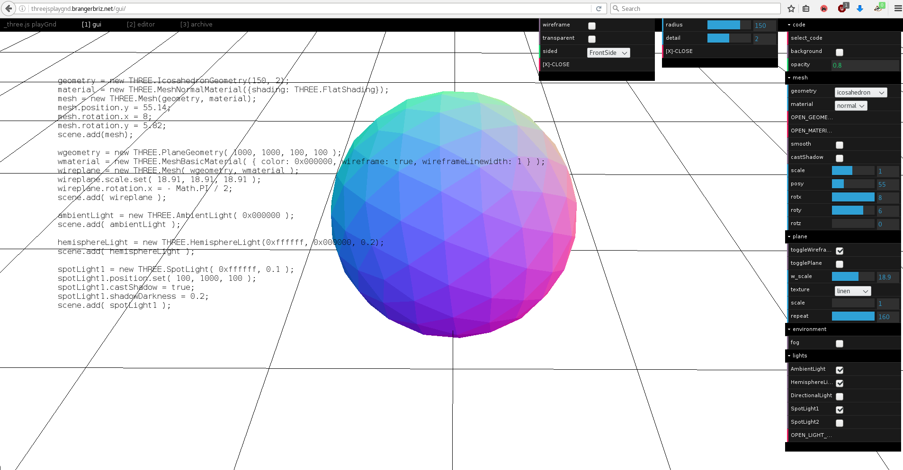
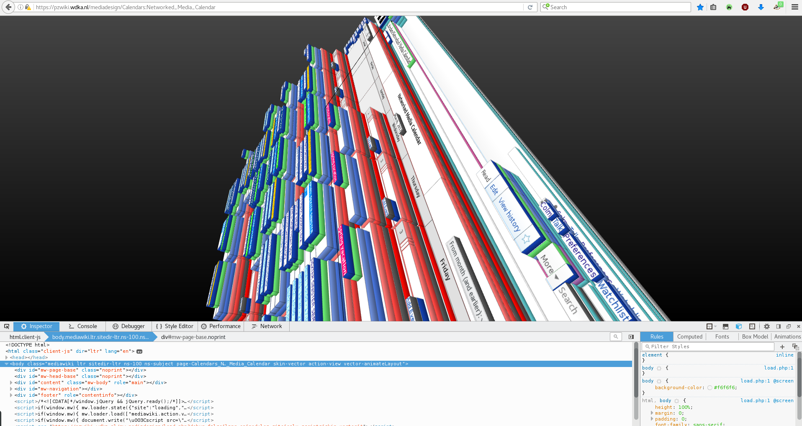

Title:Chapter 3 — The user, the learning curve
Date: 2017/01/04

# The user, the learning curve

Requesting that an interface become more open in the programs that it uses implies greater investment from the user. It would become  necessary for a user to learn the basic procedures enabled by the interface. Such an interface method expects the user to have some motivation towards learning the ways of computers and information systems. Learning this somewhat invisible material/procedure that the software system is comprised of is not always *easy* or necessarily always logical, but a payoff of the learner's investment is a much greater agency across the spectrum of computation. Following are some examples of interfaces that strike a balance between usability and visible seams.

<figcaption>This interface called _playGnd enables the creation of 3d objects that can be easily embedded on web pages. The tool proposes to start with the graphical user interface, but each value that is changed or tweaked automatically updates in the code view that is flush left on the screen. This dual attitude of code and interface shows the user how each object is encoded and reflected by the interface, in the code. It's a great tool for learning the 3D web languages. (accessed March 2017) </figcaption>

<figcaption>The pane open on the right side of this capture is called the XML editor. Inkscape is a vector drawing program that records drawing data in the Scalable Vector Graphics (svg) language along with some wrapping of the svg language in Extensible Markup language (xml) to save file names, some preferences, profiles etc. This pane lists and updates a text view of the objects you draw by using the toolbar tools. It splits object types and their attributes (type, scale, position, transformations) into legible tables. Along with this, it lets you manipulate the xml file, with keyboard and text editing procedures, to continue the creation of your drawing while manipulating the code it is recorded as.(accessed March 2017) </figcaption>

<figcaption>This 3d view is a feature inside the web inspector that is built into the Firefox web browser. Hypertext Markup Language is a way to tag portions of text for hierarchy of a document. The Browser can then read the markup and visually render the hierarchy that has been encoded. Web inspectors let users and website makers review how their html is being interpreted by the browser. Firefox takes this one step further by offering this 3d view of the html document, by layering enclosed and nested items over one another. The 3d view lets you click on the different visual layers to see what the element stack is, displaying HTML exactly how the browser reads it, but letting the user look at a third dimension rendering, for clarity and understanding.(accessed March 2017) </figcaption>

I find this type of interface extremely interesting and nourishing. These examples follow many of the established communication and interface conventions, but offer alternative positions, informing the user of the computer language and proceedings, augmenting the interface to be an exploratory, interesting object in itself. To this point I've been advocating more verbosity and transparency in interface. The examples above highlight the potential of an interface as a tunnel through abstraction layers. They make space for interfaces to become exploratory, wherein some elements are present purely to inform, for browsing purposes, I use the term browsing here in much the same way as [Adele Goldberg does in the presentation documents for one of the first graphical user interfaces; Smalltalk](https://youtu.be/AuXCc7WSczM?t=1m32s): in which browsing is emphasised because “too often we think of computers as being very precise machines, in which we have to very precisely say I want this or that and you get it back, exactly what you asked for. But the nice quality of a library [browser] is that you can walk around looking for something specific, but as you do that, you find other things, and that's what browsing is all about.” (Goldberg, 1979)

Goldberg and Smalltalk were prolific during the early 80s, a period when the computer was no longer reserved only for scientists or engineers. Personal computers were thought to extend towards other fields, other crafts could benefit from computational power. The work of Goldberg and Alan Kay (a fellow researcher within the Learning Research Group at Xerox PARC) on graphical user interfaces was never meant to obfuscate code, to hide it from the user, as it is on other commercial computer systems today, it was meant to augment the code to help you program. Windows and Apple, whose commercial activity was spawned from the work at Xerox, chose to ignored the metamedia concept (detailed below), instead, simply imitating old media. Movies, Music and books would eventually become .mov, .mp3 and .pdf on the computer, not all that different from their analog counterparts (Briz, 2016). In contrast, for Goldberg and Kay, the computer was an active medium which could “respond to queries and experiments, so that the message may involve the learner in a two-way conversation. This property has never been available before except through the medium of an individual teacher. We think the implications are vast and compelling [...] a new kind of medium would have been created: a metamedium, whose content would be a wide range of already existing and not-yet-invented media.” (Goldberg and Kay, 1977)

Unfortunately, it is hard to find many embodiments of the working methods for interfaces Goldberg and Kay set out in 1977. Teaching and learning is not a concern for modern interfaces. I am concerned by this lack of focus for learning as I find myself stuck between the effects of solutionist interfaces. In that light, a simple overview of the structure of the “parties involved in the configuration of software, services and it's [...] implications on the world” is helpful. These are: “1) developers and operators, i.e. the parties who develop software, architect services and operate the cloud infrastructure. Typically, service operators themselves use other services for development and may integrate services into their offering to their customers; (2) Curators, i.e. the end-user-facing entities that integrate software structured as services into their own operations (they include so-called enterprise customers). Curators pick and choose which services to use with implications for their end-users. These curators can be IT departments, local web development teams or individual developers; (3) End-users, i.e. the individual users, consumers, employees, workers, students, patients, audiences, who are affected by the structuring of software as services.” (Gürses and van Hoboken, 2016)

Within this structure, I am the middle-man, the curator, and it is from this position that most of the development of my thoughts around the communication issues within interface have been spawned. My work as an independent graphic designer and website developer involves the choice and implementation of pre-existing tools and processes for others to publish their content. But the more I do work as middle-man, the more responsible I feel for the digital literacy I expect of the end-users I produce for. This leads me to question the potential for the acquisition of this kind of literacy, with regards to people (customers / collaborators) who spend a lot of time on computers despite my services.

These notions of experience and seamlessness seem to be responsible for the lack of literacy mentioned above. The result of these notions is that these interfaces end up looking like one another and adopting one another's characteristics. Consistency is actively encouraged as a way ‘*for users to be able to transfer their knowledge and skills from one app to another. The principle of consistency holds that an app should respect its users and avoid forcing them to learn new ways to do things for no other reason than to be different.*’ (macOS Human Interface Guidelines, 2017) However, this statement relies on the assumption that previous apps have gotten everything right and that all the knowledge that users need exists already. The fact that it discourages alternate approaches limits diversity. Diverse interfaces are necessary in order to promote diverse approaches to different practices. If all methods become and feel similar, it stands to reason that outcomes will become similar. The term consistency is one amongst many others within these guidelines: Forgiveness, Aesthetic integrity, Metaphors, Mental models, all of these principles are documented and spoken of as singular ways to make software interfaces. They exist within the world of macOS, which openly states that it believes that technology should be transparent. In opposition to this, my vision for better communications within interfaces relies on visible seams. When OSx says transparent, they mean to make the components of an interface invisible. I believe the opposite needs to happen, that we must make models that are heterogeneous, and build interfaces that make some homogeneity for functions. The confrontation in the video below makes these visions clearest, in the words of the company itself:

<video controls="" poster="http://contemporary-home-computing.org/art-and-tech/not/material/mcluhnik.jpg" height="405" width="100%">
		<source src="http://contemporary-home-computing.org/art-and-tech/not/material/09.webm" type="video/webm">
		<source src="http://contemporary-home-computing.org/art-and-tech/not/material/09-web.mp4" type="video/mp4">
</video>

Apple inc encourages consistency for ‘user to be able to transfer their knowledge and skills from one app to another’ in their interface guidelines. They seem to confuse interface knowledge and computer literacy repeatedly with this attitude. One may be able to re-use an interface trick between one app and another, but this is only ported conventions, not actual knowledge or skill. The consequence of the consistency of the interface conventions that are nurtured is regularity and therefor, a sense of comfort. I believe that a comfortable, regular interface destroys a propensit for digital literacy. Comfort means that everything has been taken care of for the user, and she/he has absolutely no questions to answer or to ask regarding the procedures. Comfortable interface accomplishes the task of disappearing completely and leaves no space for experimenting (apart from interface conventions) the literacy of digital practices and crafts. Apple is not the only company that works in this way, but they are the most successful at the moment, and in my network, unfortunately the most present.
