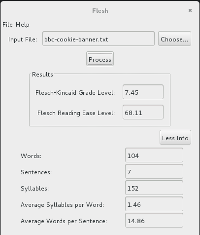
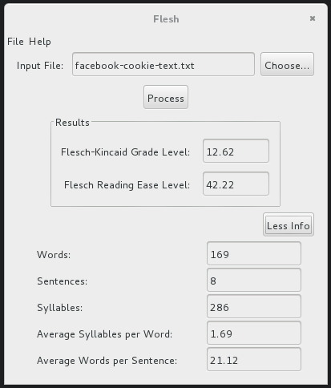

Title: Flesch-Kincaid readibility tests, cookie policy anouncements.
Date: 2017/01/15
Template: prototype

# readability test

In an attempt to better understand how the cookie policy texts are built, readibility tests seemed to be appropriate. A [recent post by Youtuber Nerdwriter](https://www.youtube.com/watch?v=_aFo_BV-UzI) vocal language construction and readibility tests are brought to the forground to analyse political campainers speech. The subject matter of the video linked above (Donald Trump) being unfortunate, I'll leave it up to you to go and watch it if you like. The methods for text analysis however are very interesting. The video iteslf brings together data from these sources:

* [Barton Swaim, “How Donald Trump’s language works for him” (via The Washington Post) September 15, 2015](https://www.washingtonpost.com/news/the-fix/wp/2015/09/15/how-trump-speak-has-pushed-the-donald-into-first-place/)
* [Emily Atkin, “What Language Experts Find So Strange About Donald Trump” (via ThinkProgress) 2015](http://thinkprogress.org/politics/2015/09/15/3701215/donald-trump-talks-funny-2/)
* [Matt Viser, “For presidential hopefuls, simpler language resonates” (via The Boston Globe) October 20, 2015](https://www.bostonglobe.com/news/politics/2015/10/20/donald-trump-and-ben-carson-speak-grade-school-level-that-today-voters-can-quickly-grasp/LUCBY6uwQAxiLvvXbVTSUN/story.html)
* [Jack Shafer, “Donald Trump Talks Like a Third-Grader” (via Politico) 2015](http://www.politico.com/magazine/story/2015/08/donald-trump-talks-like-a-third-grader-121340)

 The BBC has updated its cookie policy. We use cookies to ensure that we give you the best experience on our website. This includes cookies from third party social media websites if you visit a page which contains embedded content from social media. Such third party cookies may track your use of the BBC website. We and our partners also use cookies to ensure we show you advertising that is relevant to you. If you continue without changing your settings, we'll assume that you are happy to receive all cookies on the BBC website. However, you can change your cookie settings at any time. 

##### Readability Grade Levels
* Flesch-Kincaid Grade Level 	7.4
* Gunning-Fog Score 	9.1
* Coleman-Liau Index 	11.1
* SMOG Index 	9.7
* Automated Readability Index 	6.9
* Average Grade Level 	8.8

##### Text Quality
* Sentences > 30 Syllables 	2
* Sentences > 20 Syllables 	3
* Words > 4 Syllables 	0
* Words > 12 Letters 	0
* Passive Voice Count 	0
* Adverb Count 	0
* Cliché Count

##### Text Statistics
* Character Count 	498
* Syllable Count 	163
* Word Count 	109
* Sentence Count 	8
* Characters per Word 	4.6
* Syllables per Word 	1.5
* Words per Sentence 	13.6

* Reading Time 	0:29
* Speaking Time 	0:52

##### Sentiment
* Neutral (Slightly Positive)

##### Keyword Density
* cookies	5.50%
* website	3.67%
* bbc	3.67%
* use	2.75%
* third	1.83%
* social	1.83%
* settings	1.83%
* party	1.83%
* media	1.83%
* ensure	1.83%
* cookie	1.83%

To help personalize content, tailor and measure ads, and provide a safer experience,we use cookies. By clicking or navigating the site, you agree to allow our collection of information on and off Facebook through cookies. Learn more, including about available controls: Cookies Policy.

Cookies are small pieces of text used to store information on web browsers. Cookies are used to store and receive identifiers and other information on computers, phones, and other devices. Other technologies, including data we store on your web browser or device, identifiers associated with your device, and other software, are used for similar purposes. In this policy, we refer to all of these technologies as “cookies.”

We use cookies if you have a Facebook account, use the Facebook Services, including our website and apps (whether or not you are registered or logged in), or visit other websites and apps that use the Facebook Services (including the Like button or our advertising tools). This policy explains how we use cookies and the choices <span="reader">you have.

##### Readability Grade Levels
* Flesch-Kincaid Grade Level 	12.1
* Gunning-Fog Score 	13.4
* Coleman-Liau Index 	13.8
* SMOG Index 	14
* Automated Readability Index 	11.6
* Average Grade Level 	13.0

##### Text Quality
* Sentences > 30 Syllables 	5
* Sentences > 20 Syllables 	6
* Words > 4 Syllables 	3
* Words > 12 Letters 	0
* Passive Voice Count 	3
* Adverb Count 	3
* Cliché Count 	0

###### Text Statistics
* Character Count 	850
* Syllable Count 	292
* Word Count 	169
* Sentence Count 	9
* Characters per Word 	5.0
* Syllables per Word 	1.7
* Words per Sentence 	18.8

* Reading Time 	0:45
* Speaking Time 	1:21

##### Sentiment
* Neutral (Slightly Positive)

##### Keyword density:
* cookies	4.73%
* use	2.96%
* other	2.96%
* including	2.37%
* facebook	2.37%
* are	2.37%
* used	1.78%
* store	1.78%
* policy	1.78%
* information	1.78%
* web	1.18%
* technologies	1.18%
* services	1.18%
* identifiers	1.18%
* have	1.18%
* device	1.18%
* apps	1.18%

