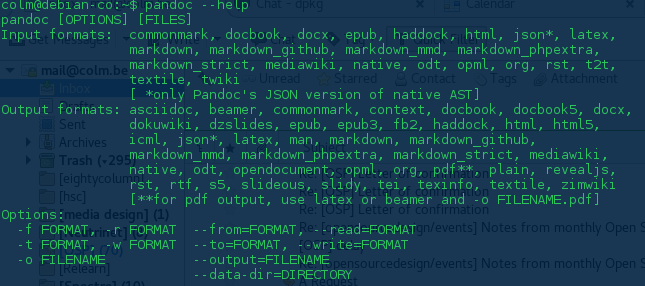
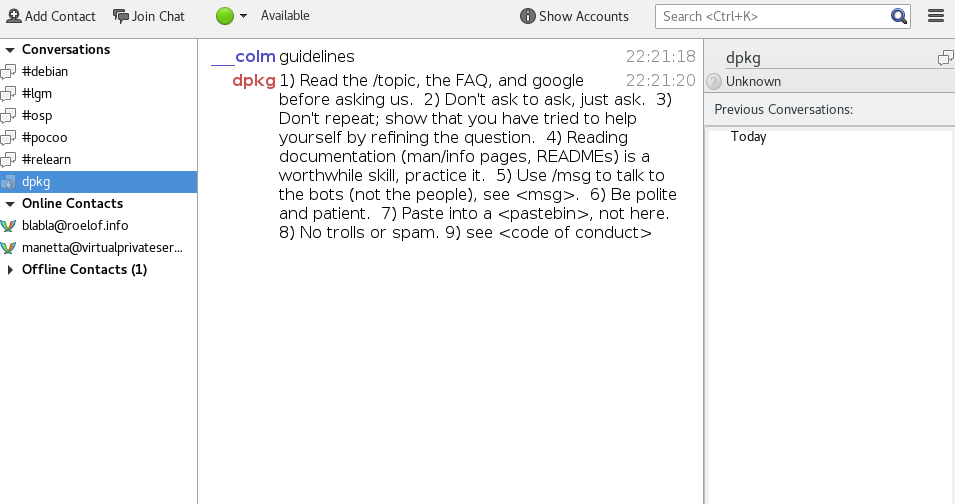

Title: Trim 5 assessment presentation markdown
Date: 2017/04/03
Template: slidy
Status: draft

# Trimester 5 assessment:
* Part 1: Recap, update, prototypes
* Part 2: Question: cynicism best managed with critical making or with direct communication?

# Part 1: A) Recap, contextualisation
## The 'what'
This project is about interfaces and how they address us.
 The way interfaces speak, what they are, what they do and what they embody.
The project looks at language specifically, but the context for the language is equally as important.

# My interest in interfaces stems from
* communication
  * textual communication
  * visual communication
* accessiblity
* possible literacy

In short, all the theoretical roles that a graphic designer has.

# software interfaces have many forms
* command line interface

# software interfaces have many forms
* IRC bot interface

# software interfaces have many forms
* Graphical user interfaces

# software interfaces have many forms
* Chatbot interface https://www.tacobell.com/feed/tacobot

# Interfaces for software services appear in so many different ways, we don't really know what they do for us anymore.

# Interfaces address us in so many different ways, We're beginning to forget about them. A sort of interface omnipresence, then an incontestable voice.

# The meaning of **interface** is slowly being confused, in the very same way the word **technology** has lost meaning.

# Technology has slowly lost meaning, because it has started to mean everything.

# Most of the times we say Technology we mean to say that it is packaging, and conventions.

# Not to say that Technologies do not exist, they simply are much deeper buried than we think.
* TCP IP
* DNS
* HTML
* JS
* these are all technologies, but to say that 'the internet', for example, is a technology is plain oversight.

# Most of the times we say Technology we mean to say that it is **packaging**, and **conventions**.

# What we see with interfaces, is the tip of the iceberg, we see the wrappers, the packaging's. And these wrappers are given to us **with but also as** interfaces.

# Why?

# interfaces are the front-end to *technologies*

# from here, I believe it is important to remind that interfaces are active, they are an action, not a mechanical process.

# (To) interface is a verb (I interface, you interface ...). The interface occurs, is action.

# As an action, the interface is the conduct of a person or a set of people.

# As an action conducted by people, interfacing comes attached with the ideas of people.

# This project exists to remind that there are lots of ideas to care about, and whichever ones we do or don't care about, ideas, through actions, through interfaces, come with *the politics of ideas*.

# More specifically, more personally, → Why?

# I believe that there is alot at stake, a lot that is risked when interfaces 'disappear'.

# The masking, the dissapearance, the misleading, the confusions of interfaces and technologies. I think that most of these phenomenons are happening mainly due to an over flooding of interfaces in the users regular digital practice.

# Entire fields are developing around the ideas of user interaction and user experience. Processes and constructs that exist to keep a user interested, to keep a user focused on the interface, and therefor, acting within the ideas / the ideals / the morals of the interface.

# Because so called Technology is also about capture, most pessimistically, getting permanent customers chained into their seats. Everybody seems to be wanting to capture the user, either for money, or for identical (almost religious) reasons.

# Attempting to keep a user focused and interested with the extremely well researched fields of user experience leads me to think of these ideals as enforced politics. That by using such interface to a program, I am substituting my ideas, my ideals for the ones of the interface.

# It is an uneven playing field. One of service and literacy. A model that has existed for years, but this model of service, service in the digital realm touches many more aspects of life and culture and politics then trades services used to.

# To balance out this playing field, broader understanding and broader literacy of interface practices, digital practices is, to my eyes, key.

# How?

# B) Prototypes : catalogue and database

## building a database, a catalogue, with which to look at the ways in which interfaces work. Building collections and crossing metadata.

## an ethnographic analysis, a categorisation of the subversive methods by which interfaces become omnipresent:

http://tangible.tools/problematic-modes-examples.html

http://localhost:5000/
