Title: Adversarial interfacing
Date: 2017/05/27
Template: slidy
Status: draft

# Adversarial interfacing:
* Part 1: examples
* Part 2: observations
* Part 3: observations → project
* Part 4: adversarial.interfacing.space site study

# examples

# direct address, sites calling me by my first name
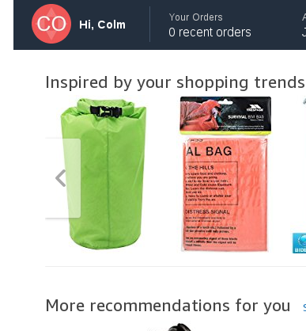

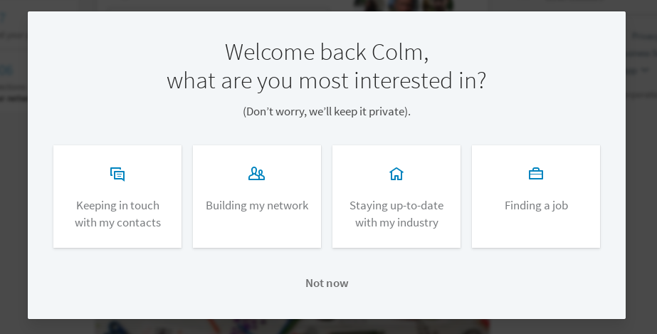

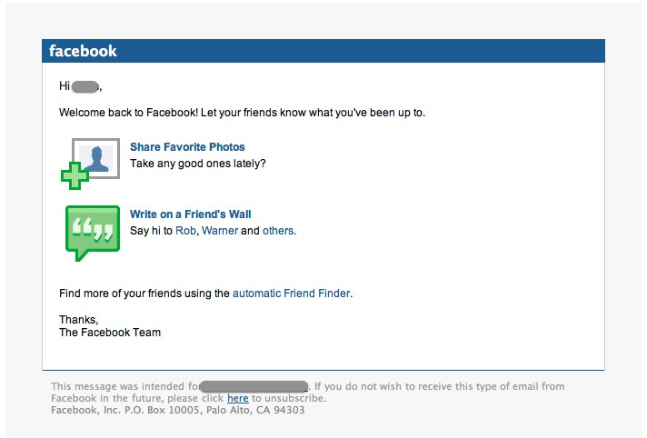

# informality to obtain consent

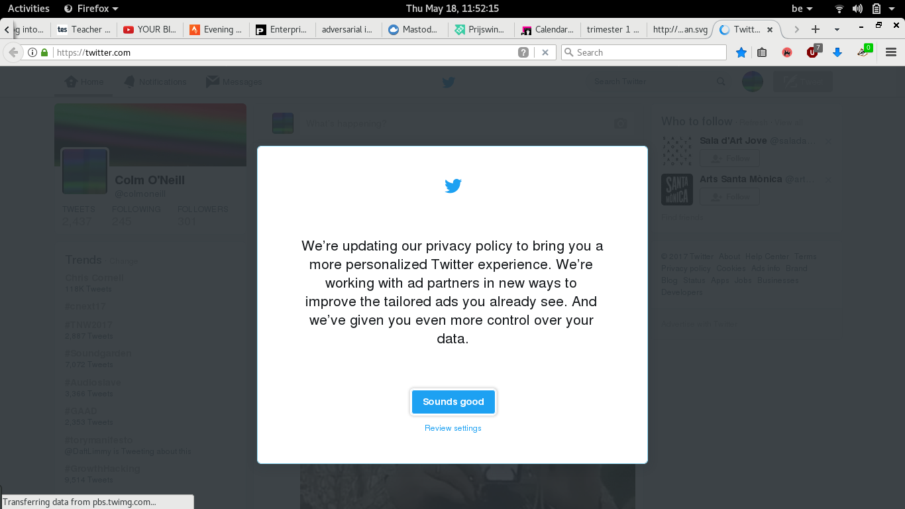

# informality to explain a point of view

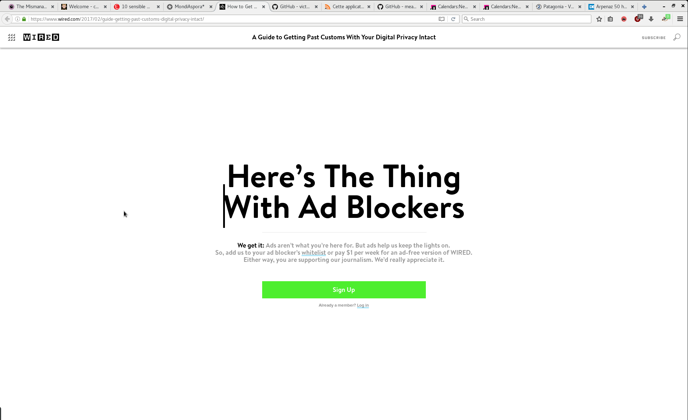

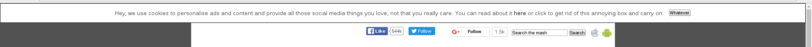

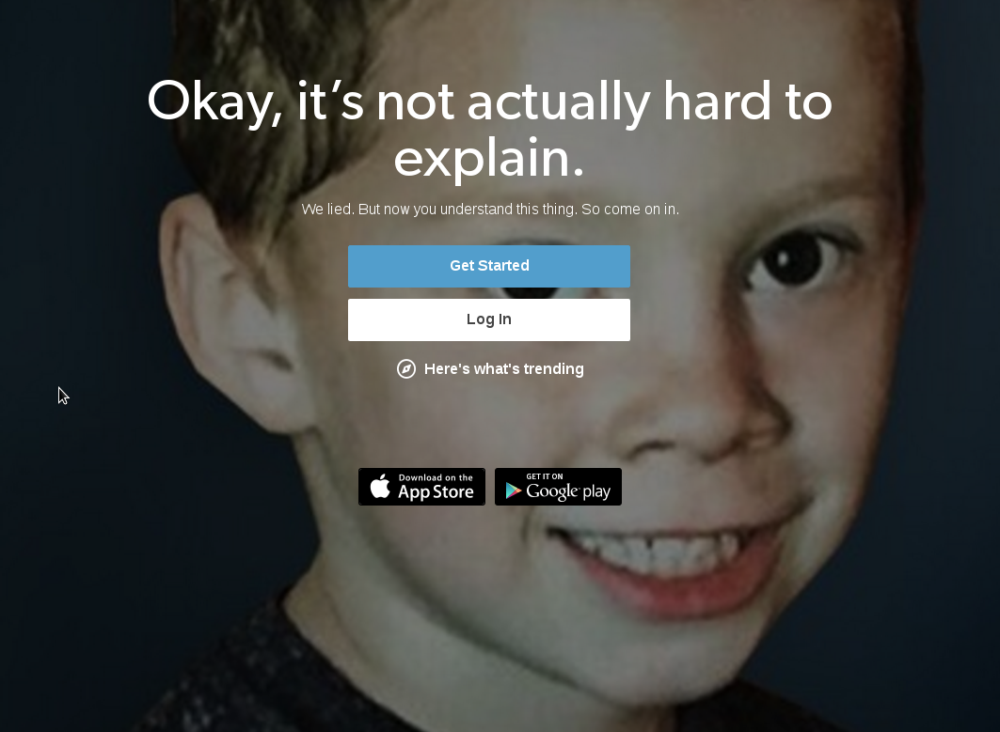

# informality to express care

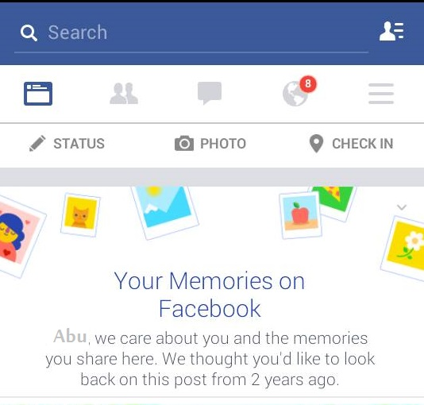

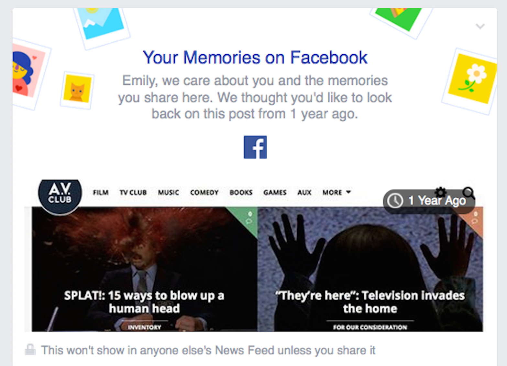

# informality to detail a change or an error

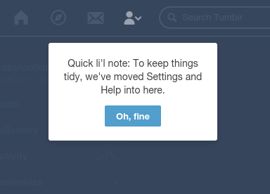

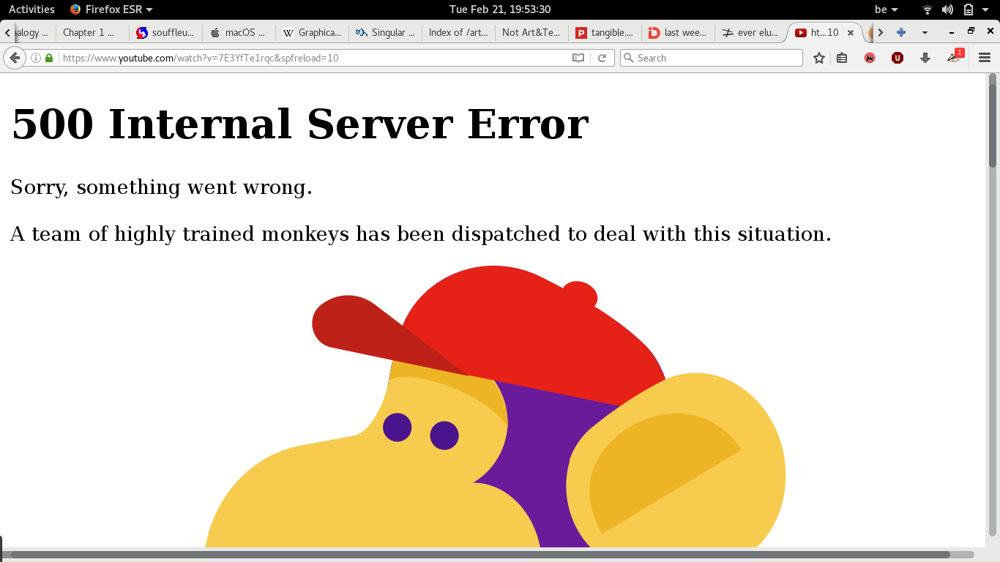

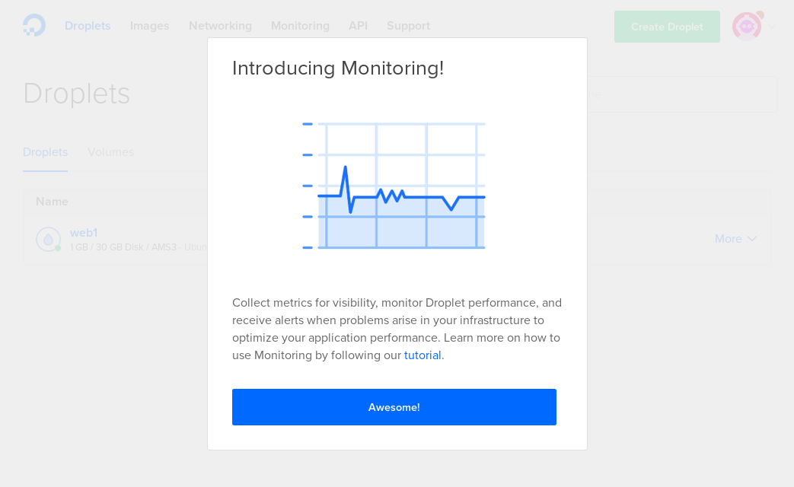

# observations & questions

# What is the need for this informality? Why do these various websites and products want me to be intimate with them? Why do they want me to be so enthusiastic about their product? What role does this informality play for the designers? Is this an echo of the way the makers of x or y website speak among themselves?

# Besides, who exactly is talking to me? Is it the designers? Is the the product manager? Is it customer support? My practice as a graphic designer keeps on reminding me that inter-face is about dialog. I know who is on my end, but who is on the other end?

# A bit of a reality check, and technical knowledge about how web pages are templated and programatically rendered, and I see these informal addresses not as the pitch of a bad salesman, but as a larger symptom.

# We are in an age of mass data analytics. Big datasets only getting bigger as we integrate the functions of the internet into all of the dimentions of life. And as the reach of data analytics grow, so does the ability to treat each individual uniquely and warmly. 
