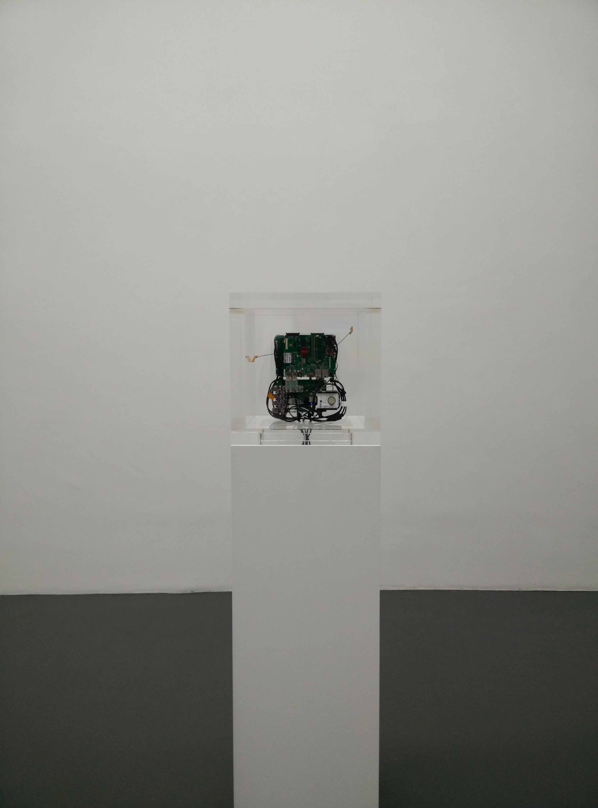
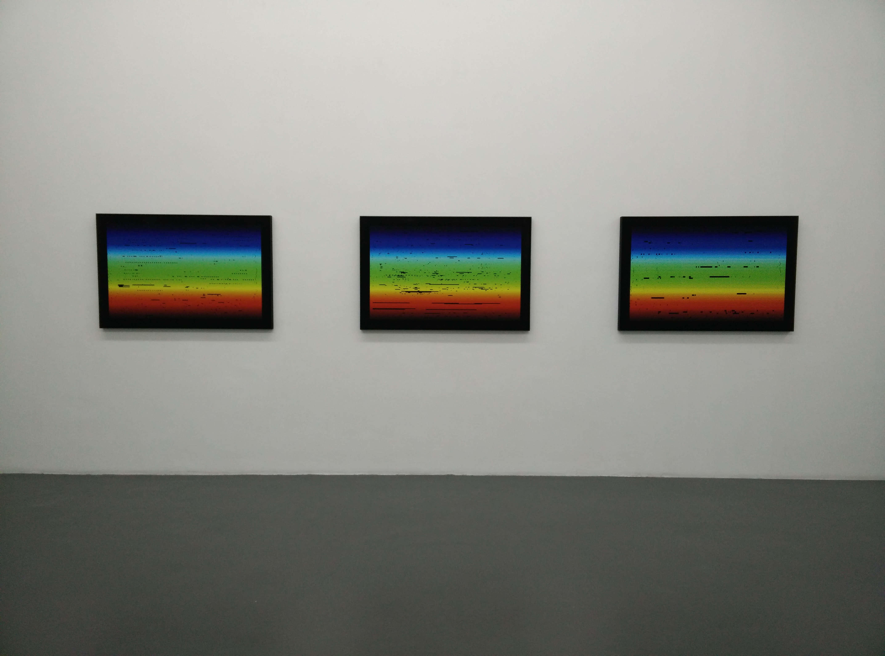

#Research methodologies
####Steve Rushton - research methodologies semiar

Art in the Age of... Asymmetrical Warfare

##### *Autonomy cube*, 2014 / Trevor Paglen with Jacob Appelbaum

The piece stands on the exhibition floor, placed on top of a white stand. It contains a cluster of circuit boards, neatly organised together, cables linking them together, and one cable bundle piercing through the base of the cube, through to the stand. The dimensions of the cube exactly match the ones of the stand, so while it has a presence in space, it remains relatively discrete.

The total amounts to a height of 116cm, and is described by the gallery as *mixed media*. That is no understatement.

The work is described as a sculpture, and also comes with the artist given tagline[1] meant to be "seen" and "used".

---

Photographer, sculptor and journalistic investigator. Paglen *looks for art to develop ways of seeing, things that help us see historical events of today* [2]. He takes concern in the topic of privacy, in some cases very directly, but for the majority of his pictural work, he observes the physical (not software or hardware or network) techniques that governmental bodies employ to hide their activities.

In his photographs, we see displays of phenomenons such as radial heat, air pollution, as well as atmospheric pressure, which are not new to the field of photography and lens based observation, but when they are shown in the contexts and themes of this artist's work, they take on a function of disguise, deliberately employed by the hidden.

---

notes on the works context within the exhibition (and or) the broader cultural context of the piece

Within all of the topics eluded to in [...] Asymmetrical warfare, this portion of the exhibition deals with data processing. It is the closest we get to the software mechanics of this asymmetricality.

The scenographic relation with the **James Bridle** piece *The Fraunhofer Lines* is thematic, but passive because of the relatively simple visualization ambition of the prints, whereas the *autonomy cube* attempts to be active, and work on a few different levels.

<figcaption>*The Fraunhofer Lines*  006 (MH17 Documents A), 2015   007 (MH17 Documents B), 2015   008 (MH17 Documents C), 2015  **James Bridle**</figcation>

Firstly the sculpture itself. The thickness of the plexiglass really gives off a sence of strenght. It looks bullet proof: it is both strong and transparent. I see this a direct image. A way of saying this network is transparent, you can see how it works, and understand it's components, but you can not destroy it.

Then it's functions; the cube generates it's own wifi signal. It distributes an access to the internet that is borrowed off of the gallery. Not only this, but it give you the luxury of routing your traffic after connection through the Tor network. This is what the artist means when saying the piece is meant to be 'used'.

Tor stands for The Onion Router:[3]
> Tor is free software for enabling anonymous communication. The name is an acronym derived from the original software project name The Onion Router. Tor directs Internet traffic through a free, worldwide, volunteer network consisting of more than six thousand relays to conceal a user's location and usage from anyone conducting network surveillance or traffic analysis. Using Tor makes it more difficult for Internet activity to be traced back to the user: this includes "visits to Web sites, online posts, instant messages, and other communication forms".

So what does this bring to us exactly?
- A metaphor for open source
- A real symbol of asymmetricality
- An activist's shout out to the world
- A tool to convince
- A trust in a self standing apparatus
- A reflection of human culture in digital culture

---

*Maybe a section on why I chose this piece rather than the next? That it is a relation between things that interest me, things I find relevant, if / or how the art piece affected me or resonated with me, and what I actually plan on doing with this afterwards?*

This relates to my work or at least what seems to be fueling my research at the moment is the aspect of transparency. There is a not so subtle display here of revelation through the plexiglas while proportionnaly this thick plexiglas would be near indestructible.

It has an almost activist standpoint of demonstration and protection, a revelation of procedure and a setup of protection.

---

[1]: http://www.paglen.com/index.php?l=work&s=cube&i=5 "Artist website"
[2]: https://www.youtube.com/watch?v=SDxue3jGAug "transmediale 2014 keynote: Art as Evidence "
[3]: https://en.wikipedia.org/wiki/Tor_%28anonymity_network%29 "Tor Anonymity Network - Wikipedia"
