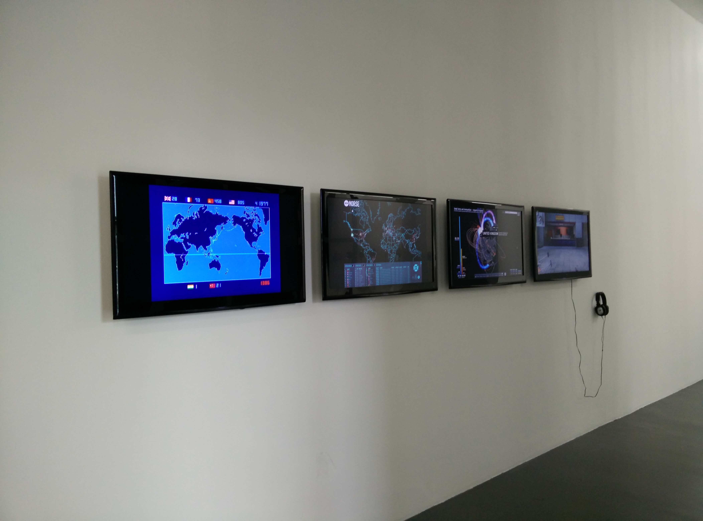

#Research methodologies
####Steve Rushton - research methodologies semiar

Art in the Age of... Asymmetrical Warfare

Make the following small texts which

a) describe a work in the show

b) research other work by that artist

c) make notes on the works context within the exhibition (and or) the
broader cultural context of the piece

d) consider the work's relation to your own work

word count = 500 maximum.

You can pick work from the exhibition Art in the Age of Asymmetrical
Warfare or Bitrot.

The aim is to simply make notes which address particular issues relating to
a particular piece, these could be used (for instance) as the basis for a
review.

